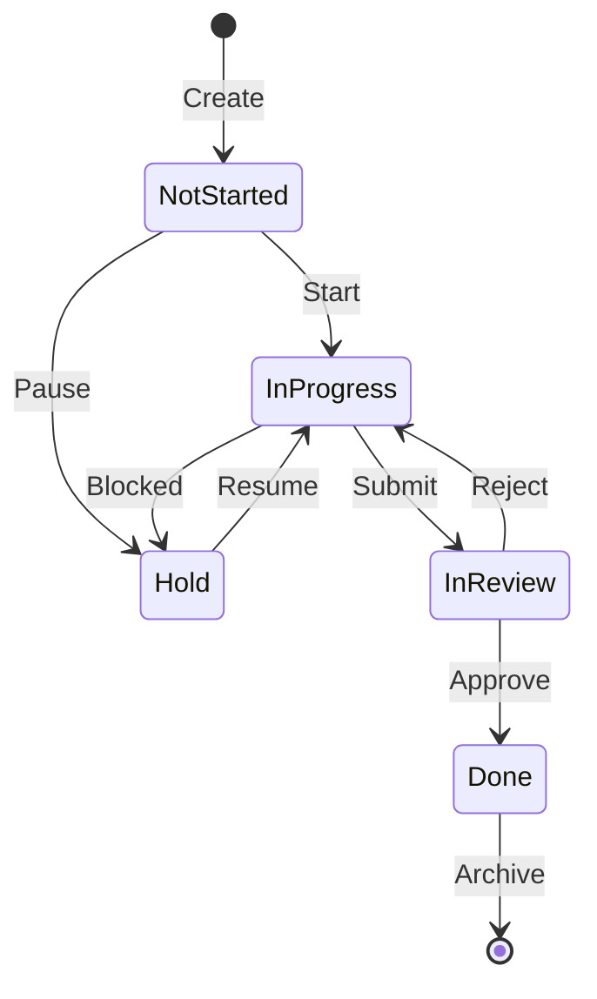

**Project**: PronaFlow 
**Version**: 1.1 
**State**: Ready for Review 
_**Last updated:** Jan 04, 2026_

---
# 1. Business Overview
**Project (Dự án)** là thực thể trung tâm nơi diễn ra sự cộng tác. Trong PronaFlow, một dự án không chỉ là tập hợp các công việc (Tasks) mà là một quy trình khép kín có Vòng đời (Lifecycle) rõ ràng, từ lúc khởi tạo, thực thi đến khi đóng lại.
Module này chịu trách nhiệm:
1. **Quản trị Meta-data:** Tên, mô tả, thời gian, ngân sách (nếu có).
2. **Quản trị Thành viên Dự án:** Ai được quyền truy cập và vai trò của họ là gì.
3. **Kiểm soát Vòng đời:** Điều phối trạng thái dự án thông qua Máy trạng thái (State Machine).
# 2. User Stories & Acceptance Criteria
## 2.1. Feature: Quản lý Thông tin Dự án (CRUD Project)
### User Story 2.1
Là một Thành viên Workspace, Tôi muốn tạo một dự án mới, Để bắt đầu tổ chức công việc cho một mục tiêu cụ thể.
### Acceptance Criteria (#AC)
#### AC 1 - Create Project Validation
- **Input:** `Title` (Required, Max 150 chars), `Description` (Optional), `Key` (Tự động sinh: PROJ-1, PROJ-2), `Start Date`, `End Date`.
- **Logic:**
	 - `Title` không được chỉ chứa khoảng trắng.
	 - Nếu nhập `End Date`, hệ thống bắt buộc `End Date >= Start Date`.
- **Default State:** Dự án tạo xong có trạng thái mặc định là **Not-Started**.
- **Owner Assignment:** Người tạo dự án tự động trở thành **Project Manager** (Quyền cao nhất trong dự án).
#### AC 2 - Update Metadata
- Chỉ **Project Manager** hoặc **Workspace Admin** mới có quyền chỉnh sửa tên, mô tả.
- Hệ thống ghi log lại người sửa và thời gian sửa (`updated_at`, `updated_by`).
#### AC 3 - Project Cloning (Nhân bản dự án) - _New_
- **Action:** Cho phép chọn "Duplicate Project".
- **Option:** Người dùng có thể chọn:
	 - [x] Copy cấu trúc (Task Lists, Settings).
	 - [ ] Copy Tasks (Thường là không chọn để tránh rác).
	 - [ ] Copy Members.
- **Result:** Tạo ra dự án mới có tên "Copy of [Old Name]".
## 2.2. Feature: Quản lý Trạng thái Dự án (Lifecycle Management)
### User Story 2.2
Là một Project Manager, Tôi muốn thay đổi trạng thái của dự án theo quy trình chuẩn, Để báo cáo chính xác giai đoạn thực hiện trên Dashboard.
### Acceptance Criteria (#AC)
#### AC 1 - 5 Global Statuses
Hệ thống quy định cứng (Hard-coded) 5 trạng thái:

|ID|Status Code|Display Name (VN)|Color Hex|Ý nghĩa Nghiệp vụ|
|---|---|---|---|---|
|0|`HOLD`|Tạm dừng|`#64748B` (Slate)|Dự án bị đóng băng, không cho phép tạo Task mới.|
|1|`NOT_STARTED`|Chưa bắt đầu|`#94A3B8` (Gray)|Giai đoạn lập kế hoạch (Default).|
|2|`IN_PROGRESS`|Đang thực hiện|`#3B82F6` (Blue)|Giai đoạn thực thi chính. Active.|
|3|`IN_REVIEW`|Đang đánh giá|`#F59E0B` (Amber)|Giai đoạn nghiệm thu, UAT.|
|4|`DONE`|Hoàn thành|`#10B981` (Emerald)|Dự án kết thúc thành công. Read-only.|
#### AC 2 - State Transition Logic
- **Trigger:** Thay đổi dropdown trạng thái hoặc Kéo thả thẻ dự án ở màn hình "All Projects".
- **Impact:**
	 - Khi chuyển sang **Done** hoặc **Hold**: Hệ thống hiển thị Confirm Modal: "Việc này có thể hạn chế quyền chỉnh sửa của thành viên. Tiếp tục?".
## 2.3. Feature: Quản lý Thành viên Dự án (Project Members) - _New_
### User Story 2.4
Là một Project Manager, Tôi muốn thêm thành viên vào dự án và phân vai trò cụ thể, Để kiểm soát ai có thể xem hoặc chỉnh sửa dữ liệu.
### Acceptance Criteria (#AC)
#### AC 1 - Add Member
- **Condition:** Chỉ thêm được những người ĐÃ là thành viên của Workspace (kết quả từ Module 2).
- **Notification:** Gửi thông báo cho người được thêm: "Bạn đã được thêm vào dự án X".
#### AC 2 - Project Roles (Vai trò cục bộ)
Khác với vai trò trong Workspace, vai trò trong dự án quy định quyền hạn cụ thể:
1. **Project Manager (PM):** Full quyền trong dự án (Sửa settings, xóa dự án, quản lý thành viên).
2. **Editor (Collaborator):** Quyền tạo/sửa Task, Comment, Upload file. Không được sửa thông tin dự án.
3. **Viewer (Stakeholder):** Chỉ được xem (Read-only), không được chỉnh sửa bất cứ thứ gì.
## 2.4. Feature: Thiết lập Quyền Riêng tư (Privacy Settings)
### User Story 2.3
Là một Chủ dự án, Tôi muốn thiết lập dự án là Riêng tư (Private), Để bảo mật thông tin nhạy cảm khỏi các thành viên khác trong cùng Workspace.
### Acceptance Criteria (#AC)
#### AC 1 - Visibility Logic
- **Public:** Tất cả thành viên Workspace đều thấy dự án này trên bảng chung và có thể tự tham gia (Join).
- **Private:**
	 - Dự án bị ẩn hoàn toàn với người không phải thành viên.
	 - Chỉ những người được mời (Invited) mới truy cập được.
## 2.5. Feature: Soft Delete & Restore
### Acceptance Criteria (#AC)
#### AC 1 - Soft Delete
- **Action:** PM chọn "Move to Trash".
- **System:** Update `is_deleted = 1`. Dự án biến mất khỏi các danh sách Active.
- **Reference:** Các Task thuộc dự án này cũng bị ẩn theo (Query Filter), nhưng không bị update trong DB ngay lập tức (Lazy Update).
#### AC 2 - Hard Delete Constraint
- Dự án trong thùng rác quá 30 ngày sẽ bị xóa vĩnh viễn bởi Cronjob (Theo quy định tại Module 8).
## 2.6. Feature: Project Templates (Mẫu Dự án)
### User Story 3.6
Là một PMO (Project Management Officer), Tôi muốn tạo các mẫu dự án chuẩn (ví dụ: "Quy trình Phần mềm", "Chiến dịch Marketing") bao gồm sẵn danh sách công việc mẫu và cấu hình, Để các PM không phải thiết lập lại từ đầu và đảm bảo tuân thủ quy trình công ty.
### Acceptance Criteria ( #AC)
#### AC 1 - Template Scope
- Khi lưu một Dự án thành Template, hệ thống lưu lại:
    - Cấu trúc **Task Lists** (Phases).
    - Các **Tasks/Subtasks** mẫu (bao gồm Mô tả, Checklist, Tags).
    - Cấu hình **Project Settings** (Workflow, Custom Fields).
    - _Không lưu:_ Thành viên cụ thể và Ngày tháng cụ thể (Dates).
#### AC 2 - Project Initialization from Template
- **Action:** Khi tạo dự án mới, User chọn "Use a Template".
- **Logic:** Hệ thống clone toàn bộ cấu trúc từ Template sang Dự án mới.
- **Date Remapping:** Hệ thống hỏi "Ngày bắt đầu dự án mới?", sau đó tự động tịnh tiến (Shift) ngày của các Task mẫu dựa trên khoảng cách tương đối (Relative Duration) so với ngày bắt đầu.
## 2.7. Feature: Project Categories & Portfolios (Phân loại & Danh mục)

### User Story 3.7
Là một Giám đốc Khối, Tôi muốn gom nhóm các dự án liên quan thành một "Chương trình" (Program) hoặc "Danh mục" (Portfolio), Để theo dõi sức khỏe tổng thể của cả nhóm dự án thay vì xem lẻ tẻ.
### Acceptance Criteria ( #AC)
#### AC 1 - Categorization
- Cho phép gắn **Category** (Ví dụ: "Internal", "Client A", "R&D") cho dự án.
- Cho phép gắn **Portfolio Tag** (Ví dụ: "Chiến lược 2025").
- Các nhãn này dùng để lọc (Filter) và gom nhóm (Group By) trên Dashboard tổng hợp (Module 11).
#### AC 2 - Hierarchy Support (Hỗ trợ Module 5)
- Việc phân loại này là cơ sở dữ liệu để Phân hệ 5 thực hiện tính năng **"Cross-Project Dependencies"** (Chỉ cho phép nối dependency giữa các dự án trong cùng Portfolio nếu cấu hình hạn chế).
## 2.8. Feature: Status Transition Gates (Cổng kiểm soát trạng thái)
### User Story 3.8
Là một Quản trị viên, Tôi muốn thiết lập các điều kiện bắt buộc trước khi dự án được phép chuyển trạng thái, Để ngăn chặn sai sót quy trình (ví dụ: Đóng dự án khi vẫn còn việc đang làm).
### Acceptance Criteria ( #AC)
#### AC 1 - "Definition of Done" Gate
- **Condition:** Khi User chuyển trạng thái Project sang **DONE**.
- **Check:** Hệ thống kiểm tra xem còn Task nào có trạng thái `!= DONE` không.
- **Action:**
    - Nếu còn: Hiển thị Modal liệt kê các Task chưa xong và yêu cầu xác nhận: _"Hủy bỏ (Cancel) các task này"_ hay _"Di chuyển (Move) sang dự án khác"_.
#### AC 2 - "Planning Approval" Gate (Integration with Module 5)
- **Condition:** Khi chuyển sang **IN_PROGRESS**.
- **Check:** Kiểm tra xem Dự án đã có **Baseline** nào được phê duyệt chưa (nếu bật chế độ Strict Governance).
# 3. Business Rules
## 3.1. Project Key Generation:
 - Mỗi dự án có một `Prefix Key` (ví dụ: "Marketing Campaign" -> Key: `MAR`).
 - Các Task trong dự án sẽ có ID dựa trên Key này: `MAR-1`, `MAR-2`.
 - Quy tắc: Tự động lấy 3-4 chữ cái đầu, in hoa. Cho phép User sửa lại lúc tạo dự án, nhưng phải duy nhất trong Workspace.
## 3.2. Date Constraint Logic:
 - `start_date` và `end_date` là Optional.
 - Tuy nhiên, nếu Task con có thời hạn nằm ngoài khoảng thời gian của Dự án -> Hệ thống hiển thị Cảnh báo (Warning) nhưng không chặn (Soft Constraint).
## 3.3. Kanban View Logic:
 - Màn hình "All Projects" nhóm dự án theo `Status`.
 - Sắp xếp mặc định: `Priority` (High -> Low) sau đó đến `Last Updated`.
## 3.4. Quy tắc Định danh (Project Key Immutability)
- **Project Key** (ví dụ: `PROJ-1`) là định danh duy nhất dùng trong URL và commit message (Git Integration).
- Sau khi dự án đã tạo Task đầu tiên, **KHÔNG** cho phép đổi Project Key nữa để đảm bảo tính toàn vẹn của các đường dẫn (Deep Links) và lịch sử hoạt động.
## 3.5. Quy tắc Lưu trữ (Archiving Strategy - Integration with Module 8)
- Khi Dự án chuyển sang trạng thái **DONE** hoặc **CANCELLED**:
    - Sau 30 ngày (cấu hình mặc định): Hệ thống gợi ý **Archive** (Lưu trữ) để ẩn khỏi danh sách chọn nhanh, giúp giao diện gọn gàng.
    - Dự án Archived chuyển sang chế độ **Read-only** hoàn toàn (bao gồm cả Task và Comment). Muốn sửa phải **Unarchive**.
# 4. Theoretical Basis (Cơ sở Lý luận)
## 4.1. Finite State Machine (Máy trạng thái hữu hạn)
Dự án được mô hình hóa như một máy trạng thái đơn chiều.

