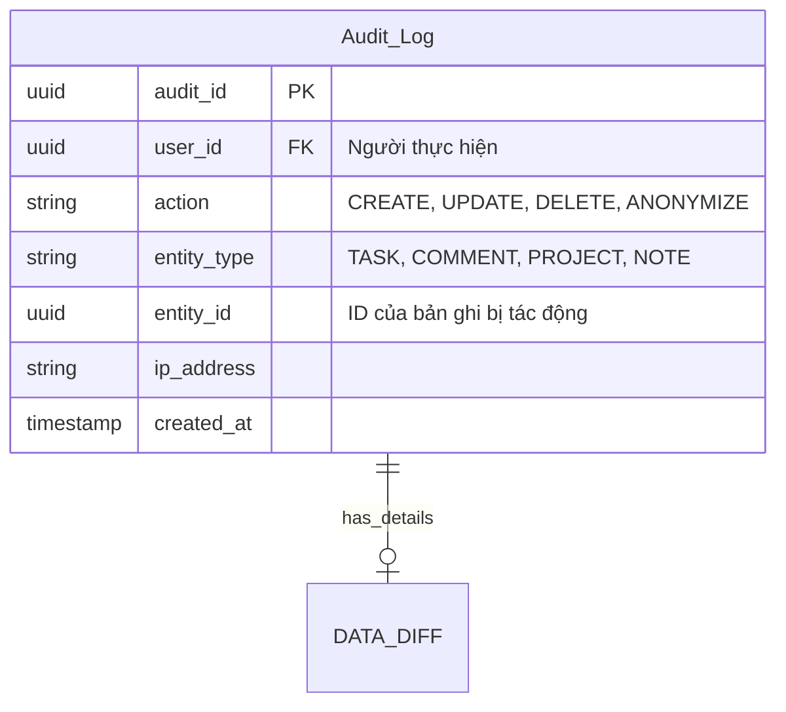

> Accouting / Auditing ( #AAA)
# Module 1

| Field       | Type      |     |                                   |
| ----------- | --------- | --- | --------------------------------- |
| audit_id () | UUID      | PK  |                                   |
| user_id ()  | UUID      | FK  | Người thực hiện                   |
| action      | varchar   |     | CRUD, Anonymize                   |
| entity_type | string    |     | Task, Comment, Project, Note, ... |
| entity_id   | UUID      |     | ID của bản ghi bị tác động        |
| ip_address  | varchar   |     |                                   |
| created_at  | timestamp |     |                                   |

