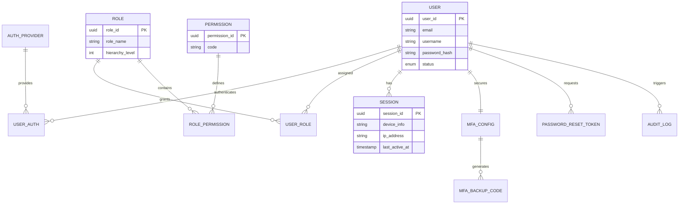

```mermaid
erDiagram
    USER ||--o{ USER_AUTH : authenticates
    AUTH_PROVIDER ||--o{ USER_AUTH : provides

    USER ||--o{ USER_ROLE : assigned
    ROLE ||--o{ USER_ROLE : grants

    ROLE ||--o{ ROLE_PERMISSION : contains
    PERMISSION ||--o{ ROLE_PERMISSION : defines

    USER ||--o{ SESSION : has
    USER ||--|| MFA_CONFIG : secures
    MFA_CONFIG ||--o{ MFA_BACKUP_CODE : generates

    USER ||--o{ PASSWORD_RESET_TOKEN : requests
    USER ||--o{ AUDIT_LOG : triggers

    USER {
        uuid user_id PK
        string email
        string username
        string password_hash
        enum status
    }

    ROLE {
        uuid role_id PK
        string role_name
        int hierarchy_level
    }

    PERMISSION {
        uuid permission_id PK
        string code
    }

    SESSION {
        uuid session_id PK
        string device_info
        string ip_address
        timestamp last_active_at
    }
```

