**Project**: PronaFlow
**Version**: 1.2 (Revised based on "Optimal Free Tier" philosophy)
**State**: Draft
***Last updated:** Jan 5, 2026*

---
## 1. Business Overview (Tổng quan Nghiệp vụ)
Trong nền kinh tế SaaS hiện đại, đặc biệt vá»›i triết lĂ½ **Product-Led Growth (PLG)**, mục tiĂªu của hệ thống tĂ­nh phĂ­ khĂ´ng phải lĂ  tạo ra rĂ o cản (Paywalls) ngay từ đầu, mĂ  lĂ  đồng hĂ nh cĂ¹ng sá»± phĂ¡t triển của khĂ¡ch hĂ ng.
PhĂ¢n hệ **Subscription & Billing Management** của PronaFlow được thiết kế vá»›i tÆ° duy: **"Free to Start, Pay to Scale"**.
1. **GĂ³i Free (Starter):** Cung cấp trải nghiệm quản lĂ½ dá»± Ă¡n **trọn vẹn** (Full Features) cho cĂ¡c nhu cầu cÆ¡ bản. Người dĂ¹ng khĂ´ng bị cắt giảm cĂ¡c tĂ­nh năng cốt lõi nhÆ° Kanban, Gantt, hay Collaboration. Giá»›i hạn chỉ nằm ở **tĂ i nguyĂªn tiĂªu thụ** (Storage, AI Tokens) vĂ  **phạm vi quản trị** (SSO, Audit Log dĂ i hạn).
2. **Cơ chế Dual-Layer Billing:**
    - **Inbound:** Quản lĂ½ đăng kĂ½ gĂ³i cÆ°á»›c linh hoạt, há»— trợ tá»± Ä‘á»™ng nĂ¢ng cấp khi quy mĂ´ team mở rá»™ng.
    - **Outbound (Work-to-Cash):** Biến PronaFlow thĂ nh cĂ´ng cụ kiếm tiền cho Freelancer/Agency bằng cĂ¡ch xuất hĂ³a Ä‘Æ¡n từ Timesheet.
# 2. User Stories & Acceptance Criteria
## 2.1. Feature: Seamless Scaling (NĂ¢ng cấp mở rá»™ng liền mạch)
### User Story 13.1
LĂ  má»™t **Workspace Owner (GĂ³i Free)**, tĂ´i muốn hệ thống cảnh bĂ¡o nhẹ nhĂ ng khi tĂ´i sắp đạt giá»›i hạn tĂ i nguyĂªn (Dung lượng/Số lượng dá»± Ă¡n) thay vì khĂ³a cứng tĂ­nh năng ngay lập tức, vĂ  cho phĂ©p tĂ´i nĂ¢ng cấp nhanh chĂ³ng để tiếp tục mạch lĂ m việc.
### Acceptance Criteria (#AC)
#### **AC 1 - Soft Limit Warning (Cảnh bĂ¡o mềm):**
- **Trigger:** Khi tĂ i nguyĂªn đạt 80% vĂ  90% (VĂ­ dụ: ÄĂ£ dĂ¹ng 2.7/3 Dá»± Ă¡n hoặc 900MB/1GB Storage).
- **Display:** Hiển thị thanh trạng thĂ¡i sá»­ dụng (Usage Bar) mĂ u vĂ ng/cam trĂªn Dashboard hoặc Settings. Gá»­i email nhắc nhở "Workspace của bạn Ä‘ang phĂ¡t triển rất nhanh!".
#### **AC 2 - Graceful Enforcement (Cưỡng chế Ă¢n hạn):**
- **Scenario:** Người dĂ¹ng đạt 100% giá»›i hạn Projects.
- **Action:** Hệ thống **KHĂ”NG** khĂ³a quyền truy cập cĂ¡c dá»± Ă¡n cÅ©. Hệ thống chỉ tạm thời vĂ´ hiệu hĂ³a nĂºt "Create New Project" cho đến khi nĂ¢ng cấp hoặc lÆ°u trữ (Archive) bá»›t dá»± Ă¡n cÅ©.
- **Philosophy:** Đảm bảo người dĂ¹ng luĂ´n xá»­ lĂ½ được cĂ´ng việc hiện tại, khĂ´ng bao giờ bị "bắt lĂ m con tin" về dữ liệu.
#### **AC 3 - Instant Upgrade (NĂ¢ng cấp tức thì):**
- Há»— trợ nĂ¢ng cấp gĂ³i Pro ngay trong luồng cĂ´ng việc (Contextual Upgrade) mĂ  khĂ´ng cần tải lại trang hay đăng nhập lại. CĂ¡c giá»›i hạn (Quota) được mở rá»™ng ngay lập tức sau khi thanh toĂ¡n thĂ nh cĂ´ng (Webhook trigger).
## 2.2. Feature: Feature Gating for Power Users (PhĂ¢n cấp tĂ­nh năng nĂ¢ng cao)
### User Story 13.2
LĂ  má»™t **Doanh nghiệp (GĂ³i Pro)**, tĂ´i muốn sá»­ dụng cĂ¡c tĂ­nh năng quản trị chuyĂªn sĂ¢u nhÆ° **SSO, Unlimited Audit Logs, vĂ  AI Advanced Insights**, để đảm bảo an ninh vĂ  tối Æ°u hĂ³a vận hĂ nh cho Ä‘á»™i ngÅ© lá»›n.
### Acceptance Criteria (#AC)
#### **AC 1 - Core vs. Power Features:**
- **Core (Free & Pro):** Task Management, Basic Gantt, Comments, File Sharing, Basic Reports.
- **Power (Pro Only):**
	- Custom Field nĂ¢ng cao (Formula, Relation).
	- Advanced AI (Module 10 - Auto Schedule, Risk Prediction).
	- Data Retention vÄ©nh viá»…n (Free chỉ lÆ°u Audit Log 90 ngĂ y - theo Module 8).
#### **AC 2 - Teaser Experience (Trải nghiệm thử):**
- Cho phĂ©p người dĂ¹ng Free dĂ¹ng thá»­ tĂ­nh năng Pro (vĂ­ dụ: AI Prediction) vá»›i số lượng giá»›i hạn (5 lần/thĂ¡ng) để họ thấy giĂ¡ trị trÆ°á»›c khi mua.
## 2.3. Feature: Freelancer Invoicing (HĂ³a Ä‘Æ¡n đầu ra)
### User Story 13.3
LĂ  má»™t **Freelancer (Sá»­ dụng cả Free/Pro)**, tĂ´i muốn chuyển đổi dữ liệu chấm cĂ´ng (Timesheet) thĂ nh hĂ³a Ä‘Æ¡n PDF chuyĂªn nghiệp để gá»­i cho khĂ¡ch hĂ ng, vá»›i khả năng tĂ¹y chỉnh thÆ°Æ¡ng hiệu.
### Acceptance Criteria (#AC)
#### **AC 1 - Basic Invoicing (DĂ nh cho mọi người):**
- Cho phĂ©p chọn cĂ¡c Time Entries Ä‘Ă£ duyệt -> Tạo PDF hĂ³a Ä‘Æ¡n cÆ¡ bản.
- Mẫu hĂ³a Ä‘Æ¡n tiĂªu chuẩn của PronaFlow.
#### **AC 2 - Branded Invoicing (DĂ nh cho Pro):**
- Cho phĂ©p tải lĂªn Logo riĂªng, chỉnh sá»­a mĂ u sắc Brand, bỏ dĂ²ng chữ "Powered by PronaFlow".
- Há»— trợ gá»­i Email hĂ³a Ä‘Æ¡n trá»±c tiếp từ hệ thống vá»›i SMTP riĂªng.
#### **AC 3 - Payment Tracking:**
- Cho phĂ©p Ä‘Ă¡nh dấu hĂ³a Ä‘Æ¡n lĂ  `Sent`, `Paid`, `Overdue` thủ cĂ´ng.
## 2.4. Feature: Transparent Usage Dashboard (Bảng theo dõi minh bạch)
### User Story 13.4
LĂ  má»™t **Admin**, tĂ´i muốn xem chi tiết mức Ä‘á»™ tiĂªu thụ tĂ i nguyĂªn (Storage, AI Tokens, API Calls) theo thời gian thá»±c, để hiểu rõ tĂ´i Ä‘ang trả tiền cho cĂ¡i gì hoặc khi nĂ o cần dọn dẹp dữ liệu.
### Acceptance Criteria (#AC)
#### **AC 1 - Resource Breakdown:**
- Biểu đồ Donut chart hiển thị dung lượng Storage: Files (80%), Database (10%), Backups (10%).
- Danh sĂ¡ch cĂ¡c "Heavy Projects" chiếm nhiều tĂ i nguyĂªn nhất.
#### **AC 2 - AI Token Usage:**
- Hiển thị số lượng Token Ä‘Ă£ dĂ¹ng cho cĂ¡c tĂ­nh năng AI (Gợi Ă½, TĂ³m tắt).
- Nếu lĂ  gĂ³i Free: Hiển thị số Token cĂ²n lại trong thĂ¡ng (Quota reset định kỳ).
# 3. Business Rules & Technical Constraints
## 3.1. Quy tắc Dunning (Quản lĂ½ thu nợ tá»± Ä‘á»™ng)
- **Retry Logic:** Nếu thanh toĂ¡n gia hạn thất bại (do hết hạn thẻ, khĂ´ng đủ số dÆ°), hệ thống tá»± Ä‘á»™ng thá»­ lại (Retry) theo lịch trình: NgĂ y 1, NgĂ y 3, NgĂ y 7.
- **Grace Period:** Cho phĂ©p người dĂ¹ng tiếp tục sá»­ dụng dịch vụ trong 7 ngĂ y Ă¢n hạn (Grace Period) trÆ°á»›c khi khĂ³a quyền truy cập (Downgrade to Read-only).
## 3.2. Quy tắc Bất biến TĂ i chĂ­nh (Financial Immutability)
- **Immutable Invoices:** Má»™t khi hĂ³a Ä‘Æ¡n Ä‘Ă£ được gá»­i Ä‘i (Sent) hoặc Ä‘Ă£ thanh toĂ¡n (Paid), ná»™i dung của nĂ³ **KHĂ”NG** được phĂ©p chỉnh sá»­a.
- Nếu cĂ³ sai sĂ³t, người dĂ¹ng phải thá»±c hiện quy trình: Hủy hĂ³a Ä‘Æ¡n cÅ© (Void) -> Tạo hĂ³a Ä‘Æ¡n má»›i (New Invoice) hoặc tạo Credit Note (Giấy bĂ¡o cĂ³).
## 3.3. Quy tắc Thuế (Tax Compliance)
- Hệ thống phải há»— trợ tĂ­nh thuế tá»± Ä‘á»™ng dá»±a trĂªn địa chỉ của người mua (Buyer's Location) để tuĂ¢n thủ luật VAT (ChĂ¢u Ă‚u) hoặc Sales Tax (Mỹ).
- TĂ­ch hợp cĂ¡c service tĂ­nh thuế (nhÆ° Stripe Tax hoặc Avalara) nếu cần thiết.
# 4. Theoretical Basis (CÆ¡ sở LĂ½ luận)

## 4.1. NguyĂªn lĂ½ Kế toĂ¡n KĂ©p (Double-Entry Bookkeeping)
Mặc dĂ¹ PronaFlow khĂ´ng phải lĂ  phần mềm kế toĂ¡n chuyĂªn sĂ¢u (nhÆ° QuickBooks), module nĂ y vẫn Ă¡p dụng tÆ° duy kế toĂ¡n kĂ©p ở tầng dữ liệu (Ledger) để đảm bảo tĂ­nh toĂ n vẹn:
- Má»—i giao dịch ghi nhận doanh thu phải cĂ³ má»™t bĂºt toĂ¡n đối ứng vĂ o tĂ i khoản phải thu (Accounts Receivable) hoặc tiền mặt (Cash).
- Công thức: $Assets = Liabilities + Equity$.
## 4.2. MĂ´ hình Định giĂ¡ SaaS (SaaS Pricing Models)
PronaFlow há»— trợ mĂ´ hình **Per-User Pricing** (TĂ­nh tiền theo đầu người) kết hợp **Tiered Pricing** (PhĂ¢n tầng).
- ÄĂ¢y lĂ  mĂ´ hình phổ biến nhất trong B2B SaaS vì tĂ­nh dá»… hiểu vĂ  khả năng mở rá»™ng doanh thu tuyến tĂ­nh theo sá»± phĂ¡t triển của khĂ¡ch hĂ ng (Scale with usage).
## 4.3. Bảo mật Giao dịch (Transaction Security & Idempotency)
Để ngăn chặn lá»—i "Double Charge" (Trừ tiền 2 lần) trong mĂ´i trường mạng khĂ´ng ổn định, Module Ă¡p dụng **Idempotency Keys**:
- Má»—i request thanh toĂ¡n gá»­i Ä‘i đều kèm theo má»™t Key duy nhất (UUID).
- Nếu Client gá»­i lại request (do timeout), Server kiểm tra Key nĂ y. Nếu Ä‘Ă£ xá»­ lĂ½, Server trả về kết quả cÅ© mĂ  khĂ´ng thá»±c hiện trừ tiền lần 2.

```mermaid
stateDiagram-v2
    [*] --> FreeTier: Register
    
    state FreeTier {
        [*] --> ActiveFree
        ActiveFree --> SoftLimit: Usage > 80%
        SoftLimit --> ActiveFree: Clean up data
        SoftLimit --> HardLimit: Usage >= 100%
        HardLimit --> ActiveFree: Archive Projects
    }

    FreeTier --> ProTier: Upgrade Payment Success

    state ProTier {
        [*] --> ActivePro
        ActivePro --> PaymentFailed: Renewal Error
        
        state PaymentFailed {
            [*] --> Retry1: Day 1
            Retry1 --> Retry2: Day 3
            Retry2 --> Retry3: Day 7
        }

        PaymentFailed --> GracePeriod: After 3 retries
        GracePeriod --> ActivePro: Update Payment Method
        GracePeriod --> Downgraded: Expired (15 days)
    }

    Downgraded --> FreeTier: Revert to Free Limits
    
    note right of HardLimit
        Người dĂ¹ng vẫn xem/sá»­a dữ liệu cÅ©.
        Chỉ chặn tạo mới (Create Block).
    end note

    note right of GracePeriod
        Vẫn giữ full tĂ­nh năng Pro.
        Hiển thị cảnh bĂ¡o thanh toĂ¡n đỏ.
    end note
```

