**Project**: PronaFlow 
**Version**: 1.1 
**State**: Ready for Review 
_**Last updated:** Jan 04, 2026_

---
# 1. Business Overview
Workspace (KhĂ´ng gian lĂ m việc) lĂ  Ä‘Æ¡n vị tổ chức cấp cao nhất trong kiến trĂºc Multi-tenancy của PronaFlow. Má»—i Workspace hoạt Ä‘á»™ng nhÆ° má»™t "container" Ä‘á»™c lập, đảm bảo tĂ­nh cĂ´ lập dữ liệu tuyệt đối (Logical Isolation). Mọi tĂ i nguyĂªn nhÆ° Project (Dá»± Ă¡n), Tasks (CĂ´ng việc), Tags (NhĂ£n) vĂ  Members (ThĂ nh viĂªn) đều thuá»™c phạm vi của má»™t Workspace cụ thể.
Module nĂ y chịu trĂ¡ch nhiệm quản lĂ½:
1. **VĂ²ng đời Workspace:** Khởi tạo -> Hoạt Ä‘á»™ng -> LÆ°u trữ/XĂ³a.
2. **Quản trị ThĂ nh viĂªn:** Mời người dĂ¹ng, phĂ¢n quyền trong ná»™i bá»™ tổ chức.
3. **Cấu hình Ngữ cảnh:** Thiết lập mĂºi giờ, lịch lĂ m việc Ă¡p dụng cho toĂ n bá»™ dá»± Ă¡n con.
# 2. User Story & Acceptance Criteria
## 2.1. Feature: Workspace Creation
### User Story 2.1:
LĂ  má»™t Người dĂ¹ng, TĂ´i muốn tạo má»™t Workspace má»›i vĂ  đặt tĂªn cho nĂ³, Để phĂ¢n tĂ¡ch cĂ¡c ngữ cảnh cĂ´ng việc khĂ¡c nhau (vĂ­ dụ: CĂ¡ nhĂ¢n, CĂ´ng ty, Dá»± Ă¡n Freelance) mĂ  khĂ´ng bị lẫn lá»™n dữ liệu.
### Acceptance Criteria ( #AC)
#### AC 1 - Khởi tạo thĂ nh cĂ´ng:
- **Given:** Người dĂ¹ng Ä‘ang ở mĂ n hình danh sĂ¡ch Workspace.
- **When:** Người dĂ¹ng nhập `Workspace Name` (Bắt buá»™c, Max 50 kĂ½ tá»±), `Description` (TĂ¹y chọn) vĂ  nhấn "Create".
- **Then:** 1. Hệ thống tạo bản ghi Workspace má»›i. 2. GĂ¡n Người dĂ¹ng hiện tại lĂ  **Owner** (Chủ sở hữu). 3. Tá»± Ä‘á»™ng chuyển ngữ cảnh (Switch Context) sang Workspace vừa tạo.
#### AC 2 - Default Workspace (Logic tá»± Ä‘á»™ng)
- **Given:** Người dĂ¹ng vừa hoĂ n tất đăng kĂ½ tĂ i khoản má»›i (Register).
- **When:** Người dĂ¹ng đăng nhập lần đầu tiĂªn.
- **Then:** Hệ thống tá»± Ä‘á»™ng tạo sẵn má»™t Workspace mặc định tĂªn lĂ  `"{Username}'s Workspace"` để người dĂ¹ng bắt đầu lĂ m việc ngay.
#### AC 3 - Validation:
- **When:** Người dĂ¹ng nhập tĂªn chỉ chứa kĂ½ tá»± đặc biệt hoặc từ ngữ cấm (Profanity Filter).
- **Then:** Hệ thống hiển thị lá»—i `WS_001: TĂªn KhĂ´ng gian lĂ m việc khĂ´ng hợp lệ`.
## 2.2. Feature: Chuyển đổi Ngữ cảnh (Context Switching)
### User Story 2.2:
LĂ  má»™t Người dĂ¹ng tham gia nhiều Workspace, TĂ´i muốn chuyển đổi nhanh giữa cĂ¡c Workspace trĂªn thanh Ä‘iều hÆ°á»›ng, Để truy cập vĂ o dữ liệu dá»± Ă¡n tÆ°Æ¡ng ứng vá»›i khĂ´ng gian Ä‘Ă³.
### Acceptance Criteria (#AC)
#### AC 1 - Data Isolation (CĂ´ lập dữ liệu)
- **Given:** Người dĂ¹ng chuyển từ `Workspace A` sang `Workspace B`.
- **Then:** - Giao diện reload lại Dashboard.
 - Danh sĂ¡ch Projects, Notifications chỉ hiển thị dữ liệu của `Workspace B`.
 - Tuyệt đối khĂ´ng hiển thị dữ liệu của `Workspace A` (trừ phần User Profile chung).
#### AC 2 - State Persistence (LÆ°u trạng thĂ¡i)
- **When:** Người dĂ¹ng đăng xuất vĂ  đăng nhập lại vĂ o ngĂ y hĂ´m sau.
- **Then:** Hệ thống Ä‘Æ°a người dĂ¹ng thẳng vĂ o Workspace cuối cĂ¹ng họ truy cập (`last_accessed_workspace_id`), thay vì bắt chọn lại từ đầu.
## 2.3. Feature: Member Invitation & Management (Quản lĂ½ ThĂ nh viĂªn)
### User Story 2.5 (New)
LĂ  má»™t Workspace Owner, TĂ´i muốn mời đồng nghiệp tham gia vĂ o Workspace qua email, Để chĂºng tĂ´i cĂ³ thể cĂ¹ng cá»™ng tĂ¡c trĂªn cĂ¡c dá»± Ă¡n chung.
### Acceptance Criteria (#AC)
#### AC 1 - Invite Flow (Luồng mời)
- **Input:** Nhập danh sĂ¡ch Email (cĂ³ thể nhập nhiều), chọn Vai trĂ² mặc định (Member/Admin).
- **Logic:**
	 - Nếu Email Ä‘Ă£ cĂ³ tĂ i khoản PronaFlow: Gá»­i thĂ´ng bĂ¡o In-app + Email.
	 - Nếu Email chÆ°a cĂ³ tĂ i khoản: Gá»­i Email chứa "Magic Link" để đăng kĂ½ tĂ i khoản má»›i vĂ  tá»± Ä‘á»™ng join Workspace sau khi đăng kĂ½ xong.
- **Token:** Link mời cĂ³ hiệu lá»±c trong 48 giờ.
#### AC 2 - Role Assignment (GĂ¡n vai trĂ²)
1. Workspace Owner (Chủ sở hữu)
	- **Định nghÄ©a**: Người tạo ra Workspace hoặc được chuyển giao quyền lá»±c. ÄĂ¢y lĂ  vai trĂ² cĂ³ quyền lá»±c tối cao trong Workspace.
	- **Đặc quyền**: Nắm giữ quyền quyết định về tĂ i chĂ­nh (Billing), quản lĂ½ vĂ²ng đời tổ chức vĂ  quản lĂ½ cĂ¡c Admin khĂ¡c
2. Workspace Admin (Quản trị viĂªn)
	- **Định nghÄ©a**: Người há»— trợ Owner vận hĂ nh tổ chức.
	- **Đặc quyền**: Quản lĂ½ thĂ nh viĂªn, thiết lập cấu hình chung (ngĂ y lĂ m việc, lá»… tết), tạo dá»± Ă¡n má»›i. Tuy nhiĂªn, Admin khĂ´ng được truy cập thĂ´ng tin thanh toĂ¡n hoặc xĂ³a Worksapce.
3. Member (ThĂ nh viĂªn)
	- **Định nghÄ©a**: NhĂ¢n viĂªn hoặc cá»™ng tĂ¡c viĂªn chĂ­nh thức.
	- **Đặc quyền**: CĂ³ quyền truy cập vĂ  thao tĂ¡c (tạo task, comment) trong cĂ¡c Dá»± Ă¡n mĂ  họ được gĂ¡n. KhĂ´ng thể thay đổi cấu hình Workspace.
4. Viewer (Người xem / KhĂ¡ch)
	-  **Định nghÄ©a**: Stakeholder hoặc đối tĂ¡c bĂªn ngoĂ i.
	- **Đặc quyền**: Chỉ cĂ³ quyền xem (Read-only) cĂ¡c tĂ i nguyĂªn được chia sẻ cụ thể. KhĂ´ng thể Ä‘iều chỉnh dữ liệu.
Ma trận phĂ¢n quyền: [[#3. Business Rules & Constraints#3.1. Security & Permissions ( RBAC Matrix)|Permission Matrix: Workspace Permission Roles]]
#### AC 3 - Remove Member (XĂ³a thĂ nh viĂªn)
- **Action:** Owner xĂ³a má»™t thĂ nh viĂªn khỏi Workspace.
- **Result:**
	 - ThĂ nh viĂªn Ä‘Ă³ mất quyền truy cập ngay lập tức.
	 - CĂ¡c Task Ä‘ang được gĂ¡n cho họ chuyển về trạng thĂ¡i `Unassigned` hoặc giữ nguyĂªn (tĂ¹y cấu hình), nhÆ°ng tĂªn hiển thị chuyển thĂ nh "Former Member".
## 2.4. Feature: Workspace Settings (Cấu hình Tổ chức)
### User Story 2.6 (New)
LĂ  má»™t Workspace Admin, TĂ´i muốn thiết lập ngĂ y lĂ m việc vĂ  ngĂ y nghỉ lá»… cho toĂ n bá»™ Workspace, Để cĂ¡c biểu đồ Gantt vĂ  tĂ­nh toĂ¡n SLA trong dá»± Ă¡n con được chĂ­nh xĂ¡c.
### Acceptance Criteria (#AC)
#### AC 1 - Working Schedule
- Cho phĂ©p cấu hình:
	 - **Work Days:** Mon - Fri (Mặc định).
	 - **Work Hours:** 09:00 - 18:00.
	 - **Timezone:** Asia/Ho_Chi_Minh (GMT+7).
#### AC 2 - Branding (TĂ¹y chọn)
- Cho phĂ©p upload Logo của cĂ´ng ty để thay thế Logo mặc định của Workspace trĂªn thanh Sidebar (Tăng tĂ­nh cĂ¡ nhĂ¢n hĂ³a).
## 2.5. Feature: Lifecycle & Soft Delete
### User Story 2.3:
LĂ  má»™t Workspace Owner, TĂ´i muốn xĂ³a má»™t Workspace khĂ´ng cĂ²n sá»­ dụng, Để dọn dẹp giao diện vĂ  quản lĂ½ tĂ i nguyĂªn hiệu quả.
### Acceptance Criteria (#AC)
#### AC 1 - Cảnh bĂ¡o tĂ¡c Ä‘á»™ng (Impact Analysis)
- **When:** Owner nhấn "Delete Workspace".
- **Then:** Hệ thống hiển thị Modal cảnh bĂ¡o: "HĂ nh Ä‘á»™ng nĂ y sẽ lÆ°u trữ **X** Dá»± Ă¡n vĂ  **Y** Task. Bạn cĂ³ chắc chắn khĂ´ng?". YĂªu cầu nhập Ä‘Ăºng tĂªn Workspace để xĂ¡c nhận.
#### AC 2 - Soft Delete Logic
- **Action:** XĂ¡c nhận xĂ³a.
- **System:** Update `is_deleted = true`, `deleted_at = NOW()`. Workspace biến mất khỏi danh sĂ¡ch truy cập của tất cả thĂ nh viĂªn.
#### AC 3 - Permissions Guard
- Chỉ **Owner** má»›i cĂ³ quyền xĂ³a Workspace. Admin hay Member khĂ´ng nhìn thấy nĂºt nĂ y.
## 2.6. Feature: System Admin Governance (Back-office)
### User Story 2.4:
LĂ  má»™t System Admin (Quản trị viĂªn hệ thống), TĂ´i muốn xem danh sĂ¡ch Workspace Ä‘Ă£ bị xĂ³a mềm vĂ  thá»±c hiện khĂ´i phục hoặc xĂ³a vÄ©nh viá»…n, Để há»— trợ người dĂ¹ng hoặc giải phĂ³ng dung lượng Database.
### Acceptance Criteria (#AC)
#### AC 1 - Auto-Purge Policy
- **Automated Job:** Má»—i ngĂ y lĂºc 00:00, hệ thống quĂ©t cĂ¡c Workspace cĂ³ `is_deleted = true` VĂ€ `deleted_at > 30 days`.
- **Action:** Thá»±c hiện **Hard Delete** (XĂ³a vÄ©nh viá»…n khỏi SQL).
#### AC 2 - Restore Capability
- Admin cĂ³ thể tìm kiếm Workspace theo ID hoặc TĂªn, sau Ä‘Ă³ nhấn "Restore" để khĂ´i phục quyền truy cập cho Owner cÅ©.
# 3. Business Rules & Constraints
## 3.1. Security & Permissions ( #RBAC Matrix)
| Permission Code    | Owner | Admin  | Member | Viewer | MĂ´ tả                                        |
| ------------------ | ----- | ------ | ------ | ------ | -------------------------------------------- |
| Quản trị Tổ chức   |       |        |        |        |                                              |
| `WS.UPDATE`        | ✅     | ✅      | ❌      | ❌      | Sá»­a tĂªn, Logo, Cấu hình Timezone             |
| `WS.DELETE`        | ✅     | ❌      | ❌      | ❌      | XĂ³a mềm Workspace                            |
| `WS.BILLING`       | ✅     | ❌      | ❌      | ❌      | Quản lĂ½ gĂ³i cÆ°á»›c thanh toĂ¡n (Module 13)      |
| Quản trị NhĂ¢n sá»±   |       |        |        |        |                                              |
| `WS.MEMBER.INVITE` | ✅     | ✅      | ❌      | ❌      | Mời thĂ nh viĂªn má»›i                           |
| `WS.MEMBER.UPDATE` | ✅     | ✅      | ❌      | ❌      | Thay đổi vai trĂ² thĂ nh viĂªn (Promote/Demote) |
| `WS.MEMBER.KICK`   | ✅     | ✅(*)   | ❌      | ❌      | XĂ³a thĂ nh viĂªn (Admin khĂ´ng xĂ³a được Owner)  |
| Quản trị Dá»± Ă¡n     |       |        |        |        |                                              |
| `PROJ.CREATE`      | ✅     | ✅      | ❌      | ❌      | Tạo dá»± Ă¡n má»›i                                |
| `PROJ.ACCESS_ALL`  | ✅     | ❌ (**) | ❌      | ❌      | Truy cập tất cả dá»± Ă¡n (Kể cả Private)        |
**Ghi chĂº:**
- `(*)` **Admin** khĂ´ng thể xĂ³a (Kick) hoặc hạ quyền (Demote) **Owner**.
- `(**)` **Admin** khĂ´ng mặc định nhìn thấy cĂ¡c dá»± Ă¡n Private trừ khi họ được mời vĂ o dá»± Ă¡n Ä‘Ă³ hoặc họ lĂ  người tạo ra nĂ³.
## 3.2. Data Integrity Rules (Quy tắc ToĂ n vẹn Dữ liệu)
1. **Isolation Query Rule:** Mọi cĂ¢u truy vấn dữ liệu (Projects, Tasks, Tags) đều **BẮT BUỘC** phải cĂ³ Ä‘iều kiện `WHERE workspace_id = :current_ws_id`. Tuyệt đối khĂ´ng cho phĂ©p truy vấn dữ liệu "Global" (trừ System Admin).
2. **Cascade Logic:** Khi Workspace bị xĂ³a (Soft Delete), khĂ´ng cần update trạng thĂ¡i `is_deleted` cho hĂ ng nghìn Project/Task con ngay lập tức (gĂ¢y lock table). Logic lọc sẽ nằm ở tầng Application (Nếu Parent deleted -> Children hidden).
3. **Owner Succession (Kế thừa quyền lực):**
	 - Má»—i Workspace phải luĂ´n cĂ³ **Ă­t nhất 1 Owner**.
	 - Owner khĂ´ng thể rời khỏi (Leave) Workspace nếu họ lĂ  Owner duy nhất. Họ bắt buá»™c phải chuyển giao quyền lá»±c (Transfer Ownership) cho má»™t thĂ nh viĂªn khĂ¡c trÆ°á»›c khi rời Ä‘i hoặc xĂ³a Workspace.
4. **Unique Constraints (RĂ ng buá»™c duy nhất):**
	 - Má»™t User khĂ´ng thể tham gia 2 lần vĂ o cĂ¹ng 1 Workspace.
	 - ID của Workspace (UUID) lĂ  duy nhất toĂ n cục hệ thống
## 3.3. CĂ¡c quy tắc trong hệ thống phĂ¢n quyền Workspace.
1. **Quy tắc Kế thừa Quyền lực (Owner Succession):**
    - Má»—i Workspace bắt buá»™c phải luĂ´n cĂ³ **Ă­t nhất 01 Owner**.
    - Owner hiện tại khĂ´ng thể rời khỏi (Leave) Workspace nếu họ lĂ  Owner duy nhất. Hệ thống buá»™c họ phải chuyển giao quyền lá»±c (Transfer Ownership) cho má»™t thĂ nh viĂªn khĂ¡c trÆ°á»›c khi rời Ä‘i.
2. **Quy tắc CĂ´ lập Dữ liệu (Isolation Rule):**
    - ThĂ nh viĂªn của Workspace A **tuyệt đối khĂ´ng** thể nhìn thấy dữ liệu của Workspace B, ngay cả khi họ cĂ³ tĂ i khoản ở cả hai nÆ¡i. Việc chuyển đổi giữa cĂ¡c Workspace phải tải lại ngữ cảnh (Context Switching).
3. **Quy tắc Bảo vệ Thanh toĂ¡n (Billing Protection):**
    - Chỉ **Owner** má»›i cĂ³ quyền truy cập vĂ o Module 13 (Subscription & Billing). Điều nĂ y ngăn chặn rủi ro Admin lạm quyền nĂ¢ng cấp gĂ³i cÆ°á»›c gĂ¢y phĂ¡t sinh chi phĂ­ cho doanh nghiệp.
# 4. Theoretical Basis (CÆ¡ sở LĂ½ luận)
## 4.1. Kiến trĂºc Multi-tenancy: Shared Database, Shared Schema
PronaFlow sá»­ dụng chiến lược **Logical Isolation** (CĂ´ lập logic).
- **LĂ½ do:** Tiết kiệm chi phĂ­ hạ tầng vĂ  dá»… dĂ ng bảo trì schema (so vá»›i việc má»—i khĂ¡ch hĂ ng 1 Database riĂªng).
- **Rủi ro:** Lá»™ lọt dữ liệu giữa cĂ¡c Tenant (Data Leakage).
- **Giải phĂ¡p:** Áp dụng **Row-Level Security (RLS)** ở tầng Database (PostgreSQL Policies) hoặc Middleware filter chặt chẽ ở tầng Backend Service.
## 4.2. Workspace State Machine (MĂ¡y trạng thĂ¡i)

```mermaid
stateDiagram-v2
 [*] --> Active: Created
 Active --> SoftDeleted: Owner deletes
 SoftDeleted --> Active: System Admin restores
 SoftDeleted --> [*]: Hard Delete (After 30 days)
 note right of Active
  Tất cả Member cĂ³ thể truy cập
  vĂ  thao tĂ¡c dữ liệu
 end note
 note right of SoftDeleted
  Dữ liệu bị ẩn.
  Chỉ System Admin nhìn thấy.
 end note
```

