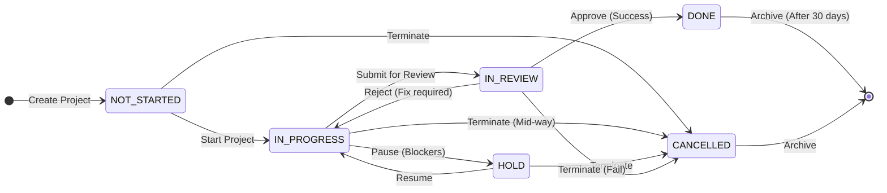
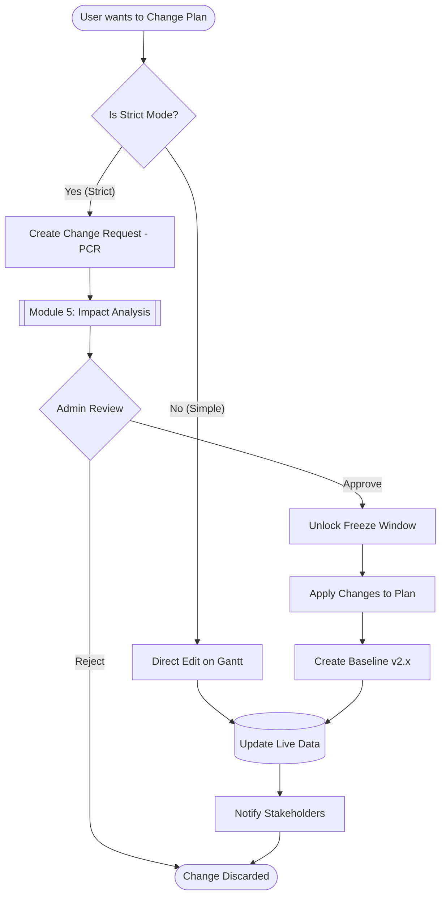
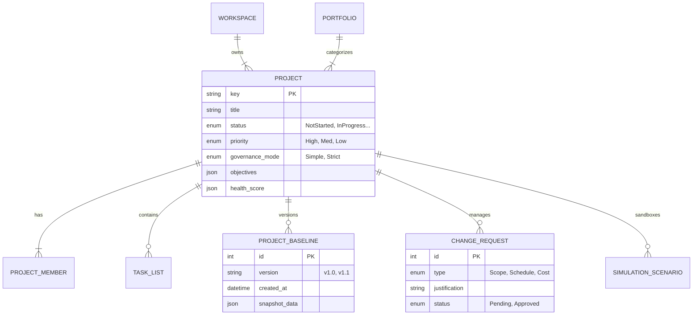

**Project**: PronaFlow 
**Version**: 1.1 
**State**: Ready for Review 
_**Last updated:** Jan 04, 2026_

---
# 1. Business Overview
**Project (Dá»± Ă¡n)** lĂ  thá»±c thể trung tĂ¢m nÆ¡i diá»…n ra sá»± cá»™ng tĂ¡c. Trong PronaFlow, má»™t dá»± Ă¡n khĂ´ng chỉ lĂ  tập hợp cĂ¡c cĂ´ng việc (Tasks) mĂ  lĂ  má»™t quy trình khĂ©p kĂ­n cĂ³ VĂ²ng đời (Lifecycle) rõ rĂ ng, từ lĂºc khởi tạo, thá»±c thi đến khi Ä‘Ă³ng lại.
Module nĂ y chịu trĂ¡ch nhiệm:
1. **Quản trị Meta-data:** TĂªn, mĂ´ tả, thời gian, ngĂ¢n sĂ¡ch (nếu cĂ³).
2. **Quản trị ThĂ nh viĂªn Dá»± Ă¡n:** Ai được quyền truy cập vĂ  vai trĂ² của họ lĂ  gì.
3. **Kiểm soĂ¡t VĂ²ng đời:** Điều phối trạng thĂ¡i dá»± Ă¡n thĂ´ng qua MĂ¡y trạng thĂ¡i (State Machine).
# 2. User Stories & Acceptance Criteria
## 2.1. Feature: Quản lĂ½ ThĂ´ng tin Dá»± Ă¡n (CRUD Project)
### User Story 2.1
LĂ  má»™t ThĂ nh viĂªn Workspace, TĂ´i muốn tạo má»™t dá»± Ă¡n má»›i, Để bắt đầu tổ chức cĂ´ng việc cho má»™t mục tiĂªu cụ thể.
### Acceptance Criteria (#AC)
#### AC 1 - Create Project Validation
- **Input:** `Title` (Required, Max 150 chars), `Description` (Optional), `Key` (Tá»± Ä‘á»™ng sinh: PROJ-1, PROJ-2), `Start Date`, `End Date`.
- **Logic:**
	 - `Title` khĂ´ng được chỉ chứa khoảng trắng.
	 - Nếu nhập `End Date`, hệ thống bắt buộc `End Date >= Start Date`.
- **Default State:** Dá»± Ă¡n tạo xong cĂ³ trạng thĂ¡i mặc định lĂ  **Not-Started**.
- **Owner Assignment:** Người tạo dá»± Ă¡n tá»± Ä‘á»™ng trở thĂ nh **Project Manager** (Quyền cao nhất trong dá»± Ă¡n).
#### AC 2 - Update Metadata
- Chỉ **Project Manager** hoặc **Workspace Admin** má»›i cĂ³ quyền chỉnh sá»­a tĂªn, mĂ´ tả.
- Hệ thống ghi log lại người sá»­a vĂ  thời gian sá»­a (`updated_at`, `updated_by`).
#### AC 3 - Project Cloning (NhĂ¢n bản dá»± Ă¡n) - _New_
- **Action:** Cho phĂ©p chọn "Duplicate Project".
- **Option:** Người dĂ¹ng cĂ³ thể chọn:
	 - [x] Copy cấu trĂºc (Task Lists, Settings).
	 - [ ] Copy Tasks (Thường lĂ  khĂ´ng chọn để trĂ¡nh rĂ¡c).
	 - [ ] Copy Members.
- **Result:** Tạo ra dá»± Ă¡n má»›i cĂ³ tĂªn "Copy of [Old Name]".
## 2.2. Feature: Quản lĂ½ Trạng thĂ¡i Dá»± Ă¡n (Lifecycle Management)
### User Story 2.2
LĂ  má»™t Project Manager, TĂ´i muốn thay đổi trạng thĂ¡i của dá»± Ă¡n theo quy trình chuẩn, Để bĂ¡o cĂ¡o chĂ­nh xĂ¡c giai Ä‘oạn thá»±c hiện trĂªn Dashboard.
### Acceptance Criteria (#AC)
#### AC 1 - 5 Global Statuses
Hệ thống quy định cứng (Hard-coded) 5 trạng thĂ¡i:

| **ID** | **Status Code** | **Display Name (VN)** | **Color Hex** | **Ý nghÄ©a Nghiệp vụ**                            |
| ------ | --------------- | --------------------- | ------------- | ------------------------------------------------ |
| 0      | `HOLD`          | Tạm dừng              | `#64748B`     | Dá»± Ă¡n bị Ä‘Ă³ng băng, khĂ´ng cho phĂ©p tạo Task má»›i. |
| 1      | `NOT_STARTED`   | Chưa bắt đầu          | `#94A3B8`     | Giai đoạn lập kế hoạch (Default).                |
| 2      | `IN_PROGRESS`   | Đang thá»±c hiện        | `#3B82F6`     | Giai Ä‘oạn thá»±c thi chĂ­nh. Active.                |
| 3      | `IN_REVIEW`     | Đang Ä‘Ă¡nh giĂ¡         | `#F59E0B`     | Giai Ä‘oạn nghiệm thu, UAT.                       |
| 4      | `DONE`          | HoĂ n thĂ nh            | `#10B981`     | Dá»± Ă¡n kết thĂºc thĂ nh cĂ´ng. Read-only.            |
| **5**  | **`CANCELLED`** | **ÄĂ£ hủy**            | **`#EF4444`** | **Dá»± Ă¡n bị chấm dứt trÆ°á»›c hạn. Read-only.**      |
#### AC 2 - State Transition Logic
- **Trigger:** Thay đổi dropdown trạng thĂ¡i hoặc KĂ©o thả thẻ dá»± Ă¡n ở mĂ n hình "All Projects".
- **Impact:**
	 - Khi chuyển sang **Done** hoặc **Hold**: Hệ thống hiển thị Confirm Modal: "Việc nĂ y cĂ³ thể hạn chế quyền chỉnh sá»­a của thĂ nh viĂªn. Tiếp tục?".
#### AC 3 - Cancellation Logic (Logic Hủy dá»± Ă¡n)
- **Action:** Khi người dĂ¹ng chọn trạng thĂ¡i **CANCELLED**.
- **Mandatory Input:** Hệ thống hiển thị Modal yĂªu cầu nhập **"Cancellation Reason"** (LĂ½ do hủy).
    - _Dropdown:_ Thay đổi chiến lược, Hết ngĂ¢n sĂ¡ch, Rủi ro kỹ thuật, KhĂ¡c.
    - _Text:_ Ghi chĂº chi tiết.
- **DoD Bypass:** KhĂ¡c vá»›i trạng thĂ¡i `DONE` (phải Ä‘i qua cổng kiểm tra "Definition of Done" - Feature 2.8), trạng thĂ¡i `CANCELLED` **bỏ qua** mọi kiểm tra về Task chÆ°a hoĂ n thĂ nh. Hệ thống sẽ tá»± Ä‘á»™ng Ä‘Ă³ng băng tất cả cĂ¡c Task cĂ²n dang dở.
- **Audit:** LÆ°u lĂ½ do hủy vĂ o lịch sá»­ dá»± Ă¡n để phục vụ phĂ¢n tĂ­ch "Tá»· lệ thất bại" (Failure Rate) sau nĂ y.
## 2.3. Feature: Quản lĂ½ ThĂ nh viĂªn Dá»± Ă¡n (Project Members) - _New_
### User Story 2.4
LĂ  má»™t Project Manager, TĂ´i muốn thĂªm thĂ nh viĂªn vĂ o dá»± Ă¡n vĂ  phĂ¢n vai trĂ² cụ thể, Để kiểm soĂ¡t ai cĂ³ thể xem hoặc chỉnh sá»­a dữ liệu.
### Acceptance Criteria (#AC)
#### AC 1 - Add Member
- **Condition:** Chỉ thĂªm được những người ÄĂƒ lĂ  thĂ nh viĂªn của Workspace (kết quả từ Module 2).
- **Notification:** Gá»­i thĂ´ng bĂ¡o cho người được thĂªm: "Bạn Ä‘Ă£ được thĂªm vĂ o dá»± Ă¡n X".
#### AC 2 - Project Roles (Vai trĂ² cục bá»™)
KhĂ¡c vá»›i vai trĂ² trong Workspace, vai trĂ² trong dá»± Ă¡n quy định quyền hạn cụ thể hÆ¡n. Hệ thống định nghÄ©a 4 vai trĂ² cốt lõi để Ä‘Ă¡p ứng cả nhu cầu quản lĂ½ linh hoạt lẫn kiểm soĂ¡t chặt chẽ:
1. **Project Manager** ( #PM - Quản trị dá»± Ă¡n)
	- **Định nghÄ©a**: Người chịu trĂ¡ch nhiệm cao nhất về sá»± thĂ nh bại của dá»± Ă¡n. LĂ  người tạo ra dá»± Ă¡n.
	- **Đặc quyền**: ToĂ n quyền cấu hình dá»± Ă¡n, phĂª duyệt kế hoạch (Baseline), quản lĂ½ thĂ nh viĂªn vĂ  quyết định cĂ¡c thay đổi phạm vi (Scope).
2. **Planner** (Người hoạch định): (Vai trĂ² đặc thĂ¹ cho Module 5) [[5 - Temporal Planning and Scheduling]]
	- **Định nghÄ©a**: Người há»— trợ #PM trong việc xĂ¢y dá»±ng lịch trình. Thường lĂ  Team Leader hoặc Scheduler chuyĂªn nghiệp.
	- **Đặc quyền**: CĂ³ quyền chỉnh sá»­a biểu đồ Gantt, thiết lập cĂ¡c mối quan hệ phụ thuá»™c (Dependencies), đề xuất Baseline má»›i. Tuy nhiĂªn, họ _**khĂ´ng**_ cĂ³ quyền xĂ³a dá»± Ă¡n hoặc thay đổi cĂ¡c thiết lập quảnn trị (Billing, Governannce Mode).
3. **Member** (ThĂ nh viĂªn thá»±c thi):
	- **Định nghÄ©a**: CĂ¡c nhĂ¢n sá»± trá»±c tiếp lĂ m việc (Dev, Designer, Tester, ...)
	- **Đặc quyền**: Tập trung vĂ o thá»±c thi (Execution). CĂ³ quyền cập nhật trạng thĂ¡i Task, log thời gian (Timesheet), comment, upload file. **Hạn chế:** KhĂ´ng được tá»± Ă½ thay đổi ngĂ y bắt đầu/kết thĂºc của Task nếu dá»± Ă¡n Ä‘ang bị khĂ³a kế hoạch (Locked Plan).
4. **Viewer** (Người quan sĂ¡t / Stakeholder):
	- **Định nghÄ©a**: KhĂ¡ch hĂ ng hoặc quản lĂ½ cấp cao muốn theo dõi tiến Ä‘á»™.
	- **Đặc quyền**: Chỉ xem (Read-only) bĂ¡o cĂ¡o, tiến Ä‘á»™ vĂ  tĂ i liệu. KhĂ´ng được tÆ°Æ¡ng tĂ¡c ghi (Writer).
> Ma trận phĂ¢n quyền chi tiết: [[#3. Business Rules#3.21. Ma trận PhĂ¢n quyền Chi tiết (Permission Matrix) |Permission Matrix: Project Permission Rules]]
## 2.4. Feature: Thiết lập Quyền RiĂªng tÆ° (Privacy Settings)
### User Story 2.3
LĂ  má»™t Chủ dá»± Ă¡n, TĂ´i muốn thiết lập dá»± Ă¡n lĂ  RiĂªng tÆ° (Private), Để bảo mật thĂ´ng tin nhạy cảm khỏi cĂ¡c thĂ nh viĂªn khĂ¡c trong cĂ¹ng Workspace.
### Acceptance Criteria (#AC)
#### AC 1 - Visibility Logic
- **Public:** Tất cả thĂ nh viĂªn Workspace đều thấy dá»± Ă¡n nĂ y trĂªn bảng chung vĂ  cĂ³ thể tá»± tham gia (Join).
- **Private:**
	 - Dá»± Ă¡n bị ẩn hoĂ n toĂ n vá»›i người khĂ´ng phải thĂ nh viĂªn.
	 - Chỉ những người được mời (Invited) mới truy cập được.
## 2.5. Feature: Soft Delete & Restore
### Acceptance Criteria (#AC)
#### AC 1 - Soft Delete
- **Action:** PM chọn "Move to Trash".
- **System:** Update `is_deleted = 1`. Dá»± Ă¡n biến mất khỏi cĂ¡c danh sĂ¡ch Active.
- **Reference:** CĂ¡c Task thuá»™c dá»± Ă¡n nĂ y cÅ©ng bị ẩn theo (Query Filter), nhÆ°ng khĂ´ng bị update trong DB ngay lập tức (Lazy Update).
#### AC 2 - Hard Delete Constraint
- Dá»± Ă¡n trong thĂ¹ng rĂ¡c quĂ¡ 30 ngĂ y sẽ bị xĂ³a vÄ©nh viá»…n bởi Cronjob (Theo quy định tại Module 8).
## 2.6. Feature: Project Templates (Mẫu Dá»± Ă¡n)
### User Story 3.6
LĂ  má»™t PMO (Project Management Officer), TĂ´i muốn tạo cĂ¡c mẫu dá»± Ă¡n chuẩn (vĂ­ dụ: "Quy trình Phần mềm", "Chiến dịch Marketing") bao gồm sẵn danh sĂ¡ch cĂ´ng việc mẫu vĂ  cấu hình, Để cĂ¡c PM khĂ´ng phải thiết lập lại từ đầu vĂ  đảm bảo tuĂ¢n thủ quy trình cĂ´ng ty.
### Acceptance Criteria ( #AC)
#### AC 1 - Template Scope
- Khi lÆ°u má»™t Dá»± Ă¡n thĂ nh Template, hệ thống lÆ°u lại:
    - Cấu trĂºc **Task Lists** (Phases).
    - CĂ¡c **Tasks/Subtasks** mẫu (bao gồm MĂ´ tả, Checklist, Tags).
    - Cấu hình **Project Settings** (Workflow, Custom Fields).
    - _KhĂ´ng lÆ°u:_ ThĂ nh viĂªn cụ thể vĂ  NgĂ y thĂ¡ng cụ thể (Dates).
#### AC 2 - Project Initialization from Template
- **Action:** Khi tạo dá»± Ă¡n má»›i, User chọn "Use a Template".
- **Logic:** Hệ thống clone toĂ n bá»™ cấu trĂºc từ Template sang Dá»± Ă¡n má»›i.
- **Date Remapping:** Hệ thống hỏi "NgĂ y bắt đầu dá»± Ă¡n má»›i?", sau Ä‘Ă³ tá»± Ä‘á»™ng tịnh tiến (Shift) ngĂ y của cĂ¡c Task mẫu dá»±a trĂªn khoảng cĂ¡ch tÆ°Æ¡ng đối (Relative Duration) so vá»›i ngĂ y bắt đầu.
## 2.7. Feature: Project Categories & Portfolios (PhĂ¢n loại & Danh mục)

### User Story 3.7
LĂ  má»™t GiĂ¡m đốc Khối, TĂ´i muốn gom nhĂ³m cĂ¡c dá»± Ă¡n liĂªn quan thĂ nh má»™t "ChÆ°Æ¡ng trình" (Program) hoặc "Danh mục" (Portfolio), Để theo dõi sức khỏe tổng thể của cả nhĂ³m dá»± Ă¡n thay vì xem lẻ tẻ.
### Acceptance Criteria ( #AC)
#### AC 1 - Categorization
- Cho phĂ©p gắn **Category** (VĂ­ dụ: "Internal", "Client A", "R&D") cho dá»± Ă¡n.
- Cho phĂ©p gắn **Portfolio Tag** (VĂ­ dụ: "Chiến lược 2025").
- CĂ¡c nhĂ£n nĂ y dĂ¹ng để lọc (Filter) vĂ  gom nhĂ³m (Group By) trĂªn Dashboard tổng hợp (Module 11).
#### AC 2 - Hierarchy Support (Hỗ trợ Module 5)
- Việc phĂ¢n loại nĂ y lĂ  cÆ¡ sở dữ liệu để PhĂ¢n hệ 5 thá»±c hiện tĂ­nh năng **"Cross-Project Dependencies"** (Chỉ cho phĂ©p nối dependency giữa cĂ¡c dá»± Ă¡n trong cĂ¹ng Portfolio nếu cấu hình hạn chế).
## 2.8. Feature: Status Transition Gates (Cổng kiểm soĂ¡t trạng thĂ¡i)
### User Story 3.8
LĂ  má»™t Quản trị viĂªn, TĂ´i muốn thiết lập cĂ¡c Ä‘iều kiện bắt buá»™c trÆ°á»›c khi dá»± Ă¡n được phĂ©p chuyển trạng thĂ¡i, Để ngăn chặn sai sĂ³t quy trình (vĂ­ dụ: ÄĂ³ng dá»± Ă¡n khi vẫn cĂ²n việc Ä‘ang lĂ m).
### Acceptance Criteria ( #AC)
#### AC 1 - "Definition of Done" Gate
- **Condition:** Khi User chuyển trạng thĂ¡i Project sang **DONE**.
- **Check:** Hệ thống kiểm tra xem cĂ²n Task nĂ o cĂ³ trạng thĂ¡i `!= DONE` khĂ´ng.
- **Action:**
    - Nếu cĂ²n: Hiển thị Modal liệt kĂª cĂ¡c Task chÆ°a xong vĂ  yĂªu cầu xĂ¡c nhận: _"Hủy bỏ (Cancel) cĂ¡c task nĂ y"_ hay _"Di chuyển (Move) sang dá»± Ă¡n khĂ¡c"_.
#### AC 2 - "Planning Approval" Gate (Integration with Module 5)
- **Condition:** Khi chuyển sang **IN_PROGRESS**.
- **Check:** Kiểm tra xem Dá»± Ă¡n Ä‘Ă£ cĂ³ **Baseline** nĂ o được phĂª duyệt chÆ°a (nếu bật chế Ä‘á»™ Strict Governance).
## 2.9. Feature: Project Objectives & Success Criteria (Mục tiĂªu & TiĂªu chĂ­ ThĂ nh cĂ´ng)
### User Story 3.9
LĂ  má»™t Stakeholder, TĂ´i muốn định nghÄ©a rõ rĂ ng mục tiĂªu vĂ  cĂ¡c tiĂªu chĂ­ Ä‘Ă¡nh giĂ¡ thĂ nh cĂ´ng ngay từ đầu, Để đảm bảo dá»± Ă¡n khĂ´ng chỉ hoĂ n thĂ nh về mặt kỹ thuật ("Done") mĂ  cĂ²n đạt được giĂ¡ trị kinh doanh mong đợi ("Success").
### Acceptance Criteria (#AC)
#### AC 1 - Definition Input
- Trong tab "Overview", cho phĂ©p PM khai bĂ¡o:
 - **Objectives:** Mục tiĂªu định tĂ­nh (Text/Rich Text). VĂ­ dụ: "NĂ¢ng cao trải nghiệm người dĂ¹ng".
 - **Success Criteria (KPIs):** Danh sĂ¡ch cĂ¡c tiĂªu chĂ­ định lượng (Checklist). VĂ­ dụ: "Tăng conversion rate lĂªn 5%", "Giảm thời gian load trang < 2s".
#### AC 2 - Evaluation at Closure
- **Trigger:** Khi chuyển trạng thĂ¡i dá»± Ă¡n sang **DONE**.
- **Action:** Hệ thống hiển thị bảng Ä‘Ă¡nh giĂ¡ (Scorecard) yĂªu cầu PM tá»± chấm Ä‘iểm từng tiĂªu chĂ­:
 - _Met (Đạt)_ / _Partially Met (Đạt má»™t phần)_ / _Missed (KhĂ´ng đạt)_.
- **Audit:** Kết quả Ä‘Ă¡nh giĂ¡ nĂ y được lÆ°u vÄ©nh viá»…n vĂ o hồ sÆ¡ dá»± Ă¡n để phục vụ bĂ¡o cĂ¡o tổng kết.
## 2.10. Feature: Project Health Indicators (Chỉ bĂ¡o Sức khỏe Dá»± Ă¡n)
### User Story 3.10
LĂ  má»™t Portfolio Manager, TĂ´i muốn nhìn thấy trạng thĂ¡i sức khỏe của dá»± Ă¡n qua hệ thống đèn giao thĂ´ng (Xanh/VĂ ng/Đỏ), Để kịp thời can thiệp vĂ o cĂ¡c dá»± Ă¡n Ä‘ang gặp rủi ro mĂ  khĂ´ng cần đọc bĂ¡o cĂ¡o chi tiết.
### Acceptance Criteria ( #AC)
#### AC 1 - Auto-Calculated Health
- Hệ thống tá»± Ä‘á»™ng tĂ­nh toĂ¡n 3 chỉ số thĂ nh phần:
 1. **Schedule Health:** Dá»±a trĂªn số lượng Task quĂ¡ hạn hoặc chỉ số SPI (từ Module 11).
 2. **Resource Health:** Dá»±a trĂªn số giờ lĂ m việc quĂ¡ tải (Overload) của thĂ nh viĂªn.
 3. **Budget Health:** Dá»±a trĂªn chi phĂ­ thá»±c tế so vá»›i ngĂ¢n sĂ¡ch (nếu cĂ³).
#### AC 2 - Overall Traffic Light
- Tổng hợp thĂ nh trạng thĂ¡i chung:
 - đŸŸ¢ **Green (On Track):** Mọi chỉ số đều ổn.
 - đŸŸ¡ **Amber (At Risk):** CĂ³ 1 chỉ số cảnh bĂ¡o (vĂ­ dụ: Trá»… < 10%).
 - đŸ”´ **Red (Off Track):** CĂ³ chỉ số nguy hiểm (vĂ­ dụ: Trá»… > 10% hoặc Over budget).
#### AC 3 - Manual Override with Context
- PM cĂ³ quyền ghi đè trạng thĂ¡i (vĂ­ dụ: Hệ thống bĂ¡o Đỏ nhÆ°ng PM biết lĂ  kiểm soĂ¡t được -> Chỉnh về VĂ ng).
- **Constraint:** Bắt buá»™c nhập "LĂ½ do/Giải trình" khi ghi đè thủ cĂ´ng.
## 2.11. Feature: Project Change Request - PCR (YĂªu cầu Thay đổi Dá»± Ă¡n)
### User Story 3.11
LĂ  má»™t PM, TĂ´i muốn tạo yĂªu cầu thay đổi khi cĂ³ phĂ¡t sinh về phạm vi hoặc thời gian, Để hợp thức hĂ³a cĂ¡c thay đổi so vá»›i kế hoạch ban đầu (Baseline) thay vì sá»­a đổi tĂ¹y tiện.
### Acceptance Criteria ( #AC)
#### AC 1 - PCR Creation
- **Action:** Tạo mới Change Request (CR).
- **Type:** Chọn loại thay đổi: _Scope_ (Phạm vi), _Schedule_ (Lịch trình), _Cost_ (Chi phĂ­), hoặc _Resource_.
- **Impact Link:** TĂ­ch hợp vá»›i **Module 5 (CIA Panel)** để Ä‘Ă­nh kèm kết quả phĂ¢n tĂ­ch tĂ¡c Ä‘á»™ng (VĂ­ dụ: "Dời deadline 5 ngĂ y sẽ lĂ m tăng chi phĂ­ 10%").
#### AC 2 - Approval Workflow
- **Flow:** `Draft` -> `Submitted` -> `Approved` / `Rejected`.
- **Approver:** Chỉ những người cĂ³ vai trĂ² **Steering Committee** hoặc **Workspace Admin** má»›i cĂ³ quyền duyệt CR.
#### AC 3 - Post-Approval Action
- Khi CR được **Approved**:
 - Hệ thống tá»± Ä‘á»™ng mở khĂ³a (Unlock) cĂ¡c rĂ ng buá»™c trong Module 5 để PM cập nhật lại kế hoạch.
 - Hệ thống yĂªu cầu lÆ°u má»™t **Baseline má»›i** ngay sau khi cập nhật xong.
## 2.12. Feature: Project Closure & Lessons Learned (ÄĂ³ng Dá»± Ă¡n & BĂ i học kinh nghiệm)
### User Story 3.12
LĂ  má»™t PMO, TĂ´i muốn thu thập cĂ¡c bĂ i học kinh nghiệm vĂ  rủi ro chĂ­nh khi Ä‘Ă³ng dá»± Ă¡n, Để lĂ m giĂ u kho tri thức (Knowledge Base) vĂ  trĂ¡nh lặp lại sai lầm trong cĂ¡c dá»± Ă¡n sau.
### Acceptance Criteria ( #AC)
#### AC 1 - Closure Wizard
- Khi chuyển trạng thĂ¡i sang **DONE**, hiển thị Wizard "Project Closure":
 1. BÆ°á»›c 1: ÄĂ¡nh giĂ¡ Mục tiĂªu (Feature 2.9).
 2. BÆ°á»›c 2: Giải phĂ³ng nguồn lá»±c (Release Resources).
 3. BÆ°á»›c 3: Nhập **Lessons Learned** (CĂ¡i gì lĂ m tốt? CĂ¡i gì cần cải thiện?).
 4. BÆ°á»›c 4: XĂ¡c nhận LÆ°u trữ (Archive).
#### AC 2 - Knowledge Recycling
- Dữ liệu "Lessons Learned" vĂ  "Key Risks" sẽ được gợi Ă½ hiển thị khi má»™t PM khĂ¡c tạo dá»± Ă¡n má»›i cĂ³ cĂ¹ng **Category** (TĂ­nh năng tĂ­ch hợp vá»›i Module 15 - Knowledge Base).
## 2.13. Feature: Project Baseline Governance (Quản trị Đường cÆ¡ sở Dá»± Ă¡n)
### User Story 3.13
LĂ  má»™t PMO hoặc Quản lĂ½ Chất lượng (QA), TĂ´i muốn kiểm soĂ¡t chặt chẽ việc tạo vĂ  thay đổi cĂ¡c phiĂªn bản Baseline (Đường cÆ¡ sở), Để đảm bảo sá»± thay đổi kế hoạch luĂ´n được ghi nhận minh bạch vĂ  cĂ³ lĂ½ do chĂ­nh Ä‘Ă¡ng (TrĂ¡nh việc PM sá»­a kế hoạch Ă¢m thầm để che giấu sá»± chậm trá»…).
### Acceptance Criteria ( #AC)
#### AC 1 - Versioning Strategy (Chiến lược PhiĂªn bản)
- **Logic:** Hệ thống tá»± Ä‘á»™ng quản lĂ½ phiĂªn bản Baseline theo quy tắc tăng tiến:
    - **v1.0 (Initial):** Được tạo tá»± Ä‘á»™ng khi Dá»± Ă¡n chuyển trạng thĂ¡i từ _Not-Started_ sang _In-Progress_ (hoặc khi được PhĂª duyệt lần đầu).
    - **v1.x (Minor):** CĂ¡c thay đổi nhỏ, Ä‘iều chỉnh ná»™i bá»™ (nếu cấu hình cho phĂ©p).
    - **v2.0 (Major):** Được tạo khi cĂ³ má»™t **Change Request (PCR)** lá»›n được duyệt (liĂªn kết vá»›i Feature 2.11).
- **Display:** Hiển thị rõ danh sĂ¡ch cĂ¡c phiĂªn bản: _Version - Date - Created By - Context_.
#### AC 2 - Creation Conditions (Điều kiện khởi tạo)
- **Constraint:** NĂºt "Save Baseline" bị khĂ³a (Disabled) nếu:
    - Dá»± Ă¡n Ä‘ang ở trạng thĂ¡i _Hold_ hoặc _Done_.
    - CĂ³ cĂ¡c Task chÆ°a được lập lịch (Missing Start/End Date).
    - (TĂ¹y chọn) ChÆ°a được phĂª duyệt bởi cấp trĂªn (Integration vá»›i Module 5 Approval).
#### AC 3 - Modification Constraints (Ràng buộc chỉnh sửa)
- **Rule:** Má»™t khi Ä‘Ă£ cĂ³ Baseline Active (v1.0 trở lĂªn):
    - Mọi hĂ nh Ä‘á»™ng thay đổi ngĂ y thĂ¡ng (Reschedule) trĂªn Gantt Chart đều kĂ­ch hoạt má»™t popup **"Change Context"**.
    - **Input bắt buá»™c:** Người dĂ¹ng phải chọn _Reason Code_ (vĂ­ dụ: "Scope Creep", "Resource unavailable", "Estimation Error") vĂ  nhập chĂº thĂ­ch trÆ°á»›c khi hệ thống cho phĂ©p LÆ°u.
## 2.14. Feature: What-if Simulation & Scenario Planning (MĂ´ phỏng & Lập kế hoạch Kịch bản)
### User Story 3.14
LĂ  má»™t Project Manager, TĂ´i muốn tạo cĂ¡c kịch bản mĂ´ phỏng (vĂ­ dụ: "Nếu team Backend nghỉ 3 ngĂ y", "Nếu thĂªm 2 nhĂ¢n sá»±") vĂ  xem trÆ°á»›c tĂ¡c Ä‘á»™ng của chĂºng mĂ  khĂ´ng lĂ m ảnh hưởng đến dữ liệu dá»± Ă¡n thá»±c tế, Để tĂ´i cĂ³ thể ra quyết định chĂ­nh xĂ¡c nhất.
### Acceptance Criteria ( #AC)
#### AC 1 - Simulation Sandbox (Há»™p cĂ¡t mĂ´ phỏng)
- **Action:** Tại mĂ n hình dá»± Ă¡n, user chọn "Enter Simulation Mode".
- **System Behavior:**
    - Hệ thống tạo má»™t bản sao tạm thời (Temporary Snapshot) của dá»± Ă¡n hiện tại trong bá»™ nhá»› (hoặc bảng tạm).
    - Giao diện chuyển sang tĂ´ng mĂ u khĂ¡c (vĂ­ dụ: Viền vĂ ng/Watermark "SIMULATION") để phĂ¢n biệt vá»›i dữ liệu thật.
    - Tại Ä‘Ă¢y, PM được phĂ©p thoải mĂ¡i thay đổi Date, Dependency, Resource.
#### AC 2 - Scenario Management (Quản lĂ½ Kịch bản)
- Cho phĂ©p lÆ°u cĂ¡c phiĂªn bản mĂ´ phỏng thĂ nh cĂ¡c Kịch bản cĂ³ tĂªn (Named Scenarios).
    - _VĂ­ dụ:_ Scenario A: "Optimistic Plan" (Kế hoạch lạc quan).
    - _VĂ­ dụ:_ Scenario B: "Worst Case" (Trường hợp xấu nhất).
- CĂ¡c kịch bản nĂ y chỉ hiển thị vá»›i PM vĂ  khĂ´ng ảnh hưởng đến Task list của thĂ nh viĂªn (Integration with Module 4).
#### AC 3 - Impact Preview (Xem trÆ°á»›c tĂ¡c Ä‘á»™ng - Integration with Module 5)
- TrÆ°á»›c khi quyết định Ă¡p dụng, hệ thống hiển thị bảng so sĂ¡nh **Diff** giữa _Simulation_ vĂ  _Live Project_:
    - **Delta Date:** Dá»± Ă¡n sẽ xong sá»›m/trá»… bao nhiĂªu ngĂ y?
    - **Delta Cost:** Chi phĂ­ thay đổi thế nĂ o?
    - **Risk:** CĂ³ bao nhiĂªu Task má»›i bị rÆ¡i vĂ o đường găng (Critical Path)?
#### AC 4 - Promote to Execution (Áp dụng vĂ o thá»±c tế)
- **Action:** User chọn "Apply Scenario to Live Project".
- **Validation:**
    - Nếu dá»± Ă¡n Ä‘ang ở chế Ä‘á»™ Strict Governance: Hệ thống tá»± Ä‘á»™ng chuyển Kịch bản nĂ y thĂ nh má»™t **Change Request (PCR)** (liĂªn kết Feature 2.11) để chờ duyệt.
    - Nếu dá»± Ă¡n bình thường: Cập nhật dữ liệu thật vĂ  tạo **Baseline** má»›i (nếu cấu hình yĂªu cầu).
## 2.15. Feature: Planning Scope Governance (Quản trị Phạm vi Hoạch định)
### User Story 3.15
LĂ  má»™t Project Manager, TĂ´i muốn định nghÄ©a rõ rĂ ng những đầu việc nĂ o tham gia vĂ o tĂ­nh toĂ¡n kế hoạch (Planning) vĂ  những đầu việc nĂ o chỉ mang tĂ­nh chất theo dõi thá»±c thi (Tracking), Để biểu đồ Gantt vĂ  đường găng (Critical Path) khĂ´ng bị nhiá»…u bởi cĂ¡c cĂ´ng việc vụn vặt.
### Acceptance Criteria ( #AC)
#### AC 1 - Planning Depth Configuration (Cấu hình Độ sĂ¢u Hoạch định)
- **Input:** Trong Project Settings, PM cĂ³ thể thiết lập "Planning Cut-off Level":
    - **Level 1 (Phase):** Chỉ tĂ­nh toĂ¡n lịch trình cho cĂ¡c Phase lá»›n.
    - **Level 2 (Task List):** TĂ­nh toĂ¡n đến cấp Task List.
    - **All Levels (Default):** TĂ­nh toĂ¡n chi tiết đến từng Task.
- **Impact:** CĂ¡c Task nằm sĂ¢u hÆ¡n mức Cut-off sẽ tá»± Ä‘á»™ng cĂ³ cờ `Is_Planning_Item = False`.
#### AC 2 - Explicit Inclusion/Exclusion (Chỉ định Phạm vi)
- Cho phĂ©p PM Ä‘Ă¡nh dấu thủ cĂ´ng má»™t Task List hoặc Task cụ thể lĂ  **"Execution Only"** (Chỉ thá»±c thi).
- **Behavior:**
    - CĂ¡c Task nĂ y vẫn hiện trĂªn Board/List để lĂ m việc.
    - NhÆ°ng trĂªn Gantt Chart (Module 5), chĂºng bị mờ Ä‘i hoặc ẩn (tĂ¹y view) vĂ  **khĂ´ng tham gia vĂ o thuật toĂ¡n CPM** (Critical Path Method).
    - Sá»± chậm trá»… của cĂ¡c Task nĂ y **khĂ´ng** tá»± Ä‘á»™ng đẩy lĂ¹i ngĂ y kết thĂºc của Dá»± Ă¡n (trừ khi PM đổi lại cấu hình).
#### AC 3 - Default Policy by Template
- Khi tạo dá»± Ă¡n từ Template (Feature 2.6), cấu hình Planning Scope cÅ©ng được kế thừa. VĂ­ dụ: Template "Agile" mặc định chỉ plan ở mức Epic (Level 1), để Dev tá»± do quản lĂ½ Task con.
## 2.16. Feature: Advanced Dependency Configuration (Cấu hình Phụ thuá»™c NĂ¢ng cao)
### User Story 3.16
LĂ  má»™t Planner/Scheduler chuyĂªn nghiệp, TĂ´i muốn thiết lập dá»± Ă¡n sá»­ dụng mĂ´ hình phụ thuá»™c nĂ¢ng cao (PDM) bao gồm cĂ¡c quan hệ song song vĂ  gối đầu, Để mĂ´ phỏng chĂ­nh xĂ¡c thá»±c tế thi cĂ´ng (vĂ­ dụ: "Vừa xĂ¢y vừa trĂ¡t") thay vì chỉ xếp hĂ ng tuần tá»± cứng nhắc.
### Acceptance Criteria ( #AC)
#### AC 1 - Supported Dependency Types (CĂ¡c loại phụ thuá»™c)
- Trong cấu hình dá»± Ă¡n, cho phĂ©p kĂ­ch hoạt bá»™ 4 loại quan hệ chuẩn PDM:
    1. **FS (Finish-to-Start):** Mặc định. Task A xong thì Task B má»›i bắt đầu.
    2. **SS (Start-to-Start):** Task B bắt đầu cĂ¹ng lĂºc (hoặc sau má»™t khoảng) vá»›i khi Task A bắt đầu. _(DĂ¹ng cho cĂ´ng việc song song)_.
    3. **FF (Finish-to-Finish):** Task B chỉ được kết thĂºc khi Task A Ä‘Ă£ kết thĂºc. _(DĂ¹ng cho cĂ´ng việc nghiệm thu/kiểm thá»­)_.
    4. **SF (Start-to-Finish):** Task A bắt đầu lĂ  Ä‘iều kiện để Task B kết thĂºc. _(Ít dĂ¹ng, dĂ nh cho quản lĂ½ ca kĂ­p/kho bĂ£i)_.
#### AC 2 - Lead & Lag Time (Độ trễ & Độ sớm)
- Cho phĂ©p định nghÄ©a tham số **Offset** trĂªn má»—i mối nối:
    - **Lag (+):** Thời gian chờ. _VĂ­ dụ: FS + 2d (A xong, chờ 2 ngĂ y cho khĂ´ bĂª tĂ´ng rồi má»›i lĂ m B)._
    - **Lead (-):** Thời gian lĂ m sá»›m (Gối đầu). _VĂ­ dụ: FS - 1d (B bắt đầu trÆ°á»›c khi A xong 1 ngĂ y)._
#### AC 3 - Validation Mode (Chế độ Kiểm tra)
- Thiết lập chế độ kiểm tra logic khi tạo Dependency:
    - **Strict:** Chặn cĂ¡c mối nối tạo ra vĂ²ng lặp (Circular Loop) hoặc mĂ¢u thuẫn logic (vừa SS vừa FF chặt chẽ gĂ¢y bĂ³ cứng lịch).
    - **Lenient:** Cho phĂ©p tạo nhÆ°ng hiện cảnh bĂ¡o (Warning).
## 2.14. Feature: What-if Simulation & Scenario Planning (MĂ´ phỏng & Lập kế hoạch Kịch bản)
### User Story 3.14
LĂ  má»™t Project Manager, TĂ´i muốn tạo cĂ¡c kịch bản mĂ´ phỏng (vĂ­ dụ: "Nếu team Backend nghỉ 3 ngĂ y", "Nếu thĂªm 2 nhĂ¢n sá»±") vĂ  xem trÆ°á»›c tĂ¡c Ä‘á»™ng của chĂºng mĂ  khĂ´ng lĂ m ảnh hưởng đến dữ liệu dá»± Ă¡n thá»±c tế, Để tĂ´i cĂ³ thể ra quyết định chĂ­nh xĂ¡c nhất.
### Acceptance Criteria ( #AC)
#### AC 1 - Simulation Sandbox (Há»™p cĂ¡t mĂ´ phỏng)
- **Action:** Tại mĂ n hình dá»± Ă¡n, user chọn "Enter Simulation Mode".
- **System Behavior:**
    - Hệ thống tạo má»™t bản sao tạm thời (Temporary Snapshot) của dá»± Ă¡n hiện tại trong bá»™ nhá»› (hoặc bảng tạm).
    - Giao diện chuyển sang tĂ´ng mĂ u khĂ¡c (vĂ­ dụ: Viền vĂ ng/Watermark "SIMULATION") để phĂ¢n biệt vá»›i dữ liệu thật.
    - Tại Ä‘Ă¢y, PM được phĂ©p thoải mĂ¡i thay đổi Date, Dependency, Resource.
#### AC 2 - Scenario Management (Quản lĂ½ Kịch bản)
- Cho phĂ©p lÆ°u cĂ¡c phiĂªn bản mĂ´ phỏng thĂ nh cĂ¡c Kịch bản cĂ³ tĂªn (Named Scenarios).
    - _VĂ­ dụ:_ Scenario A: "Optimistic Plan" (Kế hoạch lạc quan).
    - _VĂ­ dụ:_ Scenario B: "Worst Case" (Trường hợp xấu nhất).
- CĂ¡c kịch bản nĂ y chỉ hiển thị vá»›i PM vĂ  khĂ´ng ảnh hưởng đến Task list của thĂ nh viĂªn (Integration with Module 4).
#### AC 3 - Impact Preview (Xem trÆ°á»›c tĂ¡c Ä‘á»™ng - Integration with Module 5)
- TrÆ°á»›c khi quyết định Ă¡p dụng, hệ thống hiển thị bảng so sĂ¡nh **Diff** giữa _Simulation_ vĂ  _Live Project_:
    - **Delta Date:** Dá»± Ă¡n sẽ xong sá»›m/trá»… bao nhiĂªu ngĂ y?
    - **Delta Cost:** Chi phĂ­ thay đổi thế nĂ o?
    - **Risk:** CĂ³ bao nhiĂªu Task má»›i bị rÆ¡i vĂ o đường găng (Critical Path)?
#### AC 4 - Promote to Execution (Áp dụng vĂ o thá»±c tế)
- **Action:** User chọn "Apply Scenario to Live Project".
- **Validation:**
    - Nếu dá»± Ă¡n Ä‘ang ở chế Ä‘á»™ Strict Governance: Hệ thống tá»± Ä‘á»™ng chuyển Kịch bản nĂ y thĂ nh má»™t **Change Request (PCR)** (liĂªn kết Feature 2.11) để chờ duyệt.
    - Nếu dá»± Ă¡n bình thường: Cập nhật dữ liệu thật vĂ  tạo **Baseline** má»›i (nếu cấu hình yĂªu cầu).
## 2.17. Feature: Planning Freeze & Rolling Wave Lock (KhĂ³a Kế hoạch & VĂ¹ng Ä‘Ă³ng băng)
### User Story 3.17

LĂ  má»™t Team Lead, TĂ´i muốn thiết lập má»™t "VĂ¹ng Ä‘Ă³ng băng" (Freeze Window) cho khoảng thời gian sắp tá»›i (vĂ­ dụ: 1 tuần tá»›i), Để đảm bảo cĂ¡c cĂ´ng việc sắp triển khai khĂ´ng bị thay đổi lịch trình tĂ¹y tiện, giĂºp team yĂªn tĂ¢m thá»±c thi.
### Acceptance Criteria ( #AC)
#### AC 1 - Freeze Window Configuration (Cấu hình VĂ¹ng Ä‘Ă³ng băng)
- **Input:** Trong Project Settings, cho phĂ©p thiết lập tham số `Freeze Duration` (vĂ­ dụ: 5 Working Days).
- **Logic:** Hệ thống tá»± Ä‘á»™ng tĂ­nh toĂ¡n vĂ¹ng Ä‘Ă³ng băng lĂ  khoảng thời gian từ `Current Date` đến `Current Date + Freeze Duration`.
- **Visual:** TrĂªn Gantt Chart (Module 5), vĂ¹ng thời gian nĂ y được tĂ´ nền xĂ¡m hoặc cĂ³ gạch chĂ©o (Hatched pattern) để bĂ¡o hiệu trá»±c quan.
#### AC 2 - Enforcement Mechanism (Cơ chế Cưỡng chế)
- **Constraint:** Mọi hĂ nh Ä‘á»™ng cố gắng thay đổi `Start Date`, `End Date` hoặc `Dependency` của cĂ¡c Task nằm trong vĂ¹ng Ä‘Ă³ng băng sẽ bị chặn (Block).
- **Message:** Hiển thị thĂ´ng bĂ¡o lá»—i: _"Task nĂ y nằm trong vĂ¹ng Ä‘Ă³ng băng (Freeze Zone). Lịch trình Ä‘Ă£ được cam kết vĂ  khĂ´ng thể thay đổi."_
#### AC 3 - Exception Handling via PCR (Xá»­ lĂ½ Ngoại lệ)
- **Override:** Nếu thá»±c sá»± cần thay đổi (vĂ­ dụ: Khẩn cấp), PM phải thá»±c hiện quy trình:
    1. Tạo **Change Request (PCR)** (Feature 2.11) vá»›i loại lĂ  "Emergency Schedule Change".
    2. Sau khi PCR được duyệt, hệ thống mở khĂ³a tạm thời (Temporary Unlock) cho Task Ä‘Ă³ để sá»­a đổi.
## 2.19. Feature: Project Ownership Transfer (Chuyển giao Quyền sở hữu Dá»± Ă¡n)
### User Story 3.19
LĂ  má»™t Workspace Admin, TĂ´i muốn chuyển quyền sở hữu dá»± Ă¡n (Project Owner) từ nhĂ¢n viĂªn nĂ y sang nhĂ¢n viĂªn khĂ¡c, Để đảm bảo hoạt Ä‘á»™ng quản trị dá»± Ă¡n được liĂªn tục khi người quản lĂ½ cÅ© nghỉ việc hoặc luĂ¢n chuyển cĂ´ng tĂ¡c.
### Acceptance Criteria (#AC)
#### AC 1 - Admin-Only Privilege (Đặc quyền Admin)
- **Constraint:** TĂ­nh năng "Transfer Ownership" chỉ hiển thị vĂ  thá»±c thi được bởi **Workspace Owner** hoặc **Workspace Admin**.
- **Restriction:** Project Manager hiện tại (Current Owner) **KHĂ”NG** được tá»± Ă½ chuyển quyền cho người khĂ¡c (để trĂ¡nh việc chối bỏ trĂ¡ch nhiệm khi dá»± Ă¡n gặp sá»± cố).
#### AC 2 - Audit Trail Requirement (YĂªu cầu Ghi vết)
- **Input:** Khi thá»±c hiện chuyển đổi, hệ thống bắt buá»™c Admin nhập **"Reason for Transfer"** (LĂ½ do chuyển giao).
- **Logging:** Hệ thống ghi lại bản ghi lịch sá»­ khĂ´ng thể sá»­a xĂ³a:
    - `old_owner`: [TĂªn người cÅ©]
    - `new_owner`: [TĂªn người má»›i]
    - `reason`: [LĂ½ do nhập vĂ o]
    - `timestamp`: [Thời gian thực hiện]
    - `executor`: [Admin thực hiện]
#### AC 3 - Role Swapping Logic (Logic HoĂ¡n đổi Vai trĂ²)
- **Action:** Sau khi xĂ¡c nhận chuyển:
    1. **New Owner:** Được nĂ¢ng quyền lĂªn **Project Manager**.
    2. **Old Owner:** Hệ thống hiển thị há»™p thoại hỏi Admin: _"Giữ người cÅ© lĂ m Member hay XĂ³a khỏi dá»± Ă¡n?"_.
- **Notification:** Gá»­i email thĂ´ng bĂ¡o cho cả Người cÅ© vĂ  Người má»›i về sá»± thay đổi nĂ y.
## 2.20. Feature: Project Priority & Strategic Alignment (Độ Æ°u tiĂªn & Định hÆ°á»›ng Chiến lược)
### User Story 3.20
LĂ  má»™t GiĂ¡m đốc Danh mục (Portfolio Manager), TĂ´i muốn gĂ¡n mức Ä‘á»™ Æ°u tiĂªn vĂ  Ä‘Ă¡nh trọng số chiến lược cho từng dá»± Ă¡n, Để hệ thống cĂ³ cÆ¡ sở tá»± Ä‘á»™ng há»— trợ ra quyết định phĂ¢n bổ nguồn lá»±c khi xảy ra xung Ä‘á»™t (Resource Contention).
### Acceptance Criteria (#AC)
#### AC 1 - Priority Metadata
- **Input:** Trong phần cĂ i đặt chung (General Settings), bổ sung trường `Priority` (Dropdown):
    - **Critical (Nguy cấp):** Dá»± Ă¡n sống cĂ²n, được Æ°u tiĂªn nguồn lá»±c tuyệt đối.
    - **High (Cao):** Dá»± Ă¡n trọng Ä‘iểm.
    - **Medium (Trung bình):** Dá»± Ă¡n tiĂªu chuẩn (Default).
    - **Low (Thấp):** Dá»± Ă¡n ná»™i bá»™ hoặc lĂ m khi rảnh (Fillers).
- **Visualization:** Hiển thị Badge mĂ u tÆ°Æ¡ng ứng (Đỏ/Cam/Xanh/XĂ¡m) cạnh tĂªn dá»± Ă¡n trong mọi danh sĂ¡ch.
#### AC 2 - Strategic Alignment (Định hướng chiến lược)
- **Input:** Trường `Strategic Value` (Thang điểm 1-10 hoặc Tags).
    - _VĂ­ dụ:_ "Digital Transformation", "Revenue Growth", "Compliance".
- **Usage:** DĂ¹ng để lọc vĂ  gom nhĂ³m trong bĂ¡o cĂ¡o Portfolio (Module 11).
#### AC 3 - Impact on Resource Leveling (Integration with Module 5)
- **Logic:** Thuá»™c tĂ­nh nĂ y lĂ  đầu vĂ o quan trọng cho thuật toĂ¡n **Auto-Leveling** của PhĂ¢n hệ 5.
    - _Rule:_ Khi User A bị trĂ¹ng lịch giữa Dá»± Ă¡n X (Critical) vĂ  Dá»± Ă¡n Y (Low), hệ thống sẽ tá»± Ä‘á»™ng dời lịch của Dá»± Ă¡n Y vĂ  giữ nguyĂªn Dá»± Ă¡n X.
## 2.21. Feature: Progressive Governance Configuration (Cấu hình Quản trị LÅ©y tiến)
### User Story 3.21
LĂ  má»™t Project Manager, TĂ´i muốn lá»±a chọn mức Ä‘á»™ nghiĂªm ngặt của quy trình quản trị (Simple hoặc Strict) để phĂ¹ hợp vá»›i quy mĂ´ vĂ  văn hĂ³a lĂ m việc của team, trĂ¡nh việc quy trình phức tạp lĂ m chậm tiến Ä‘á»™ của cĂ¡c dá»± Ă¡n nhỏ.
### Acceptance Criteria (#AC)
#### AC 1 - Governance Mode Selection (Lựa chọn Chế độ)
- **Input:** Trong Project Settings, cung cấp tĂ¹y chọn `Governance Mode`:
    1. **Simple Mode (Mặc định):** DĂ nh cho team nhỏ, Agile, Fast-paced.
    2. **Strict Mode (Enterprise):** DĂ nh cho dá»± Ă¡n lá»›n, cĂ³ hợp đồng fix-price, yĂªu cầu tuĂ¢n thủ cao.
#### AC 2 - Simple Mode Behavior (Cơ chế Đơn giản)
- Khi chọn Simple Mode, hệ thống tá»± Ä‘á»™ng **ẩn/tắt** cĂ¡c tĂ­nh năng rườm rĂ :
    - **Baseline:** Cho phĂ©p sá»­a ngĂ y trá»±c tiếp trĂªn Gantt mĂ  _khĂ´ng cần_ Change Context.
    - **PCR:** Tắt quy trình duyệt thay đổi. PM sá»­a lĂ  xong.
    - **Freeze Window:** Tắt cảnh bĂ¡o vĂ¹ng Ä‘Ă³ng băng.
    - **Approval Gate:** Tắt cổng phĂª duyệt khi chuyển trạng thĂ¡i dá»± Ă¡n.
- **UI:** Giao diện trở nĂªn gọn nhẹ, ẩn cĂ¡c nĂºt "Request Approval", "Baseline Version".
#### AC 3 - Strict Mode Behavior (CÆ¡ chế NghiĂªm ngặt)
- Khi chọn Strict Mode, hệ thống **kĂ­ch hoạt toĂ n bá»™** hĂ ng rĂ o bảo vệ:
    - Bắt buá»™c dĂ¹ng PCR để đổi Scope/Time.
    - Bắt buá»™c nhập lĂ½ do khi sá»­a Baseline.
    - Chặn sửa Task trong Freeze Window.
    - Bắt buá»™c kiểm tra đủ Ä‘iều kiện (DoD) má»›i cho Close dá»± Ă¡n.
# 3. Business Rules
## 3.1. Project Key Generation:
 - Má»—i dá»± Ă¡n cĂ³ má»™t `Prefix Key` (vĂ­ dụ: "Marketing Campaign" -> Key: `MAR`).
 - CĂ¡c Task trong dá»± Ă¡n sẽ cĂ³ ID dá»±a trĂªn Key nĂ y: `MAR-1`, `MAR-2`.
 - Quy tắc: Tá»± Ä‘á»™ng lấy 3-4 chữ cĂ¡i đầu, in hoa. Cho phĂ©p User sá»­a lại lĂºc tạo dá»± Ă¡n, nhÆ°ng phải duy nhất trong Workspace.
## 3.2. Date Constraint Logic:
 - `start_date` vĂ  `end_date` lĂ  Optional.
 - Tuy nhiĂªn, nếu Task con cĂ³ thời hạn nằm ngoĂ i khoảng thời gian của Dá»± Ă¡n -> Hệ thống hiển thị Cảnh bĂ¡o (Warning) nhÆ°ng khĂ´ng chặn (Soft Constraint).
## 3.3. Kanban View Logic:
 - MĂ n hình "All Projects" nhĂ³m dá»± Ă¡n theo `Status`.
 - Sắp xếp mặc định: `Priority` (High -> Low) sau Ä‘Ă³ đến `Last Updated`.
## 3.4. Quy tắc Định danh (Project Key Immutability)
- **Project Key** (vĂ­ dụ: `PROJ-1`) lĂ  định danh duy nhất dĂ¹ng trong URL vĂ  commit message (Git Integration).
- Sau khi dá»± Ă¡n Ä‘Ă£ tạo Task đầu tiĂªn, **KHĂ”NG** cho phĂ©p đổi Project Key nữa để đảm bảo tĂ­nh toĂ n vẹn của cĂ¡c đường dẫn (Deep Links) vĂ  lịch sá»­ hoạt Ä‘á»™ng.
## 3.5. Quy tắc Lưu trữ (Archiving Strategy - Integration with Module 8)
- Khi Dá»± Ă¡n chuyển sang trạng thĂ¡i **DONE** hoặc **CANCELLED**:
    - Sau 30 ngĂ y (cấu hình mặc định): Hệ thống gợi Ă½ **Archive** (LÆ°u trữ) để ẩn khỏi danh sĂ¡ch chọn nhanh, giĂºp giao diện gọn gĂ ng.
    - Dá»± Ă¡n Archived chuyển sang chế Ä‘á»™ **Read-only** hoĂ n toĂ n (bao gồm cả Task vĂ  Comment). Muốn sá»­a phải **Unarchive**.
## 3.6. Quy tắc TĂ­nh toĂ¡n Sức khỏe (Health Computation Logic)
- **Real-time vs. Periodic:** Chỉ số sức khỏe được tĂ­nh toĂ¡n lại sau má»—i 4 giờ hoặc khi cĂ³ sá»± kiện lá»›n (HoĂ n thĂ nh Phase, Thay đổi ngĂ y thĂ¡ng). KhĂ´ng tĂ­nh toĂ¡n real-time liĂªn tục để trĂ¡nh lock database.
- **Inheritance:** Nếu Dá»± Ă¡n con (Sub-project) bị **Red**, Dá»± Ă¡n cha (Program) cÅ©ng sẽ bị ảnh hưởng (hiển thị cảnh bĂ¡o).
## 3.7. Quy tắc Thay đổi Phạm vi (Scope Change Governance)
- Nếu Dá»± Ă¡n Ä‘ang ở trạng thĂ¡i **Strict Mode** (Chế Ä‘á»™ nghiĂªm ngặt):
    - KhĂ´ng cho phĂ©p thay đổi `End Date` của Dá»± Ă¡n hoặc thĂªm `Task List` má»›i nếu khĂ´ng cĂ³ **PCR** (Change Request) được duyệt.
    - Mọi ná»— lá»±c thay đổi trá»±c tiếp sẽ bị chặn vĂ  hiển thị thĂ´ng bĂ¡o: _"Vui lĂ²ng tạo Change Request để thá»±c hiện thay đổi nĂ y."_
## 3.8. Quy tắc Bất biến Baseline (Baseline Immutability)
- CĂ¡c phiĂªn bản Baseline cÅ© (Historical Baselines) lĂ  tĂ i sản kiểm toĂ¡n (Audit Assets).
- **Tuyệt đối khĂ´ng** cho phĂ©p sá»­a đổi hoặc xĂ³a bỏ cĂ¡c Baseline cÅ©. Chỉ cho phĂ©p tạo phiĂªn bản má»›i đè lĂªn lĂ m "Current Baseline" để so sĂ¡nh.
## 3.9. Quy tắc Đồng bá»™ Trạng thĂ¡i (Baseline-Status Sync)
- Khi Dá»± Ă¡n quay lại trạng thĂ¡i **Not-Started** (Reset dá»± Ă¡n), hệ thống cĂ³ quyền (tĂ¹y chọn) lÆ°u trữ Baseline hiện tại vĂ o Archive vĂ  reset về trạng thĂ¡i chÆ°a cĂ³ Baseline để lập kế hoạch lại từ đầu.
## 3.10. Quy tắc CĂ´ lập Dữ liệu MĂ´ phỏng (Simulation Isolation Rule)
- **Notifications:** Tuyệt đối **KHĂ”NG** gá»­i email hay thĂ´ng bĂ¡o (Notification) cho thĂ nh viĂªn khi PM Ä‘ang thao tĂ¡c trong chế Ä‘á»™ Simulation.
- **Audit Logs:** CĂ¡c thao tĂ¡c trong Simulation khĂ´ng ghi vĂ o Audit Log chĂ­nh của dá»± Ă¡n, chỉ ghi log vĂ o lịch sá»­ phiĂªn lĂ m việc của PM.
## 3.11. Quy tắc Tự hủy (Ephemeral Data Rule)
- CĂ¡c Kịch bản mĂ´ phỏng (Scenarios) chÆ°a được lÆ°u (Unsaved) sẽ tá»± Ä‘á»™ng bị hủy khi phiĂªn lĂ m việc kết thĂºc hoặc sau 24 giờ để giải phĂ³ng tĂ i nguyĂªn hệ thống.
## 3.12. Quy tắc TĂ¡ch biệt Hoạch định & Thá»±c thi (Planning-Execution Decoupling Rule)
- **Planning Items (Mục hoạch định):** LĂ  xÆ°Æ¡ng sống của dá»± Ă¡n. Thay đổi ngĂ y thĂ¡ng của cĂ¡c mục nĂ y sẽ kĂ­ch hoạt tĂ­nh toĂ¡n lại toĂ n bá»™ lịch trình (Cascade Update) vĂ  ảnh hưởng đến Baseline.
- **Tracking Items (Mục theo dõi):** LĂ  "thịt" đắp vĂ o xÆ°Æ¡ng sống. ChĂºng cĂ³ thể trá»… hạn, kĂ©o dĂ i thời gian thá»±c tế (Actual Duration) nhÆ°ng khĂ´ng được phĂ©p lĂ m thay đổi ngĂ y kế hoạch (Planned Date) của cĂ¡c Planning Items cha, trừ khi cĂ³ can thiệp thủ cĂ´ng.
## 3.13. Quy tắc TĂ­nh toĂ¡n PDM (PDM Calculation Rules)
Quy định cĂ¡ch Module 5 xá»­ lĂ½ cĂ¡c loại Dependency được định nghÄ©a trong Module 3:
- **NguyĂªn tắc "Thỏa mĂ£n tất cả":** Nếu má»™t Task cĂ³ nhiều Predecessors, ngĂ y bắt đầu/kết thĂºc của nĂ³ phải thỏa mĂ£n **tất cả** cĂ¡c rĂ ng buá»™c.
    - $Start(B) \geq \max( Constraint_1, Constraint_2, ... )$
- **Quy đổi Offset:** Mọi Ä‘Æ¡n vị Lag/Lead phải được quy đổi ra "Working Days" (NgĂ y lĂ m việc) dá»±a trĂªn Calendar của dá»± Ă¡n (trừ khi cĂ³ Ä‘Ă¡nh dấu lĂ  _Elapsed Days_ - ngĂ y lịch).
## 3.10. Quy tắc CĂ´ lập Dữ liệu MĂ´ phỏng (Simulation Isolation Rule)
- **Notifications:** Tuyệt đối **KHĂ”NG** gá»­i email hay thĂ´ng bĂ¡o (Notification) cho thĂ nh viĂªn khi PM Ä‘ang thao tĂ¡c trong chế Ä‘á»™ Simulation.
- **Audit Logs:** CĂ¡c thao tĂ¡c trong Simulation khĂ´ng ghi vĂ o Audit Log chĂ­nh của dá»± Ă¡n, chỉ ghi log vĂ o lịch sá»­ phiĂªn lĂ m việc của PM.
## 3.11. Quy tắc Tự hủy (Ephemeral Data Rule)
- CĂ¡c Kịch bản mĂ´ phỏng (Scenarios) chÆ°a được lÆ°u (Unsaved) sẽ tá»± Ä‘á»™ng bị hủy khi phiĂªn lĂ m việc kết thĂºc hoặc sau 24 giờ để giải phĂ³ng tĂ i nguyĂªn hệ thống.
## 3.14. Quy tắc Cam kết Ngắn hạn (Short-term Commitment Rule)

- CĂ¡c Task nằm trong **Freeze Window** được hệ thống coi lĂ  "Hard Commitment" (Cam kết cứng).
- **Impact:**
    - TĂ­nh năng **Auto-Scheduling** (Module 5) sẽ tá»± Ä‘á»™ng bỏ qua (Skip) cĂ¡c Task nĂ y khi tĂ­nh toĂ¡n dồn toa. ChĂºng Ä‘Ă³ng vai trĂ² nhÆ° cĂ¡c "cọc neo" giữ cố định lịch trình.
    - Nếu má»™t Task trÆ°á»›c Ä‘Ă³ (Predecessor) bị trá»… vĂ  đẩy lĂ¹i Task trong Freeze Zone, hệ thống sẽ bĂ¡o **Conflict** (Xung Ä‘á»™t) thay vì tá»± Ä‘á»™ng dời lịch.
## 3.16. Quy tắc PhĂ¢n biệt "HOLD" vĂ  "FREEZE" (Disambiguation Rule)
Để trĂ¡nh nhầm lẫn về mặt nghiệp vụ, hệ thống quy định rõ sá»± khĂ¡c biệt giữa hai trạng thĂ¡i nĂ y nhÆ° sau:

|**TiĂªu chĂ­**|**HOLD (Tạm dừng)**|**FREEZE (ÄĂ³ng băng)**|
|---|---|---|
|**Bản chất**|**Strategic Pause (Tạm dừng Chiến lược)**|**Operational Lock (KhĂ³a Vận hĂ nh)**|
|**Phạm vi**|ToĂ n bá»™ Dá»± Ă¡n (Project Level).|Má»™t khoảng thời gian cụ thể (Time Range) trĂªn lịch trình.|
|**TĂ¡c Ä‘á»™ng**|**Ngừng tất cả hoạt Ä‘á»™ng:** KhĂ´ng được tạo Task má»›i, khĂ´ng được Log time, khĂ´ng được Comment. Dá»± Ă¡n "ngủ Ä‘Ă´ng".|**Dá»± Ă¡n vẫn chạy bình thường:** Mọi người vẫn lĂ m việc, log time, update status. Chỉ **KHĂ”NG** được thay đổi ngĂ y thĂ¡ng (Reschedule).|
|**Mục Ä‘Ă­ch**|DĂ¹ng khi chờ ngĂ¢n sĂ¡ch, chờ quyết định BLĐ, hoặc gặp sá»± cố phĂ¡p lĂ½.|DĂ¹ng để ổn định kế hoạch ngắn hạn (Sprint/Week), giĂºp team tập trung lĂ m việc mĂ  khĂ´ng bị thay đổi lịch liĂªn tục.|
|**Module**|Quản lĂ½ bởi Module 3 (Lifecycle).|Cấu hình bởi Module 3, Thá»±c thi bởi Module 5.|

## 3.17. Quy tắc Ngăn chặn Dá»± Ă¡n "Mồ cĂ´i" (Orphan Project Prevention)
- **Validation:** Hệ thống khĂ´ng cho phĂ©p **Deactivate** (VĂ´ hiệu hĂ³a) hoặc **Delete** (XĂ³a) tĂ i khoản của má»™t người dĂ¹ng nếu họ Ä‘ang lĂ  **Owner** của bất kỳ dá»± Ă¡n nĂ o Ä‘ang hoạt Ä‘á»™ng (`Status != DONE/CANCELLED`).
- **Solution:** Admin bắt buá»™c phải thá»±c hiện **Transfer Ownership** cĂ¡c dá»± Ă¡n Ä‘Ă³ cho người khĂ¡c trÆ°á»›c, sau Ä‘Ă³ má»›i được phĂ©p xĂ³a tĂ i khoản người dĂ¹ng cÅ©.
## 3.18. Quy tắc Tranh chấp Nguồn lực (Resource Contention Rule)
- Trong trường hợp xảy ra xung Ä‘á»™t tĂ i nguyĂªn giữa cĂ¡c dá»± Ă¡n (Cross-Project Resource Conflict):
    - Hệ thống luĂ´n Æ°u tiĂªn bảo vệ tiến Ä‘á»™ của Dá»± Ă¡n cĂ³ **Priority cao hÆ¡n**.
    - Nếu hai dá»± Ă¡n cĂ¹ng Priority, hệ thống sẽ xĂ©t đến **Start Date** (Dá»± Ă¡n nĂ o chạy trÆ°á»›c Æ°u tiĂªn trÆ°á»›c) hoặc cần sá»± can thiệp thủ cĂ´ng của Resource Manager.
## 3.19. Quy tắc Hợp đồng Chỉ đọc Tường minh (Explicit Read-only Contract)
Hệ thống quy định chi tiết phạm vi cho phĂ©p thao tĂ¡c đối vá»›i cĂ¡c trạng thĂ¡i "ÄĂ³ng" (Terminal States) để đảm bảo tĂ­nh nhất quĂ¡n giữa cĂ¡c Ä‘á»™i ngÅ© phĂ¡t triển:

|**HĂ nh Ä‘á»™ng (Action)**|**Trạng thĂ¡i DONE / CANCELLED (Active Terminal)**|**Trạng thĂ¡i ARCHIVED (Cold Storage)**|
|---|---|---|
|**Sá»­a thĂ´ng tin Dá»± Ă¡n** (Name, Settings)|❌ **Chặn**|❌ **Chặn**|
|**Sửa Task** (Status, Date, Assignee)|❌ **Chặn**|❌ **Chặn**|
|**ThĂªm Comment / Upload File**|⚠️ **TĂ¹y chọn** (Cấu hình: _Allow comments after Done_)|❌ **Chặn tuyệt đối**|
|**Xem BĂ¡o cĂ¡o / Dashboard**|✅ **Cho phĂ©p**|✅ **Cho phĂ©p**|
|**Clone / Tạo Template từ Dá»± Ă¡n**|✅ **Cho phĂ©p**|✅ **Cho phĂ©p** (Cần restore tạm về Hot Storage để clone nếu file quĂ¡ lá»›n)|
|**Xuất dữ liệu (Export)**|✅ **Cho phĂ©p**|✅ **Cho phĂ©p**|
|**KhĂ´i phục (Re-open)**|✅ **Cho phĂ©p** (Cần quyền Admin/PM)|✅ **Cho phĂ©p** (Phải Unarchive trÆ°á»›c)|

**Giải thĂ­ch:**
- **Active Terminal (`DONE/CANCELLED`):** Dữ liệu vẫn nằm trong "Hot Storage", truy cập nhanh. Người dĂ¹ng vẫn cĂ³ thể thảo luận (Post-mortem discussion) nếu cấu hình cho phĂ©p.
- **Cold Storage (`ARCHIVED`):** Dữ liệu Ä‘Ă£ được nĂ©n hoặc chuyển sang kho lÆ°u trữ rẻ tiền (S3 Glacier). Mục tiĂªu lĂ  lÆ°u trữ lĂ¢u dĂ i, bất biến (Immutable), khĂ´ng cho phĂ©p bất kỳ tÆ°Æ¡ng tĂ¡c ghi (Write) nĂ o.
## 3.20. Quy tắc Chuyển đổi Chế độ (Mode Switching Rule)
- **Upgrading (Simple $\rightarrow$ Strict):**
    - Cho phĂ©p chuyển đổi bất cứ lĂºc nĂ o.
    - Hệ thống sẽ yĂªu cầu tạo Baseline v1.0 ngay lập tức để lĂ m mốc bắt đầu kiểm soĂ¡t.
- **Downgrading (Strict $\rightarrow$ Simple):**
    - Cho phĂ©p chuyển đổi, NHƯNG hệ thống hiển thị cảnh bĂ¡o: _"Việc chuyển về Simple Mode sẽ bỏ qua cĂ¡c quy trình kiểm soĂ¡t. Lịch sá»­ duyệt PCR cĂ³ thể khĂ´ng cĂ²n hiệu lá»±c tham chiếu."_
    - CĂ¡c Change Request Ä‘ang chờ duyệt (Pending) sẽ tá»± Ä‘á»™ng bị Hủy (Cancelled).
## 3.21. Ma trận PhĂ¢n quyền Chi tiết (Permission Matrix)
Bảng đặc tả chi tiết cĂ¡c quyền hạn dá»±a trĂªn cĂ¡c PhĂ¢n hệ chức năng:
> Chi tiết trong file: ["E://Workspace//# project//pronaflow//docs//docs - PronaFlow React&FastAPI//01-Requirements//Functional-Modules//PronaFlow_Project_Roles.xlsx"](Project-Permission-Matrix)

**Ghi chĂº RĂ ng buá»™c:**
- **⚠️ (1) Thay đổi Deadline:**
    - Nếu Dá»± Ă¡n ở chế Ä‘á»™ **Simple Mode**: Member được phĂ©p đổi ngĂ y thoải mĂ¡i.
    - Nếu Dá»± Ă¡n ở chế Ä‘á»™ **Strict Mode (hoặc Locked)**: Member bị chặn đổi ngĂ y. Họ phải comment yĂªu cầu PM/Planner đổi, hoặc tạo Change Request.
- **⚠️ (2) XĂ³a Task:** Member chỉ được xĂ³a Task do chĂ­nh mình tạo ra (Creator), khĂ´ng được xĂ³a Task của người khĂ¡c.
## 3.22. Quy tắc nghiệp vụ phĂ¢n quyền:
1. **Quy tắc "Chủ quyền riĂªng tÆ°" (Privacy Sovereignty):**
    - Nếu má»™t dá»± Ă¡n được set lĂ  **Private (RiĂªng tÆ°)**: Chỉ những người cĂ³ tĂªn trong danh sĂ¡ch thĂ nh viĂªn má»›i truy cập được.
    - **Ngoại lệ:** Workspace Owner (người trả tiền) cĂ³ quyền truy cập "cá»­a sau" (Backdoor access) để kiểm tra, nhÆ°ng hĂ nh Ä‘á»™ng nĂ y phải được ghi log Audit rõ rĂ ng ("Owner accessed private project X") vĂ  phải thĂ´ng qua cÆ¡ chế gá»­i Request đến chủ Project-private để xin phĂ©p kiểm tra.
2. **Quy tắc Bảo vệ Kế hoạch (Plan Protection):**
    - Khi dá»± Ă¡n Ä‘ang ở trạng thĂ¡i **Freeze (ÄĂ³ng băng)** hoặc **Locked (ÄĂ£ duyệt)**: Quyền `Sá»­a Gantt` của Planner cÅ©ng bị tạm khĂ³a. Muốn sá»­a, họ phải mở khĂ³a (Unlock) hoặc Ä‘i qua quy trình duyệt thay đổi.
3. **Quy tắc Kế thừa từ Workspace (Inheritance):**
    - Nếu tĂ i khoản của má»™t User bị `Deactive` ở cấp Workspace (Module 2), họ ngay lập tức mất quyền truy cập vĂ o TẤT CẢ cĂ¡c dá»± Ă¡n, bất kể vai trĂ² trong dá»± Ă¡n lĂ  gì.
4. **Quy tắc PhĂ¢n quyền Dữ liệu Nhạy cảm (Sensitive Data):**
    - Chỉ **PM** (vĂ  Workspace Owner) má»›i nhìn thấy cĂ¡c trường dữ liệu liĂªn quan đến tiền bạc nhÆ°: `Hourly Rate` (LÆ°Æ¡ng giờ), `Total Cost` (Tổng chi phĂ­ dá»± Ă¡n), `Budget`.
    - Planner vĂ  Member chỉ nhìn thấy `Hours` (Số giờ lĂ m việc).
# 4. Theoretical Basis (CÆ¡ sở LĂ½ luận)
## 4.1. Tam giĂ¡c sắt trong Quản trị Thay đổi (Iron Triangle in Change Management)
TĂ­nh năng PCR (Feature 2.11) dá»±a trĂªn lĂ½ thuyết Tam giĂ¡c dá»± Ă¡n (Scope, Time, Cost).
- PronaFlow buá»™c người dĂ¹ng phải Ä‘Ă¡nh đổi: Nếu muốn thay đổi **Scope** (thĂªm tĂ­nh năng), buá»™c phải Ä‘iều chỉnh **Time** (dời lịch) hoặc **Cost** (thĂªm người).
- PCR lĂ  văn bản hĂ³a sá»± Ä‘Ă¡nh đổi nĂ y, đảm bảo tĂ­nh minh bạch (Transparency) vĂ  trĂ¡ch nhiệm giải trình (Accountability).
## 4.2. VĂ²ng lặp Học tập (Double-Loop Learning)
TĂ­nh năng **Closure & Lessons Learned** (Feature 2.12) há»— trợ mĂ´ hình học tập vĂ²ng lặp kĂ©p của _Argyris & Schön_.
- Thay vì chỉ sá»­a lá»—i (Single-loop), hệ thống khuyến khĂ­ch Ä‘á»™i ngÅ© đặt cĂ¢u hỏi về cĂ¡c giả định vĂ  quy trình cốt lõi (Double-loop) để cải tiến Template dá»± Ă¡n cho cĂ¡c lần sau.
# Diagram
## 1. Project State Machine Diagram
**Mục Ä‘Ă­ch:** MĂ´ tả cĂ¡c trạng thĂ¡i cứng của dá»± Ă¡n vĂ  cĂ¡c hĂ nh Ä‘á»™ng (Transition) được phĂ©p để chuyển đổi giữa chĂºng. ÄĂ¢y lĂ  "xÆ°Æ¡ng sống" của Module 3.

## 2. PCR & Baseline Workflow
**Mục Ä‘Ă­ch:** Minh họa quy trình "Strict Governance". LĂ m rõ mối quan hệ giữa **Change Request (PCR)**, **Impact Analysis** (từ Module 5) vĂ  **Baseline**.

## 3. ERD - Conceptual Level
**Mục Ä‘Ă­ch:** GiĂºp DB Designer thiết kế bảng. Biểu đồ nĂ y lĂ m rõ cĂ¡c quan hệ má»›i thĂªm vĂ o nhÆ° `Portfolio`, `Baseline`, `Scenarios` (Simulation).

## 4. Luồng MĂ´ phỏng & PhĂ¢n tĂ­ch TĂ¡c Ä‘á»™ng

```mermaid
sequenceDiagram
    autonumber
    actor PM as Project Manager
    participant FE as Frontend (React)
    participant M3 as Mod 3 (Lifecycle Service)
    participant DB as Redis/Temp Storage
    participant M5 as Mod 5 (Calculation Engine)
    participant LiveDB as PostgreSQL (Live Data)

    Note over PM, LiveDB: Giai đoạn 1: Khởi tạo Sandbox
    PM->>FE: Click "Enter Simulation Mode"
    FE->>M3: POST /projects/{id}/simulation/init
    M3->>LiveDB: Fetch Current Project State
    M3->>DB: Clone State to Sandbox (SessionID)
    M3-->>FE: Return SessionID (Simulation Ready)

    Note over PM, LiveDB: Giai Ä‘oạn 2: Thao tĂ¡c & TĂ­nh toĂ¡n
    PM->>FE: Drag Task A (Delay +5 days)
    FE->>M5: POST /calculate/impact (SessionID, Delta)
    M5->>DB: Read Sandbox State
    M5->>M5: Run CPM & Resource Leveling
    M5-->>FE: Return Impact Metrics (Diff: +5d End Date)
    FE->>PM: Show "Impact Alert Panel"

    Note over PM, LiveDB: Giai đoạn 3: Quyết định
    alt Apply Changes
        PM->>FE: Click "Apply to Live"
        FE->>M3: POST /projects/{id}/simulation/promote
        M3->>LiveDB: Overwrite Live Data
        M3->>LiveDB: Create New Baseline Audit
        M3-->>FE: Success
    else Discard
        PM->>FE: Click "Discard"
        FE->>M3: DELETE /simulation/{id}
        M3->>DB: Flush Sandbox Data
    end
```

## 5. Luồng Khởi tạo Dá»± Ă¡n từ Template

```mermaid
flowchart TD
    %% Node Khởi đầu - DĂ¹ng ngoặc kĂ©p bao quanh text để an toĂ n
    Start(["User clicks Create Project"]) --> ChooseSource{"Source Type?"}
    
    %% NhĂ¡nh Template
    ChooseSource -- From Template --> SelectTemp["Select Template from Library"]
    SelectTemp --> LoadConfig["Load Settings: Simple/Strict Mode"]
    LoadConfig --> LoadTasks["Load Task Structure & Tags"]
    LoadTasks --> RemapDates["User inputs Start Date<br/>(System shifts Task dates)"]
    
    %% NhĂ¡nh Má»›i
    ChooseSource -- Blank Project --> InputMeta["Input Title, Key, Priority"]
    InputMeta --> SelectMode{"Select Governance Mode?"}
    SelectMode -- Simple --> ConfigSimple["Disable PCR, Baseline, Gates"]
    SelectMode -- Strict --> ConfigStrict["Enable PCR, Baseline, Gates"]
    
    %% Gá»™p cĂ¡c nhĂ¡nh về Review (Thay thế cĂº phĂ¡p & bằng dĂ²ng riĂªng để trĂ¡nh lá»—i)
    RemapDates --> Review["Review Project Summary"]
    ConfigStrict --> Review
    ConfigSimple --> Review
    
    Review --> CreateDB[("Save to Database")]
    
    CreateDB --> CheckStrict{"Is Strict Mode?"}
    CheckStrict -- Yes --> CreateBaseline["Auto-create Baseline v1.0"]
    CheckStrict -- No --> EndNode(["Done - Navigate to Board"])
    CreateBaseline --> EndNode
```

