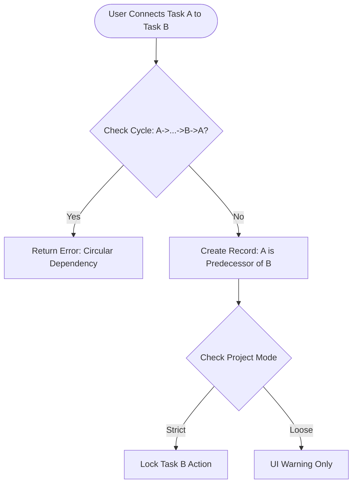

**Project**: PronaFlow
**Version**: 1.0
**State**: Draft
*Last updated: Jan 04, 2026*

---
# 1. Business Overview
Trong hệ thống PronaFlow, Task (CĂ´ng việc) lĂ  Ä‘Æ¡n vị nguyĂªn tá»­ (Atomic Unit) của giĂ¡ trị. Mọi hoạt Ä‘á»™ng quản trị, cá»™ng tĂ¡c vĂ  Ä‘o lường đều xoay quanh thá»±c thể nĂ y. Module nĂ y chịu trĂ¡ch nhiệm về:
1. Work Breakdown Structure ( #WBS): PhĂ¢n rĂ£ dá»± Ă¡n thĂ nh cĂ¡c phĂ¢n quản lĂ½ được: `Task Lists` -> `Tasks` -> `Subtasks`
	1.  Task Lists (Danh sĂ¡ch cĂ´ng việc): ÄĂ³ng vai trĂ² lĂ  cĂ¡c "Container" dĂ¹ng để gom nhĂ³m cĂ¡c cĂ´ng việc. TĂ¹y theo phÆ°Æ¡ng phĂ¡p quản lĂ½ (Waterfall hay Agile), Task List cĂ³ thể đại diện cho cĂ¡c Giai Ä‘oạn (Phrase), Print, hoặc cĂ¡c NhĂ³m chức năng tĂ¹y theo cấu hình mĂ  người dĂ¹ng triển khai trong dá»± Ă¡n của họ.
	2. Tasks (CĂ´ng việc): Đơn vị thá»±c thi chĂ­nh, chứa đầy đủ thĂ´ng tin về tiến Ä‘á»™, thời gian, vĂ  người thá»±c hiện. Task bắt buá»™c nằm trong má»™t Task List.
	3. Subtasks (CĂ´ng việc con): CĂ¡c đầu mục kiểm tra (Checklist) nhỏ nằm trong Task, giĂºp chia nhỏ khối lượng cĂ´ng việc phức tạp.
2. Execution: Cung cấp đầy đủ cĂ´ng cụ để thá»±c thi cĂ´ng việc (GĂ¡n người, đặt hạn, dĂ¡n nhĂ£n).
3. Orchestrain (Điều phối): Quản lĂ½ dá»± phụ thuá»™c vĂ  lặp lại để đảm bảo dĂ²ng chảy cĂ´ng việc khĂ´ng bị giĂ¡n Ä‘oạn.
# 2. User Stories & Acceptance Criteria
## 2.1. Feature: Task List Management
### User Story 4.1.
LĂ  má»™t Quản lĂ½ dá»± Ă¡n, TĂ´i muốn tạo, sắp xếp vĂ  quản lĂ½ cĂ¡c Task List trong dá»± Ă¡n. Để phĂ¢n chia dá»± Ă¡n thĂ nh cĂ¡c giai Ä‘oạn rõ rĂ ng hoặc cĂ¡c nhĂ³m việc logic.
### Acceptance Criteria ( #AC)
#### AC 1 - Container Management
- **Action:** CRUD Task List.
- **Constraint:** KhĂ´ng thể xĂ³a má»™t List nếu nĂ³ Ä‘ang chứa Task (Phải di chuyển Task Ä‘i nÆ¡i khĂ¡c hoặc Archive cả List).
#### AC 2 - Drag & Drop Ordering
- **Action:** KĂ©o thả List A sang vị trĂ­ của List B.
- **System:** Cập nhật trường `position` trong DB. Đảm bảo trải nghiệm mượt mĂ , khĂ´ng bị giật (Optimistic UI update).
## 2.2. Feature: Task Execution
### User Story 4.2.
LĂ  má»™t ThĂ nh viĂªn dá»± Ă¡n, TĂ´i muốn tạo má»™t Task má»›i nằm trong má»™t Task List cụ thể, Để xĂ¡c định rõ cĂ´ng việc cần lĂ m, thời hạn vĂ  mức Ä‘á»™ Æ°u tiĂªn.
### Acceptance Critera ( #AC)
#### AC 1 - Parent Constraint:
- Rule: Má»™t Task khĂ´ng thể tồn tại Ä‘á»™c lập. Khi tạo Task, hệ thống buá»™c phải gĂ¡n `task_list_id`
#### AC 2 - Metadata Management:
- Há»— trợ cập nhật cĂ¡c trường thĂ´ng tin quan trọng:
	- `Title` (Bắt buộc).
	- `Assigness` (Cho phĂ©p gĂ¡n nhiều người, nhÆ°ng phải chỉ định 1 người chịu trĂ¡ch nhiệm chĂ­nh - Primary Owner).
	- `Priority`: Mức Ä‘á»™ Æ°u tiĂªn (Chọn từ Danh mục: `Low`, `Medium`, `High`, `Urgent`)
	- `Status`: Trạng thĂ¡i xá»­ lĂ½ của Task (`Not-Started`, `In-Progress`, `Done`).
	- `Date Range`: `Start Date` vĂ  `End Date` ($End Date >= Start Date$), cĂ³ thể cĂ³ giờ cụ thể (e.g. 17:00 31/12).
	- `Estimated Hours`: Ước lượng thời gian lĂ m việc (số giờ) (Input cho [[10 - Intelligent Decision Support System|Module 10]] vĂ  [[11 - Advanced Analytics and Reporting|Module 11]])
	- `Is Milestone`: ÄĂ¡nh dấu Ä‘Ă¢y lĂ  cá»™t mốc quan trọng của dá»± Ă¡n.
- Trigger: Khi tạo xong, hệ thống gá»­i thĂ´ng bĂ¡o cho người được gĂ¡n ([[7 - Event-Driven Notification System|Module 7]])
#### AC 3 - Tags & Labels System
- Action: User cĂ³ thể tạo má»›i hoặc chọn tag cĂ³ sẵn.
- Visual: Má»—i tag cĂ³ má»™t mĂ u sắc riĂªng biệt để nhận diện trĂªn Board.
- Scope: Tag được quản lĂ½ ở cấp Ä‘á»™ Workspace để tĂ¡i sá»­ dụng giữa cĂ¡c dá»± Ă¡n.
- Xem chi tiết tại: [[]]
#### AC 44 - Time Tracking Integration
- **UI:** Hiển thị nĂºt "Start Timer" ngay trĂªn Task Detail.
- **Logic:** Khi bấm Start -> Gọi API sang **Module 11** để bắt đầu tĂ­nh giờ. Khi bấm Stop -> LÆ°u Log.
## 2.3. Feature: Subtasks.
### User Story 4.3.
- LĂ  má»™t Người thá»±c hiện (Assignee), 
- TĂ´i muốn chia nhỏ Task thĂ nh danh sĂ¡ch kiểm tra (Checklist),
- Để kiểm soĂ¡t cĂ¡c bÆ°á»›c thá»±c hiện chi tiết mĂ  khĂ´ng cần tạo thĂªm Task lá»›n.
### Acceptance Criteria ( #AC)
#### AC 1 - Checklist Behavior
- **Input:** Nhập text vĂ  Enter để thĂªm dĂ²ng má»›i nhanh.
- **State:** Má»—i subtask cĂ³ checkbox (Done/Not Done).
- **Progress Bar:** Task cha hiển thị thanh tiến Ä‘á»™ dá»±a trĂªn % Subtask hoĂ n thĂ nh (VĂ­ dụ: 3/4 Subtasks = 75%).
#### AC 2 - Assignable Subtasks
- Cho phĂ©p gĂ¡n người thá»±c hiện riĂªng cho từng Subtask (nếu cần thiết). Nếu khĂ´ng gĂ¡n, mặc định thuá»™c về người lĂ m Task cha.
- Scope: Đối vá»›i gĂ¡n Subtask chỉ cho phĂ©p gĂ¡n cho những người được gĂ¡n trong Task cha.
#### AC 3 - Ordering:
- CĂ¡c Subtask cĂ³ thể được sắp xếp lại thứ tá»± (`position`) để thể hiện quy trình thá»±c hiện cĂ¡c bÆ°á»›c.
## 2.4. Feature: Task Dependencies (Predecessor & Successor).
### User Story 4.4.
- LĂ  má»™t Quản lĂ½ dá»± Ă¡n, 
- TĂ´i muốn thiết lập cĂ¡c mối quan hệ giữa Task A vĂ   Task B, 
- Để đảm bảo quy trình thá»±c hiện Ä‘Ăºng trình tá»±.
### Acceptance Criteria ( #AC)
#### AC 1 - Dependency Definition
- **Data Model:** Định nghÄ©a quan hệ `Predecessor` (Task A - Việc trÆ°á»›c) vĂ  `Successor` (Task B - Việc sau).
- **Default Type:** Hỗ trợ chuẩn **Finish-to-Start (FS)**.
    - *Logic:* Task B khĂ´ng thể chuyển sang `In-Progress` nếu Task A chÆ°a `Done`.
#### AC 2 - Cycle Detection Validation
- **Logic:** Khi User cố gắng nối A -> B, hệ thống kiểm tra đồ thị. Nếu phĂ¡t hiện B Ä‘ang giĂ¡n tiếp chặn A (A -> ... -> B), ngăn chặn hĂ nh Ä‘á»™ng vĂ  bĂ¡o lá»—i `TASK_001: Circular dependency detected`.
## 2.5. Feature: Recurring Tasks (CĂ´ng việc lặp lại)
### User Story 4.5
LĂ  má»™t Team Lead, TĂ´i muốn thiết lập Task "Gá»­i bĂ¡o cĂ¡o tuần" tá»± Ä‘á»™ng lặp lại vĂ o thứ 6 hĂ ng tuần, Để khĂ´ng phải tạo thủ cĂ´ng.
### Acceptance Criteria (#AC)
#### AC 1 - Recurrence Pattern
- Há»— trợ cĂ¡c mẫu: 
	- Daily, 
	- Weekly (chọn ngĂ y trong tuần), 
	- Monthly, 
	- Custom.
#### AC 2 - Generation Strategy (Chiến lược sinh Task)
- **Lazy Generation:** Hệ thống khĂ´ng sinh ra hĂ ng nghìn task tÆ°Æ¡ng lai ngay lập tức.
- **Logic:** Chỉ sinh ra Task tiếp theo (Next Instance) khi Task hiện tại được Ä‘Ă¡nh dấu lĂ  **Done** hoặc đến ngĂ y kĂ­ch hoạt.
- **Prefix:** Tá»± Ä‘á»™ng thĂªm suffix vĂ o tĂªn task (e.g., "Report [2025-01-01]", "Report [2025-01-08]").
## 2.6. Feature: Milestones (Cá»™t mốc Dá»± Ă¡n)
### User Story 4.6
LĂ  má»™t Project Manager, TĂ´i muốn Ä‘Ă¡nh dấu cĂ¡c Task quan trọng lĂ  "Cá»™t mốc", Để dá»… dĂ ng theo dõi cĂ¡c Ä‘iểm chốt (Checkpoints) quan trọng của dá»± Ă¡n trĂªn timeline.
### Acceptance Criteria ( #AC)
#### AC 1 - Milestone Definition
- **Input:** Toggle `Is Milestone = True`.
- **Constraint:** Milestone cĂ³ `Duration = 0` (Start Date = End Date). KhĂ´ng cho phĂ©p nhập Estimated Hours.
#### AC 2 - Visual Distinction
- Hiển thị dÆ°á»›i dạng hình thoi (Diamond shape) trĂªn biểu đồ Gantt vĂ  cĂ³ icon nổi bật trong danh sĂ¡ch Task để phĂ¢n biệt vá»›i Task thường.

## 2.7. Feature: Bulk Actions (Thao tĂ¡c hĂ ng loạt)
### User Story 4.7
LĂ  má»™t Người dĂ¹ng, TĂ´i muốn chọn vĂ  chỉnh sá»­a nhiều Task cĂ¹ng má»™t lĂºc, Để tiết kiệm thời gian khi cần thay đổi trạng thĂ¡i hoặc người thá»±c hiện cho cả nhĂ³m việc.
### Acceptance Criteria ( #AC)
#### AC 1 - Multi-select Interaction
- **Interaction:** Giữ phĂ­m `Shift` hoặc `Ctrl/Cmd` để chọn nhiều Task, hoặc tick vĂ o checkbox đầu dĂ²ng.
- **Floating Toolbar:** Khi cĂ³ >1 task được chọn, hiển thị thanh cĂ´ng cụ nổi phĂ­a dÆ°á»›i mĂ n hình: "X Tasks selected".
#### AC 2 - Batch Operations
- Há»— trợ cĂ¡c hĂ nh Ä‘á»™ng:
    - `Move to...`: Di chuyển sang List khĂ¡c hoặc Dá»± Ă¡n khĂ¡c.
    - `Set Status/Priority/Assignee`: Cập nhật đồng loạt giĂ¡ trị má»›i.
    - `Delete`: XĂ³a nhiều task (YĂªu cầu confirm).
## 2.8. Feature: Custom Fields (Trường tĂ¹y chỉnh)
### User Story 4.8
LĂ  má»™t **Pro User**, TĂ´i muốn định nghÄ©a thĂªm cĂ¡c trường dữ liệu đặc thĂ¹ (nhÆ° "Ticket ID", "KhĂ¡ch hĂ ng"), Để quản lĂ½ thĂ´ng tin sĂ¡t vá»›i nghiệp vụ thá»±c tế của cĂ´ng ty.
### Acceptance Criteria ( #AC)
#### AC 1 - Field Definition (Project Level)
- PM cĂ³ thể tạo Custom Field trong Project Settings.
- **Data Types:** Text, Number, Dropdown (Single/Multi select), Date, Checkbox, URL.
#### AC 2 - Tier Enforcement (RBAC)
- TĂ­nh năng nĂ y chỉ khả dụng cho Workspace sá»­ dụng gĂ³i **Pro** hoặc **Enterprise** (Check quota từ Module 13). GĂ³i Free bị khĂ³a chức năng nĂ y.
#### AC 3 - Task Input
- CĂ¡c trường tĂ¹y chỉnh sẽ hiển thị ở khu vá»±c riĂªng trong Task Detail. Dữ liệu nhập vĂ o phải được Validate theo kiểu dữ liệu Ä‘Ă£ định nghÄ©a.
## 2.9. Feature: Task Templates
### User Story 4.9
LĂ  má»™t Team Lead, TĂ´i muốn lÆ°u cấu trĂºc của má»™t Task mẫu (gồm mĂ´ tả, checklist, tag) vĂ  tĂ¡i sá»­ dụng nĂ³, Để chuẩn hĂ³a quy trình giao việc cho nhĂ¢n viĂªn.
### Acceptance Criteria ( #AC)
#### AC 1 - Save as Template
- Từ má»™t Task Ä‘ang cĂ³, chọn "Save as Template". Hệ thống lÆ°u lại: Description, Subtasks, Tags, Priority (khĂ´ng lÆ°u Assignee vĂ  Due Date).
#### AC 2 - Instantiate from Template
- Khi tạo Task mới, hiển thị dropdown: "Apply Template".
- Khi chọn, dữ liệu từ Template sẽ đổ vĂ o form tạo Task.
## 2.10. Feature: Watchers/Followers (Người theo dõi)
### User Story 4.10
LĂ  má»™t Stakeholder, TĂ´i muốn theo dõi má»™t Task mĂ  tĂ´i khĂ´ng trá»±c tiếp thá»±c hiện, Để nhận được thĂ´ng bĂ¡o má»—i khi cĂ³ cập nhật má»›i về tiến Ä‘á»™ hoặc thảo luận.
### Acceptance Criteria ( #AC)
#### AC 1 - Watch Logic
- **Manual:** NĂºt toggle hình con mắt (Eye Icon). Bấm để Follow/Unfollow.
- **Auto-watch:** Người tạo Task (Creator) vĂ  Người comment (Commenter) tá»± Ä‘á»™ng được thĂªm vĂ o danh sĂ¡ch Watchers (trừ khi họ tắt thủ cĂ´ng).
#### AC 2 - Notification Trigger
- Danh sĂ¡ch Watchers sẽ được [[7 - Event-Driven Notification System|Module 7]] sá»­ dụng để gá»­i thĂ´ng bĂ¡o khi cĂ³ sá»± kiện thay đổi (`task.updated`, `comment.created`).

## 2.11. Feature: Execution Constraints under Locked Plan (RĂ ng buá»™c Thá»±c thi khi Kế hoạch bị KhĂ³a)
### User Story 4.11
LĂ  má»™t ThĂ nh viĂªn dá»± Ă¡n, TĂ´i muốn biết những thĂ´ng tin nĂ o mình được phĂ©p chỉnh sá»­a khi dá»± Ă¡n Ä‘Ă£ chốt kế hoạch (Baseline), Để tĂ´i cập nhật tiến Ä‘á»™ mĂ  khĂ´ng vĂ´ tình phĂ¡ vỡ cam kết vá»›i khĂ¡ch hĂ ng.
### Acceptance Criteria (#AC)

#### AC 1 - Allowed Actions (HĂ nh Ä‘á»™ng được phĂ©p)

- DĂ¹ Plan Ä‘ang ở trạng thĂ¡i **Locked**, User vẫn được quyền:
    - Thay đổi `Status` (VĂ­ dụ: In-Progress -> Done).
    - Cập nhật `% Complete`.
    - ThĂªm `Comment`, `Attachment`.
    - Log `Time` (Time Tracking).
    - ÄĂ¡nh dấu `Subtask` lĂ  hoĂ n thĂ nh.
    - **LĂ½ do:** ÄĂ¢y lĂ  cĂ¡c hĂ nh Ä‘á»™ng thuá»™c về **Thá»±c thi (Execution)**, khĂ´ng lĂ m thay đổi cấu trĂºc kế hoạch.
#### AC 2 - Restricted Actions (HĂ nh Ä‘á»™ng bị hạn chế)
- Khi Plan = **Locked**, hệ thống vĂ´ hiệu hĂ³a (Disable/Gray-out) cĂ¡c trường sau trĂªn Form chi tiết Task:
    - `Start Date` / `End Date` (NgĂ y kế hoạch).
    - `Duration`.
    - `Dependency` (KhĂ´ng được nối thĂªm hoặc cắt bỏ dĂ¢y).
- **Exception:** Chỉ **Project Manager** má»›i cĂ³ quyền mở khĂ³a tạm thời (Override) hoặc phải Ä‘i qua quy trình Change Request (Module 5).
#### AC 3 - Scope Creep Prevention (Ngăn chặn phình to phạm vi)
- **Constraint:** KhĂ´ng cho phĂ©p tạo má»›i **Task cha (Parent Task)** trá»±c tiếp vĂ o danh sĂ¡ch khi Plan Ä‘ang Lock.
- **Allowed:** Vẫn cho phĂ©p tạo thĂªm **Subtask** (vì Subtask được xem lĂ  chi tiết hĂ³a cĂ¡ch lĂ m, miá»…n lĂ  khĂ´ng lĂ m thay đổi ngĂ y kết thĂºc của Task cha).
# 3. Business Rules
## 3.1. Quy tắc Kế thừa (Inheritance):
- Task con khĂ´ng tá»± Ä‘á»™ng kế thừa Assignee từ Task cha (để linh hoạt), nhÆ°ng nĂªn kế thừa quyền truy cập (Permissions).
## 3.2. Quy tắc RĂ ng buá»™c Custom Fields:
- Tối Ä‘a 50 Custom Fields cho má»—i dá»± Ă¡n (để bảo đảm hiệu năng render UI).
- Custom Field khi xĂ³a sẽ mất vÄ©nh viá»…n dữ liệu Ä‘Ă£ nhập trong cĂ¡c Task, cần cảnh bĂ¡o kỹ.
## 3.3. Quy tắc Dependency Chặt chẽ (Strict Dependency):
- Nếu cấu hình Project lĂ  `Strict Mode`: Hệ thống **khĂ³a** (Disable) nĂºt "Start" hoặc "Complete" của Task Successor nếu Task Predecessor chÆ°a xong.
- Nếu `Loose Mode` (Mặc định): Chỉ hiển thị cảnh bĂ¡o (Warning Toast) nhÆ°ng vẫn cho phĂ©p lĂ m.
## 3.4. Quy tắc "Actual vs Planned" (Thực tế vs Kế hoạch)
- PhĂ¢n hệ 4 cần phĂ¢n biệt rõ hai bá»™ dữ liệu ngĂ y thĂ¡ng:
    1. **Planned Dates (Baseline):** NgĂ y cam kết (Do Module 5 quản lĂ½, bị Read-only khi Lock).
    2. **Actual Dates:** NgĂ y thá»±c tế (Do Module 4 ghi nhận).
        - _Actual Start:_ Tự động điền `NOW()` khi Task chuyển sang `In-Progress`.
        - _Actual End:_ Tự động điền `NOW()` khi Task chuyển sang `Done`.
- **Logic:** Việc nhĂ¢n viĂªn lĂ m xong sá»›m hay muá»™n (Actual khĂ¡c Planned) lĂ  chuyện bình thường, hệ thống ghi nhận sá»± chĂªnh lệch nĂ y để tĂ­nh KPI, chứ khĂ´ng chặn nhập liệu.
## 3.5. Quy tắc "Auto-Push" khi trễ hạn
- **Vấn đề:** Task A cĂ³ Deadline hĂ´m qua (Planned End = Yesterday), nhÆ°ng hĂ´m nay vẫn chÆ°a xong (`Status != Done`).
- **Xá»­ lĂ½:**
    - Nếu Plan **Unlocked**: Hệ thống cĂ³ thể tá»± Ä‘á»™ng đẩy Planned End sang hĂ´m nay (Auto-reschedule).
    - Nếu Plan **Locked**: Giữ nguyĂªn Planned End lĂ  ngĂ y hĂ´m qua (để ghi nhận lĂ  Trá»… hạn - Overdue). Hệ thống hiển thị nhĂ£n **"Overdue by X days"** mĂ u đỏ.
# 4. Theoretical Basis (CÆ¡ sở LĂ½ luận)
## 4.1. Work Breakdown Structure (WBS)
Module nĂ y tuĂ¢n thủ nguyĂªn tắc phĂ¢n rĂ£ cĂ´ng việc WBS:
- **Level 1:** Project.
- **Level 2:** Task Lists (Phases/Epics).
- **Level 3:** Tasks (Work Packages).
- **Level 4:** Subtasks (Activities). GiĂºp quản lĂ½ sá»± phức tạp bằng cĂ¡ch chia nhỏ vấn đề ("Divide and Conquer").
## 4.2. Định luật Brooks (Brooks's Law)

> "ThĂªm nhĂ¢n lá»±c vĂ o má»™t dá»± Ă¡n phần mềm Ä‘ang chậm tiến Ä‘á»™ sẽ chỉ lĂ m nĂ³ chậm thĂªm."

Áp dụng vĂ o tĂ­nh năng **Activity Log & Dependencies**: Việc giao tiếp khĂ´ng rõ rĂ ng (Implicit Communication) lĂ  nguyĂªn nhĂ¢n gĂ¢y chậm trá»…. Hệ thống lĂ m rõ cĂ¡c phụ thuá»™c vĂ  lịch sá»­ thay đổi để giảm chi phĂ­ giao tiếp (Communication Overhead), giĂºp việc thĂªm người má»›i (nếu cần) dá»… dĂ ng hÆ¡n nhờ lịch sá»­ minh bạch.
## 4.3. Getting Things Done (GTD Methodology)
Há»— trợ tÆ° duy GTD thĂ´ng qua cĂ¡c trạng thĂ¡i Task:
- **In-Basket:** Task má»›i tạo (chÆ°a phĂ¢n loại).
- **Next Action:** Task cĂ³ ngĂ y vĂ  người lĂ m cụ thể.
- **Waiting For:** Task bị chặn (Blocked by dependency).
- **Someday/Maybe:** Task ở trạng thĂ¡i "Hold".
## 4.4. SÆ¡ đồ Luồng xá»­ lĂ½ Dependency:

## 4.5. Dependency Types Matrix
| **MĂ£ (Code)** | **TĂªn loại (Type)**  | **KĂ½ hiệu**                   | **MĂ´ tả Quy chuẩn (Logic)**                                                              | **VĂ­ dụ Thá»±c tế (Business Case)**                                                   | **Mức Ä‘á»™ Há»— trợ trong PronaFlow**          |
| ------------- | -------------------- | ----------------------------- | ---------------------------------------------------------------------------------------- | ----------------------------------------------------------------------------------- | ------------------------------------------ |
| **FS**        | **Finish-to-Start**  | $A \rightarrow B$             | **Task B** khĂ´ng thể bắt đầu cho đến khi **Task A** kết thĂºc. ($Start_B \geq End_A$)  | Phải _đổ mĂ³ng_ (A) xong thì má»›i được _xĂ¢y tường_ (B).                               | **Mặc định (Default)** ✅ Há»— trợ đầy đủ. |
| **SS**        | **Start-to-Start**   | $Start_A \rightarrow Start_B$ | **Task B** khĂ´ng thể bắt đầu cho đến khi **Task A** bắt đầu. ($Start_B \geq Start_A$) | Khi bắt đầu _viết code_ (A) thì cĂ³ thể bắt đầu _viết test case_ (B) song song.      | ⚠️ **Optional** (CĂ¢n nhắc cho Phase 2). |
| **FF**        | **Finish-to-Finish** | $End_A \rightarrow End_B$     | **Task B** khĂ´ng thể kết thĂºc cho đến khi **Task A** kết thĂºc. ($End_B \geq End_A$)   | Việc _nghiệm thu_ (B) chỉ xong khi việc _sá»­a lá»—i_ (A) Ä‘Ă£ xong hoĂ n toĂ n.            | ⚠️ **Optional** (CĂ¢n nhắc cho Phase 2). |
| **SF**        | **Start-to-Finish**  | $Start_A \rightarrow End_B$   | **Task B** khĂ´ng thể kết thĂºc cho đến khi **Task A** bắt đầu. ($End_B \geq Start_A$)  | Ca trá»±c của _bảo vệ cÅ©_ (B) chỉ kết thĂºc khi _bảo vệ má»›i_ (A) Ä‘Ă£ đến vĂ  bắt đầu ca. | ❌ **KhĂ´ng há»— trợ** (Ít dĂ¹ng, gĂ¢y rối).  |
## 4.6. Iron Triangle Constraints (RĂ ng buá»™c Tam giĂ¡c sắt)
Trong quản lĂ½ dá»± Ă¡n, thay đổi má»™t cạnh sẽ ảnh hưởng cĂ¡c cạnh cĂ²n lại. PhĂ¢n hệ 4 thá»±c thi cĂ¡c rĂ ng buá»™c nĂ y:
- **Scope (Phạm vi):** Được cố định bởi danh sĂ¡ch Task. Khi Lock Plan -> Cố định Scope.
- **Time (Thời gian):** Được cố định bởi Start/End Date.
- **Cost (Chi phĂ­):** Được cố định bởi Resource Assignee. -> Việc ngăn chặn thĂªm Task má»›i hoặc đổi người khi Plan Locked chĂ­nh lĂ  bảo vệ sá»± toĂ n vẹn của Tam giĂ¡c sắt dá»± Ă¡n.

