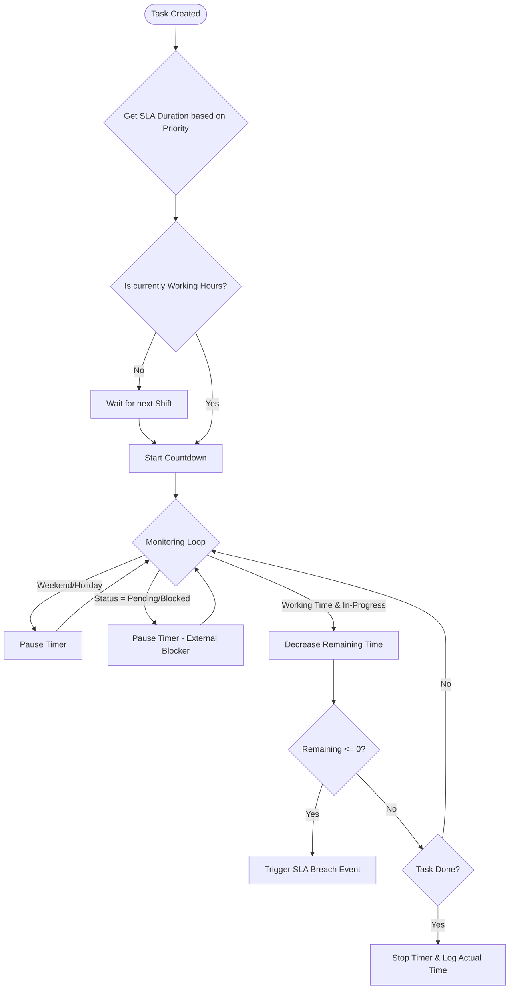

**Project**: PronaFlow 
**Version**: 1.1 
**State**: Draft 
*Last updated: Jan 04, 2026*

---
# 1. Business Overview
Module nĂ y đại diện cho phĂ¢n hệ "Planning" (Hoạch định Dá»± Ă¡n) chuyĂªn sĂ¢u của dá»± Ă¡n. KhĂ¡c vá»›i việc quản lĂ½ thá»±c thi hĂ ng ngĂ y (Task Execution - Module 4), module nĂ y tập truung vĂ o tầm nhìn dĂ i hạn vĂ  sá»± phụ thuá»™c giữa cĂ¡c đầu việc.
**Triết lĂ½ Thiết kế**: "***Optional & Scalable***": Hệ thống PronaFlow tĂ´n trọng quy mĂ´ của từng dá»± Ă¡n. KhĂ´ng phải dá»± Ă¡n nĂ o cÅ©ng cần biểu đồ Gantt phức tạp hay cÆ¡ chế tĂ­nh toĂ¡n lịch trình.
- **Đối vá»›i dá»±a Ă¡n nhỏ** (**Simple/Agile**): Người dĂ¹ng cĂ³ thể bỏ qua module nĂ y. Họ chỉ cần tạo Task List, Task vĂ  Subtask (nhÆ° Module 3&4 trình bĂ y) để quản lĂ½ Dá»±a Ă¡n Ä‘Æ¡n giản vĂ  gọn nhẹ.
- **Đối vá»›i Dá»± Ă¡n lá»›n** (**Waterfall/Hybrid**): Project Leader cĂ³ thể kĂ­ch hợp chế Ä‘á»™ "Planning". Khi Ä‘Ă³, Project Leader cĂ³ thể thá»±c hiện cĂ¡c tĂ¡c vụ hoạch định dá»± Ă¡n, nhÆ° Gantt Chart, Resource Balancing vĂ  SLA Tracking.
# 2. User Stories & Acceptance Criteria

## 2.1. Feature: Interactive Gantt Chart (Biểu đồ Gantt tÆ°Æ¡ng tĂ¡c)
### User Story 5.1
LĂ  má»™t Project Manager, TĂ´i muốn trá»±c quan hĂ³a lịch trình dá»± Ă¡n trĂªn biểu đồ Gantt vĂ  thao tĂ¡c kĂ©o thả, Để nhìn thấy bức tranh tổng thể vĂ  Ä‘iều chỉnh kế hoạch nhanh chĂ³ng.
### Acceptance Criteria ( #AC)
#### AC 1 - Visualization Elements
- **Timeline:** Trục hoĂ nh hiển thị thời gian (Zoom level: Day, Week, Month, Quarter).
- **Task Bars:**
    - Độ dài thanh = `Duration` (Start -> End).
    - MĂ u sắc thể hiện `Status` (Xanh: Done, Lam: In-progress).
    - Hiển thị `% Progress` lấp đầy bĂªn trong thanh task.
- **Milestones:** Hiển thị cĂ¡c Task cĂ³ cờ `Is Milestone = True` (từ Module 4) dÆ°á»›i dạng hình thoi (Diamond) mĂ u vĂ ng/đỏ.
#### AC 2 - Interaction (KĂ©o thả thĂ´ng minh)
- **Move:** KĂ©o cả thanh Task để dời ngĂ y (Shift Dates).
- **Resize:** KĂ©o cạnh phải để tăng/giảm `Duration`.
- **Constraint:** Nếu Task cĂ³ Subtasks, thanh Task cha chỉ lĂ  bao hình (Wrapper), khĂ´ng thể kĂ©o thả trá»±c tiếp (Thời gian Task cha tá»± Ä‘á»™ng = Min Start -> Max End của con).

## 2.2. Feature: Auto-Scheduling & Dependencies Impact
### User Story 5.2
LĂ  má»™t PM, TĂ´i muốn hệ thống tá»± Ä‘á»™ng tĂ­nh toĂ¡n lại lịch trình khi cĂ³ thay đổi, Để đảm bảo cĂ¡c rĂ ng buá»™c phụ thuá»™c (Dependency) luĂ´n được tuĂ¢n thủ mĂ  khĂ´ng cần chỉnh sá»­a thủ cĂ´ng hĂ ng trăm task.
### Acceptance Criteria ( #AC)
#### AC 1 - Cascade Updates (Cập nhật dĂ¢y chuyền)
- **Scenario:** Task A (Predecessor) bị trễ 2 ngày.
- **System Action:**
    - Tá»± Ä‘á»™ng dời `Start Date` của Task B (Successor - quan hệ FS) lĂ¹i lại 2 ngĂ y.
    - Tiếp tục dời Task C (Successor của B).
#### AC 2 - Conflict Highlighting
- Nếu việc dời lịch lĂ m vi phạm `Hard Deadline` của Dá»± Ă¡n hoặc Task cha, hệ thống hiển thị đường gạch chĂ©o đỏ (Red Hash) trĂªn vĂ¹ng bị vi phạm vĂ  hiện cảnh bĂ¡o: "Schedule Conflict".
#### AC 3 - Scheduling Mode (Chế độ lập lịch)
- Cho phĂ©p thiết lập trĂªn từng Task:
    - **Auto-scheduled:** Tá»± Ä‘á»™ng trĂ´i theo Task trÆ°á»›c (Mặc định).
    - **Manually-scheduled (Pinned):** Cố định ngĂ y, khĂ´ng bị ảnh hưởng bởi Auto-scheduling. Hiển thị icon "CĂ¡i ghim" trĂªn thanh Task.
#### AC 4 - Lag & Lead Time Configuration
- **Interaction:** Khi click Ä‘Ăºp vĂ o đường nối (Dependency Line) giữa 2 Task, hiển thị Modal/Popover cấu hình.
- **Input:** Cho phĂ©p nhập số ngĂ y lệch (Offset Days).
    - Số dÆ°Æ¡ng (+2d): **Lag Time** (Chờ 2 ngĂ y).
    - Số Ă¢m (-1d): **Lead Time** (LĂ m sá»›m 1 ngĂ y trÆ°á»›c khi việc trÆ°á»›c kết thĂºc).
- **Calculation:** $Start(B) = End(A) + Offset$.
## 2.3. Feature: Critical Path Analysis (PhĂ¢n tĂ­ch Đường găng)
### User Story 5.3
LĂ  má»™t PM, TĂ´i muốn biết những cĂ´ng việc nĂ o lĂ  quan trọng nhất quyết định thời gian hoĂ n thĂ nh dá»± Ă¡n, Để tĂ´i tập trung nguồn lá»±c vĂ o Ä‘Ă³ vĂ  khĂ´ng để chĂºng bị trá»….
### Acceptance Criteria ( #AC)
#### AC 1 - Highlight Critical Path
- **Toggle:** CĂ³ nĂºt bật/tắt "Show Critical Path".
- **Visual:** Khi bật, hệ thống tĂ´ viền đỏ đậm cho cĂ¡c Task nằm trĂªn đường găng (Tasks cĂ³ `Total Float = 0`).
#### AC 2 - Dynamic Recalculation
- Khi người dĂ¹ng rĂºt ngắn thời gian má»™t Task trĂªn đường găng, hệ thống tĂ­nh toĂ¡n lại. Nếu đường găng thay đổi sang nhĂ¡nh khĂ¡c, cập nhật highlight tức thì.

## 2.4. Feature: Project Baselines (Vạch cơ sở)
### User Story 5.4
LĂ  má»™t PM, TĂ´i muốn lÆ°u lại bản kế hoạch ban đầu trÆ°á»›c khi dá»± Ă¡n chạy, Để sau nĂ y so sĂ¡nh được thá»±c tế Ä‘ang nhanh hay chậm hÆ¡n so vá»›i kế hoạch gốc.
### Acceptance Criteria ( #AC)
#### AC 1 - Create Snapshot
- **Action:** Chọn "Save Baseline".
- **System:** LÆ°u bản sao (Snapshot) của `Start Date`, `End Date`, `Duration` của toĂ n bá»™ Task tại thời Ä‘iểm Ä‘Ă³ vĂ o bảng `task_baselines`.
#### AC 2 - Visual Comparison
- TrĂªn Gantt Chart, hiển thị 2 thanh song song cho má»—i Task:
    - **Thanh mờ (Gray bar):** Kế hoạch gốc (Baseline).
    - **Thanh mĂ u (Colored bar):** Thá»±c tế (Actual).
- GiĂºp PM nhìn thấy trá»±c quan Ä‘á»™ lệch (Variance).

## 2.5. Feature: Workload & Resource Balancing (CĂ¢n bằng nguồn lá»±c)
### User Story 5.5
LĂ  má»™t PM, TĂ´i muốn nhìn thấy biểu đồ tải cĂ´ng việc của nhĂ¢n viĂªn ngay trong lĂºc lập kế hoạch, Để trĂ¡nh việc giao quĂ¡ nhiều việc cho má»™t người trong cĂ¹ng má»™t ngĂ y (Overallocation).
### Acceptance Criteria ( #AC)
#### AC 1 - Resource Histogram
- DÆ°á»›i Gantt Chart cĂ³ má»™t panel hiển thị biểu đồ cá»™t chồng (Stacked Bar) cho từng nhĂ¢n sá»± theo ngĂ y.
- **Ngưỡng:** Nếu tổng giờ lĂ m việc dá»± kiến > 8h/ngĂ y -> Cá»™t chuyển mĂ u đỏ (Overload).
#### AC 2 - Soft Warning
- Khi gĂ¡n Task cho User A vĂ o khung giờ họ Ä‘Ă£ bận, hiển thị Warning: "User A is overloaded on [Date]". Hệ thống vẫn cho phĂ©p lÆ°u (Soft Constraint) nhÆ°ng cảnh bĂ¡o rủi ro.

## 2.6. Feature: Calendar View (Giao diện Lịch)
### User Story 5.6
LĂ  má»™t ThĂ nh viĂªn, TĂ´i muốn xem cĂ¡c cĂ´ng việc của mình dÆ°á»›i dạng lịch thĂ¡ng/tuần, Để dá»… hình dung lịch trình cĂ¡ nhĂ¢n.
### Acceptance Criteria ( #AC)
#### AC 1 - View Modes
- Há»— trợ xem theo ThĂ¡ng (Month), Tuần (Week), NgĂ y (Day).
- Cho phĂ©p lọc: "My Tasks", "Project Tasks".
#### AC 2 - External Sync (TĂ­ch hợp Module 12)
- Cung cấp link iCal/WebCal để đồng bộ 1 chiều sang Google Calendar/Outlook.
## 2.7. Feature: SLA Tracking (Theo dõi Cam kết Dịch vụ)
### User Story 5.7
LĂ  má»™t Quản lĂ½, TĂ´i muốn thiết lập vĂ  theo dõi SLA cho cĂ¡c Task quan trọng, Để đảm bảo Ä‘á»™i ngÅ© khĂ´ng chỉ hoĂ n thĂ nh việc mĂ  cĂ²n Ä‘Ă¡p ứng Ä‘Ăºng cam kết về thời gian phản hồi.
### Acceptance Criteria ( #AC)
#### AC 1 - SLA Definition
- Cho phĂ©p định nghÄ©a `SLA Policy` dá»±a trĂªn Ä‘á»™ Æ°u tiĂªn (Priority).
    - _Urgent:_ 4 giờ lĂ m việc.
    - _High:_ 1 ngày làm việc (8h).
    - _Normal:_ 3 ngày làm việc.
#### AC 2 - Business Hours Logic
- **Calculation:** Bá»™ đếm thời gian (Timer) chỉ chạy trong khung giờ lĂ m việc (vĂ­ dụ: 08:00 - 17:00, T2-T6).
- **Exclusion:** Tá»± Ä‘á»™ng trừ cĂ¡c ngĂ y nghỉ lá»… (Holidays) vĂ  cuối tuần (Weekends) được cấu hình trong Workspace Settings.
#### AC 3 - Visual Warning
Hệ thống hiển thị trạng thĂ¡i SLA thĂ´ng qua mĂ£ mĂ u trĂªn thẻ Task:
- **On Track (Xanh):** Thời gian trĂ´i qua < 75% SLA.
- **At Risk (VĂ ng):** Thời gian trĂ´i qua $\geq$ 75% SLA.
- **Breached (Đỏ):** Thời gian trĂ´i qua > 100% SLA.
#### AC 4 - SLA Pause Conditions
- **Logic:** Đồng hồ SLA (Timer) phải **Tạm dừng** khi Task chuyển sang trạng thĂ¡i thuá»™c nhĂ³m `Blocking` (vĂ­ dụ: "Waiting for Customer", "Blocked").
- **Resume:** Đồng hồ tiếp tục chạy khi Task quay lại trạng thĂ¡i `Active` (In-Progress).
- **Audit:** Ghi log lại khoảng thời gian bị Pause để giải trình khi xuất bĂ¡o cĂ¡o.
## 2.8. Feature: Export & Reporting (Xuất dữ liệu)
### User Story 5.8 
- LĂ  má»™t PM, 
- TĂ´i muốn xuất biểu đồ Gantt ra file ảnh hoặc PDF, 
- Để bĂ¡o cĂ¡o tiến Ä‘á»™ trong cĂ¡c cuá»™c họp vá»›i Ban lĂ£nh đạo (những người khĂ´ng truy cập hệ thống). 
### Acceptance Criteria ( #AC) 
#### AC 1 - Export Options 
- Hỗ trợ xuất ra: PDF (A4/A3 Landscape), PNG. 
- TĂ¹y chọn khoảng thời gian xuất (ToĂ n bá»™ dá»± Ă¡n hoặc ThĂ¡ng nĂ y).
## 2.9. Feature: Planning Scope Control (Kiểm soĂ¡t phạm vi hoạch định)
### Business Problem
Trong thực tế:
- KhĂ´ng phải **mọi Task** đều cần:
    - Auto-scheduling
    - CPM
    - Dependency cascade
- PM thường:
    - Chỉ hoạch định **Phase chĂ­nh**
    - Hoặc **Task Level cao**
    - CĂ²n Task chi tiết để team tá»± xá»­ lĂ½
Nếu khĂ´ng cĂ³ Scope Control:
- Gantt quĂ¡ phức tạp
- CPM nhiá»…u
- Auto-scheduling phĂ¡ vỡ kế hoạch vi mĂ´

> [!NOTE] Business Definition
> Planning Scope xĂ¡c định Task/Phase nĂ o được hệ thống coi lĂ  đối tượng hoạch định, tham gia vĂ o cĂ¡c thuật toĂ¡n Scheduling, CPM vĂ  Impact Analystic.
### User Story 5.9
LĂ  má»™t Project Manager, tĂ´i muốn chỉ định phạm vi cĂ¡c Task/Phase được Ä‘Æ°a vĂ o hoạch định, để tập trung vĂ o kế hoạch cấp cao mĂ  khĂ´ng bị nhiá»…u bởi cĂ¡c Task chi tiết.
### Acceptance Criteria ( #AC)
#### AC 1 – Scope Flag
- Má»—i **Task / Task List / Phase** cĂ³ thuá»™c tĂ­nh:
    - `IncludeInPlanning: Boolean`
- Mặc định:
    - Level cao (Phase, Task List): `true`
    - Subtask chi tiết: `false`
#### AC 2 – Scope Inheritance
- Nếu Parent = `IncludeInPlanning = false`  
    → toàn bộ Children **tự động excluded**
- PM cĂ³ thể override ở Child (nếu được quyền)
#### AC 3 – Behavior Rules
Task **khĂ´ng thuá»™c Planning Scope**:
- KhĂ´ng tham gia:
    - CPM
    - Auto-scheduling
    - Dependency cascade
-  Vẫn:
    - Hiển thị trĂªn Gantt (mĂ u xĂ¡m nhạt)
    - CĂ³ thể gĂ¡n người, cập nhật trạng thĂ¡i
#### AC 4 – Visual Distinction
- Task ngoĂ i scope:
    - Opacity giảm (30–40%)
    - KhĂ´ng vẽ dependency line
- Tooltip:
    > “This task is excluded from planning scope”
#### AC 5 – Scope Summary
- Panel hiển thị:
    - Tổng số Task trong scope
    - % phạm vi dá»± Ă¡n được hoạch định
## 2.10. Feature: What-If Simulation Mode
### Business Problem
PM thường:
- Muốn thử:
    - Dời Task
    - ThĂªm Dependency
    - RĂºt Duration
- NhÆ°ng:
    - Sợ phĂ¡ kế hoạch thật
    - KhĂ´ng thấy trÆ°á»›c hậu quả
KhĂ´ng cĂ³ Simulation = **Hệ thống khĂ´ng an toĂ n cho quyết định chiến lược**
### User Story 5.10.
LĂ  PM, tĂ´i muốn mĂ´ phỏng thay đổi lịch trình để thấy tĂ¡c Ä‘á»™ng trÆ°á»›c khi quyết định Ă¡p dụng.
### Acceptance Criteria ( #AC)
#### AC 1 – Enter Simulation Mode
- Toggle “Simulation Mode”
- UI chuyển:
	 - MĂ u nền vĂ ng nhạt
	 - Watermark: _Simulation_
#### AC 2 – Simulation Behavior
Trong Simulation:
- Cho phép:
	 - KĂ©o Gantt
	 - Đổi Dependency
	 - Thay Duration
- KhĂ´ng ghi DB chĂ­nh
- Tất cả thay đổi lưu trong **temporary simulation graph**
#### AC 3 – Impact Analysis Panel (Realtime)
Hiển thị:
- Δ Project End Date (+/- days)
- Tasks newly on Critical Path
- SLA at risk count
- Resource overload increase
#### AC 4 – Exit Options
Khi thoĂ¡t Simulation:
- **Apply Changes**
	 - Ghi vĂ o DB
	 - Recalculate baseline variance
- **Discard**
	 - Rollback toĂ n bá»™
- **Save as New Baseline**
	 - Baseline v2 (optional)
### 3.5. Business Rules
- Simulation **khĂ´ng trigger notification**
- SLA Timer **khĂ´ng chạy trong Simulation**
- Baseline cÅ© **khĂ´ng bị ghi đè**
## 2.11. Feature: Planning Governance & Approval Workflow
### User Story 5.11
LĂ  má»™t Program Manager, TĂ´i muốn phĂª duyệt vĂ  khĂ³a (Lock) kế hoạch dá»± Ă¡n (Baseline) trÆ°á»›c khi Ä‘Æ°a vĂ o thá»±c thi, Để đảm bảo tĂ­nh ká»· luật vĂ  ngăn chặn cĂ¡c thay đổi tĂ¹y tiện lĂ m sai lệch cam kết vá»›i khĂ¡ch hĂ ng.
### Acceptance Criteria (#AC)
#### AC 1 - Plan State Machine
- Trạng thĂ¡i của Kế hoạch (Plan) tuĂ¢n theo quy trình:
 1. **Draft:** PM Ä‘ang soạn thảo, chỉnh sá»­a thoải mĂ¡i.
 2. **Submitted:** Gá»­i yĂªu cầu phĂª duyệt.
 3. **Approved:** Được cấp trĂªn phĂª duyệt. Tạo Baseline chĂ­nh thức.
 4. **Locked:** ÄĂ£ chốt.
#### AC 2 - Locked State Behavior
- Khi Plan ở trạng thĂ¡i **Locked**:
 - VĂ´ hiệu hĂ³a tĂ­nh năng kĂ©o thả trĂªn Gantt Chart.
 - KhĂ´ng cho phĂ©p thay đổi `Duration`, `Start/End Date` trá»±c tiếp.
 - Mọi thay đổi bắt buá»™c phải thĂ´ng qua quy trình **Change Request (CR)**.
#### AC 3 - Approval Audit
- Ghi nhận: Người duyệt, Thời gian duyệt vĂ  Version của Baseline tại thời Ä‘iểm duyệt.
## 2.12. Feature: Change Impact Analysis (CIA) Panel
### User Story 5.12
LĂ  má»™t Project Manager, TĂ´i muốn hệ thống tá»± Ä‘á»™ng phĂ¢n tĂ­ch vĂ  cảnh bĂ¡o tĂ¡c Ä‘á»™ng của việc thay đổi má»™t Task cụ thể, Để tĂ´i hiểu rõ hậu quả (về tiến Ä‘á»™, chi phĂ­) trÆ°á»›c khi nhấn nĂºt LÆ°u.
### Acceptance Criteria (#AC)
#### AC 1 - Pre-save Analysis
- **Trigger:** Khi người dĂ¹ng thay đổi ngĂ y hoặc dependency của má»™t Task vĂ  nhấn Save.
- **Action:** Hệ thống hiển thị Panel "Impact Analysis" (chÆ°a ghi vĂ o DB ngay).
#### AC 2 - Impact Metrics
- Panel hiển thị rõ cĂ¡c thĂ´ng số thay đổi ($\Delta$):
 - **Project End Date:** Trá»… bao nhiĂªu ngĂ y? (VĂ­ dụ: +5 days).
 - **Critical Path:** Liệt kĂª cĂ¡c Task má»›i bị rÆ¡i vĂ o đường găng.
 - **SLA Risk:** Số lượng Task cĂ³ nguy cÆ¡ vi phạm SLA do sá»± thay đổi nĂ y.
 - **Resource Overload:** Số lượng nhĂ¢n sá»± bị quĂ¡ tải do lịch má»›i.
#### AC 3 - Confirmation
- YĂªu cầu PM phải tick chọn: _"I understand the impact"_ (TĂ´i Ä‘Ă£ hiểu tĂ¡c Ä‘á»™ng) má»›i được phĂ©p LÆ°u thay đổi.
## 2.13. Feature: Planning Drift Analytics
### User Story 5.13
LĂ  má»™t Stakeholder, TĂ´i muốn theo dõi Ä‘á»™ lệch tĂ­ch lÅ©y giữa Kế hoạch vĂ  Thá»±c thi theo thời gian, Để biết được dá»± Ă¡n Ä‘ang trá»… do khĂ¢u Lập kế hoạch yếu kĂ©m hay do khĂ¢u Thá»±c thi chậm chạp.
### Acceptance Criteria (#AC)
#### AC 1 - Schedule Variance (SV) Tracking
- Hệ thống tĂ­nh toĂ¡n chỉ số SV theo từng giai Ä‘oạn (Phase):
 $$SV = Earned\ Value (EV) - Planned\ Value (PV)$$
- Hiển thị biểu đồ xu hÆ°á»›ng (Trendline) của SV qua cĂ¡c tuần.
#### AC 2 - Phase Drift Heatmap
- Hiển thị biểu đồ nhiệt: Phase nĂ o bị lệch nhiều nhất (VĂ­ dụ: Phase "Testing" thường xuyĂªn bị trá»… 30% so vá»›i Baseline).
- **Insight:** Hệ thống Ä‘Æ°a ra nhận định text: _"70% tổng thời gian trá»… của dá»± Ă¡n đến từ giai Ä‘oạn UAT"_.
## 2.14. Feature: Risk-aware Scheduling (Optional)
### User Story 5.14
LĂ  má»™t Risk Manager, TĂ´i muốn lập lịch dá»± Ă¡n dá»±a trĂªn xĂ¡c suất rủi ro thay vì cĂ¡c con số cố định (Deterministic), Để cĂ³ cĂ¡i nhìn thá»±c tế hÆ¡n về ngĂ y hoĂ n thĂ nh khả dÄ© (P50/P90).
### Acceptance Criteria (#AC)
#### AC 1 - Risk Buffer Input
- Cho phĂ©p nhập **Risk Factor (%)** trĂªn từng Task hoặc cả Project.
- Hệ thống tá»± Ä‘á»™ng cá»™ng thĂªm **Buffer Time** vĂ o Ä‘uĂ´i Task nhÆ°ng Ä‘Ă¡nh dấu rõ Ä‘Ă¢y lĂ  thời gian dá»± phĂ²ng (khĂ´ng phải thời gian lĂ m việc chĂ­nh thức).
#### AC 2 - Probabilistic Dates
- Thay vì hiển thị 1 ngĂ y kết thĂºc duy nhất, hệ thống tĂ­nh toĂ¡n vĂ  hiển thị:
 - **P50 Date:** NgĂ y cĂ³ 50% khả năng hoĂ n thĂ nh.
 - **P90 Date:** NgĂ y cĂ³ 90% khả năng hoĂ n thĂ nh (An toĂ n để cam kết vá»›i khĂ¡ch hĂ ng).
#### AC 3 - Confidence Band
- TrĂªn Gantt Chart, hiển thị vĂ¹ng mờ (Shaded area) phĂ­a sau thanh Task thể hiện khoảng thời gian rủi ro cĂ³ thể xảy ra.
## 2.15. Feature: Planning Permissions (RBAC)
### User Story 5.15
LĂ  má»™t Admin, TĂ´i muốn phĂ¢n quyền chi tiết cho việc lập kế hoạch, Để phĂ¢n biệt rõ ai lĂ  người thiết kế lịch trình vĂ  ai chỉ lĂ  người Ä‘Ă³ng gĂ³p Ă½ kiến.
### Acceptance Criteria (#AC)
#### AC 1 - Planning Roles
- **Planner:** Quyền chỉnh sửa Gantt, tạo Dependency, lưu Baseline.
- **Contributor:** Quyền xem Gantt, comment vĂ o Task, nhÆ°ng khĂ´ng được kĂ©o thả lịch.
- **Approver:** Quyền duyệt Baseline (Feature 2.11).
#### AC 2 - Edit Lock
- Khi má»™t Planner Ä‘ang chỉnh sá»­a lịch trình (Edit Mode), hệ thống khĂ³a quyền sá»­a của cĂ¡c Planner khĂ¡c để trĂ¡nh xung Ä‘á»™t (Concurrent Editing Lock).
## 2.16. Feature: Advanced Planning Utilities
### User Story 5.16
LĂ  má»™t PM chuyĂªn nghiệp, TĂ´i muốn cĂ³ cĂ¡c cĂ´ng cụ tiện Ă­ch nĂ¢ng cao để thao tĂ¡c trĂªn biểu đồ Gantt nhanh chĂ³ng vĂ  chĂ­nh xĂ¡c.
### Acceptance Criteria (#AC)
#### AC 1 - Gantt Undo/Redo
- Há»— trợ `Ctrl+Z` / `Ctrl+Y` để hoĂ n tĂ¡c cĂ¡c hĂ nh Ä‘á»™ng kĂ©o thả nhầm trĂªn Gantt Chart (LÆ°u state tạm ở Client).
#### AC 2 - Baseline Versioning
- Quản lĂ½ danh sĂ¡ch cĂ¡c Baseline: `v1.0 (Initial)`, `v1.1 (Change Request #1)`, `v2.0 (Replanned)`.
- Cho phĂ©p chuyển đổi view để so sĂ¡nh giữa cĂ¡c version Baseline khĂ¡c nhau.
#### AC 3 - Freeze Window
- Cho phĂ©p thiết lập "VĂ¹ng Ä‘Ă³ng băng" (VĂ­ dụ: 2 tuần tá»›i).
- CĂ¡c Task nằm trong vĂ¹ng nĂ y bị khĂ³a cứng, khĂ´ng cho phĂ©p Auto-scheduling tá»± Ä‘á»™ng dời lịch, để đảm bảo ổn định cho team Ä‘ang chạy Sprint.
## 2.17. Feature: Automated Resource Leveling (CĂ¢n bằng Nguồn lá»±c Tá»± Ä‘á»™ng)
### User Story 5.17
LĂ  má»™t Project Manager, TĂ´i muốn hệ thống tá»± Ä‘á»™ng Ä‘iều chỉnh lịch trình của cĂ¡c cĂ´ng việc khĂ´ng quan trọng để giải quyết tình trạng quĂ¡ tải nhĂ¢n sá»±, Để tối Æ°u hĂ³a nguồn lá»±c mĂ  khĂ´ng cần phải dời từng Task thủ cĂ´ng.
### Acceptance Criteria (#AC)
#### AC 1 - Leveling Strategy Configuration
- **Action:** Khi nhấn nĂºt "Level Resources", hiển thị Popup cho phĂ©p chọn chiến lược:
    1. **Within Slack (An toĂ n):** Chỉ dời cĂ¡c Task cĂ³ Ä‘á»™ trĂ´i (`Total Float > 0`). Đảm bảo **khĂ´ng** lĂ m trá»… ngĂ y kết thĂºc dá»± Ă¡n.
    2. **Extend Project (ToĂ n diện):** Dời bất kỳ Task nĂ o gĂ¢y quĂ¡ tải. Chấp nhận việc ngĂ y kết thĂºc dá»± Ă¡n bị kĂ©o dĂ i ra.
#### AC 2 - Heuristic Priority Logic
- Hệ thống sá»­ dụng thuật toĂ¡n Æ°u tiĂªn để chọn Task nĂ o sẽ bị dời (Delay) khi cĂ³ xung Ä‘á»™t tĂ i nguyĂªn:
    - **Priority 1:** Task cĂ³ Ä‘á»™ Æ°u tiĂªn thấp hÆ¡n (Low Priority).
    - **Priority 2:** Task cĂ³ Ä‘á»™ trĂ´i (Float) lá»›n hÆ¡n.
    - **Priority 3:** Task cĂ³ thời lượng (Duration) ngắn hÆ¡n.
#### AC 3 - Visualization & Diff
- **Preview:** TrÆ°á»›c khi Ă¡p dụng, hệ thống hiển thị bản xem trÆ°á»›c (Shadow Bars) của lịch trình má»›i chồng lĂªn lịch trình cÅ©.
- **Diff:** Hiển thị tĂ³m tắt tĂ¡c Ä‘á»™ng: _"Sẽ dời 5 Tasks, giảm 80% xung Ä‘á»™t, ngĂ y kết thĂºc dá»± Ă¡n tăng 2 ngĂ y"_.
#### AC 4 - Constraint Adherence
- Thuật toĂ¡n Leveling **tuyệt đối khĂ´ng** được dời cĂ¡c Task:
    - Đang ở trạng thĂ¡i `Started` / `Done`.
    - CĂ³ rĂ ng buá»™c cứng (`Must Start On`, `Locked`).
    - Task Ä‘Ă£ được phĂª duyệt trong Freeze Window (Feature 5.16).
## 2.18. Feature: Cross-Project Dependencies (Phụ thuá»™c Đa Dá»± Ă¡n)
### User Story 5.18
LĂ  má»™t Program Manager, TĂ´i muốn thiết lập mối quan hệ phụ thuá»™c giữa cĂ¡c cĂ´ng việc thuá»™c hai dá»± Ă¡n khĂ¡c nhau, Để nhìn thấy bức tranh tổng thể vĂ  Ä‘Ă¡nh giĂ¡ được tĂ¡c Ä‘á»™ng dĂ¢y chuyền (Domino Effect) khi má»™t dá»± Ă¡n thĂ nh phần bị chậm trá»….
### Acceptance Criteria (#AC)
#### AC 1 - External Predecessor Selection
- **Action:** Trong há»™p thoại "Add Dependency", bổ sung tĂ¹y chọn: _Source = External Project_.
- **Interaction:**
    1. Chọn Dá»± Ă¡n nguồn (Dropdown list - chỉ hiện cĂ¡c dá»± Ă¡n User cĂ³ quyền truy cập).
    2. Tìm kiếm Task nguồn (Search by Name/ID).
    3. Chọn loại quan hệ (FS/SS...).
- **Result:** Tạo má»™t liĂªn kết logic giữa Task A (Project 1) vĂ  Task B (Project 2).
#### AC 2 - Ghost Task Visualization (Hiển thị Task "BĂ³ng ma")
- TrĂªn biểu đồ Gantt của Dá»± Ă¡n Ä‘Ă­ch (Project 2)
    - Hiển thị Task nguồn (từ Project 1) dÆ°á»›i dạng **"Ghost Bar"** (Thanh mờ, mĂ u xĂ¡m nhạt, nĂ©t đứt).
    - **Tooltip:** Khi hover vĂ o Ghost Bar, hiển thị rõ: _"External Dependency: [Project 1] - Task A - End: 15/10/2025"_.
    - KhĂ´ng cho phĂ©p sá»­a đổi Ghost Task nĂ y tại Ä‘Ă¢y (Read-only).
#### AC 3 - Impact Propagation (Lan truyền tĂ¡c Ä‘á»™ng)
- **Scenario:** Khi Task A (Project 1) bị dời ngĂ y kết thĂºc trá»… 3 ngĂ y.
- **System Action:**
    - Tá»± Ä‘á»™ng tĂ­nh toĂ¡n lại ngĂ y bắt đầu của Task B (Project 2).
    - Gá»­i thĂ´ng bĂ¡o **Critical Alert** cho PM của Project 2: _"Task B is impacted by delay in Project 1"_.
    - ÄĂ¡nh dấu trạng thĂ¡i **"Sync Pending"** trĂªn Gantt Chart nếu Project 2 Ä‘ang bị Lock/Freeze.
## 2.19. Feature: Calendar Exception Handling (Xá»­ lĂ½ Ngoại lệ Lịch biểu)
### User Story 5.19
LĂ  má»™t ThĂ nh viĂªn dá»± Ă¡n, TĂ´i muốn đăng kĂ½ lịch nghỉ phĂ©p (Leave Request) vĂ  hệ thống tá»± Ä‘á»™ng cập nhật lại kế hoạch cĂ¡c Task được gĂ¡n cho tĂ´i, Để PM khĂ´ng phải Ä‘iều chỉnh thủ cĂ´ng vĂ  Deadline được tĂ­nh toĂ¡n chĂ­nh xĂ¡c.
### Acceptance Criteria (#AC)
#### AC 1 - Personal Exception Input (Đăng kĂ½ ngoại lệ cĂ¡ nhĂ¢n)
- **Action:** User cĂ³ thể Ä‘Ă¡nh dấu cĂ¡c ngĂ y cụ thể trĂªn Calendar cĂ¡ nhĂ¢n lĂ : _Vacation_, _Sick Leave_, hoặc _Half-day Off_.
- **Sync:** Dữ liệu nĂ y cĂ³ thể được đồng bá»™ từ module HRM (nếu cĂ³ tĂ­ch hợp) hoặc nhập tay.
#### AC 2 - Availability Conflict Warning
- **Scenario:** Khi PM gĂ¡n Task cho User A vĂ o ngĂ y họ Ä‘Ă£ đăng kĂ½ nghỉ phĂ©p.
- **System Action:**
    - Hiển thị cảnh bĂ¡o: _"User A is unavailable on [Date] due to [Reason]"_.
    - Đề xuất: _"GĂ¡n cho người khĂ¡c"_ hoặc _"Tá»± Ä‘á»™ng kĂ©o dĂ i Task qua ngĂ y nghỉ"_.
#### AC 3 - Task Splitting (Chia tĂ¡ch cĂ´ng việc)
- **Logic:** Nếu má»™t Task dĂ i 5 ngĂ y (T2 -> T6) nhÆ°ng User nghỉ phĂ©p vĂ o Thứ 4.
- **Result:** Hệ thống tá»± Ä‘á»™ng chia Task thĂ nh 2 phĂ¢n Ä‘oạn (Segments) trĂªn Gantt Chart:
    - Segment 1: T2, T3.
    - Segment 2: T5, T6, T7 (KĂ©o dĂ i thĂªm 1 ngĂ y lĂ m việc để bĂ¹ cho Thứ 4).
    - NgĂ y Thứ 4 được tĂ´ xĂ¡m (Non-working) trĂªn dĂ²ng Task Ä‘Ă³.
# 3. Business Rules (Quy tắc Nghiệp vụ)
## 3.1. Quy tắc ToĂ n vẹn Thời gian (Temporal Integrity)
1. **Parent-Child Constraint:** Khoảng thời gian của Task List (Parent) lĂ  bao trĂ¹m (union) của tất cả cĂ¡c Task con.
    - $Start(Parent) = \min(Start(Children))$
    - $End(Parent) = \max(End(Children))$
2. **Milestone Logic:** Milestone lĂ  má»™t Ä‘iểm thời gian, khĂ´ng cĂ³ thời lượng ($Duration = 0$). Milestone khĂ´ng thể cĂ³ Subtask.
## 3.2. Quy tắc Lập lịch (Scheduling Rules)
- **Dependency:** Mặc định FS (Finish-to-Start). Nếu vi phạm (Task sau bắt đầu trÆ°á»›c khi Task trÆ°á»›c kết thĂºc), hệ thống tá»± Ä‘á»™ng đẩy Task sau lĂ¹i lại (trừ khi Task sau Ä‘ang ở chế Ä‘á»™ *Pinned*).
- **Non-working Days:** Task tá»± Ä‘á»™ng kĂ©o dĂ i qua ngĂ y nghỉ. VĂ­ dụ: Task 2 ngĂ y bắt đầu thứ 6 sẽ kết thĂºc vĂ o thứ 2 (nếu T7, CN nghỉ).
## 3.3. Quy tắc SLA (Service Level Agreement)
- **SLA Timer:** Chỉ chạy trong giờ hĂ nh chĂ­nh (Working Hours: 08:00 - 17:00).
- **Breach Logic:**
    - Khi thời gian thực hiện > SLA quy định (theo Priority trong Module 4).
    - HĂ nh Ä‘á»™ng: Gá»­i email cho Manager + Đổi mĂ u Task sang Đỏ.
## 3.4. Quy tắc RĂ ng buá»™c Task (Constraint Types)
Hệ thống phĂ¢n biệt 2 loại rĂ ng buá»™c ngĂ y thĂ¡ng để xá»­ lĂ½ xung Ä‘á»™t:
1. **Soft Constraint (Mềm):** "Start No Earlier Than".
    - Áp dụng cho Task thường.
    - _HĂ nh vi:_ Nếu Task trÆ°á»›c bị đẩy lĂ¹i, Task nĂ y trĂ´i theo.
2. **Hard Constraint (Cứng):** "Must Start On" / "Must Finish On".
    - Áp dụng cho Task cĂ³ chế Ä‘á»™ **Pinned** (Ghim).
    - _HĂ nh vi:_ Hệ thống **khĂ´ng bao giờ** tá»± Ä‘á»™ng thay đổi ngĂ y của Task nĂ y. Nếu Task trÆ°á»›c đẩy lĂ¹i đè lĂªn ngĂ y của Task nĂ y -> BĂ¡o lá»—i xung Ä‘á»™t (Conflict) đỏ rá»±c trĂªn UI.
## 3.5. Quy tắc Đa MĂºi giờ (Multi-Timezone Strategy)
- **Lưu trữ:** Mọi thời gian trong Database phải lưu dưới dạng chuẩn **UTC**.
- **Hiển thị:** Gantt Chart hiển thị theo mĂºi giờ của **Project Settings** (khĂ´ng phải mĂºi giờ của User Ä‘ang xem).
    - _LĂ½ do:_ Đảm bảo tất cả thĂ nh viĂªn nhìn thấy cĂ¹ng má»™t kế hoạch thống nhất, trĂ¡nh việc User ở Mỹ thấy Task bắt đầu thứ 5, User ở Việt Nam thấy bắt đầu thứ 6 gĂ¢y hiểu lầm deadline.
## 3.6. Quy tắc Leo thang SLA (SLA Escalation Rule)
- **CÆ¡ chế:** Nếu má»™t Task bị vi phạm SLA (Breached) vĂ  khĂ´ng được xá»­ lĂ½ trong vĂ²ng X giờ tiếp theo:
    1. **Level 1:** Gửi email nhắc nhở Assignee.
    2. **Level 2:** Gá»­i thĂ´ng bĂ¡o cho Line Manager.
    3. **Level 3 (Auto-Action):** Tá»± Ä‘á»™ng chuyển Task sang trạng thĂ¡i "At Risk" hoặc Re-assign cho Team Lead (tĂ¹y cấu hình).
## 3.7. Quy tắc Kiểm toĂ¡n Lập lịch (Planning Audit Trail)
- Mọi thay đổi tĂ¡c Ä‘á»™ng đến **Start Date**, **End Date**, **Duration**, hoặc **Dependency** đều phải lÆ°u vết:
    - _Who:_ Ai thay đổi?
    - _From:_ GiĂ¡ trị cÅ© (Old Value).
    - _To:_ GiĂ¡ trị má»›i (New Value).
    - _Reason:_ LĂ½ do thay đổi (bắt buá»™c nhập nếu Dá»± Ă¡n Ä‘ang ở trạng thĂ¡i Locked/In-Progress).
## 3.8. Quy tắc Bảo toĂ n Đường găng (Critical Path Preservation Rule)
- Trong chế Ä‘á»™ Leveling mặc định (_Within Slack_), hệ thống được phĂ©p tiĂªu thụ **Free Float** (Ä‘á»™ trĂ´i tá»± do) của Task.
- Nếu việc dời Task lĂ m tiĂªu tốn hết Float vĂ  biến Task Ä‘Ă³ thĂ nh Critical Task (Float = 0), hệ thống phải dừng lại vĂ  khĂ´ng dời thĂªm nữa, ngay cả khi nhĂ¢n sá»± vẫn cĂ²n quĂ¡ tải (Æ°u tiĂªn Deadline hÆ¡n Resource).
## 3.9. Quy tắc ToĂ n vẹn Tham chiếu ChĂ©o (Cross-Reference Integrity)
- **Permission Check:** Để tạo Dependency chĂ©o, người dĂ¹ng phải cĂ³ quyền **View** ở Dá»± Ă¡n nguồn vĂ  quyền **Edit** ở Dá»± Ă¡n Ä‘Ă­ch.
- **Broken Link Handling:** Nếu Task nguồn (Project 1) bị xĂ³a hoặc Dá»± Ă¡n 1 bị Archive:
    - Hệ thống **khĂ´ng** xĂ³a Dependency mĂ  chuyển nĂ³ sang trạng thĂ¡i **"Broken"** (GĂ£y liĂªn kết).
    - Hiển thị icon cảnh bĂ¡o tam giĂ¡c vĂ ng trĂªn Task Ä‘Ă­ch (Project 2) để PM biết vĂ  xá»­ lĂ½ thủ cĂ´ng (XĂ³a link hoặc nối lại vĂ o Task khĂ¡c).
## 3.10. Quy tắc Thứ bậc Lịch biểu (Calendar Hierarchy Precedence)
Hệ thống Ă¡p dụng cÆ¡ chế **"Calendar Layering"** (Lá»›p lịch) để xĂ¡c định má»™t ngĂ y cụ thể lĂ  "Working" hay "Non-working". Thứ tá»± Æ°u tiĂªn từ cao xuống thấp nhÆ° sau:
1. **Individual Exception:** Lịch nghỉ phĂ©p/lĂ m bĂ¹ của từng cĂ¡ nhĂ¢n (Cao nhất).
2. **Project Calendar:** Lịch đặc thĂ¹ của dá»± Ă¡n (vĂ­ dụ: Team onsite lĂ m việc cả T7 để kịp tiến Ä‘á»™).
3. **Workspace Calendar:** Lịch nghỉ lá»… chung của cĂ´ng ty (Quốc khĂ¡nh, Tết)
4. **System Default:** T2-T6, 09:00-18:00 (Thấp nhất). -> _VĂ­ dụ:_ Nếu CĂ´ng ty nghỉ lá»… (Layer 3), nhÆ°ng Dá»± Ă¡n quy định lĂ m việc (Layer 2) -> NgĂ y Ä‘Ă³ lĂ  Working Day cho team dá»± Ă¡n Ä‘Ă³.
# 4. Theoretical Basis & Algorithms (CÆ¡ sở LĂ½ luận & Thuật toĂ¡n)
## 4.1. PhÆ°Æ¡ng phĂ¡p Đường găng (Critical Path Method - CPM)
Hệ thống tá»± Ä‘á»™ng xĂ¡c định chuá»—i cĂ¡c cĂ´ng việc quyết định thời gian hoĂ n thĂ nh dá»± Ă¡n.
- **Forward Pass (TĂ­nh toĂ¡n xuĂ´i):** XĂ¡c định thời gian sá»›m nhất ($ES, EF$).
    - $ES(Task) = \max(EF(Predecessors))$
    - $EF(Task) = ES(Task) + Duration$
- **Backward Pass (TĂ­nh toĂ¡n ngược):** XĂ¡c định thời gian muá»™n nhất ($LS, LF$).
    - $LF(Task) = \min(LS(Successors))$
    - $LS(Task) = LF(Task) - Duration$
- **Float/Slack (Độ trôi):** $Float = LS - ES$.
    - Nếu $Float = 0$: Task nằm trĂªn đường găng (Critical Task). Bất kỳ sá»± chậm trá»… nĂ o của task nĂ y đều lĂ m trá»… cả dá»± Ă¡n. Hệ thống sẽ tĂ´ đỏ cĂ¡c task nĂ y trĂªn Gantt Chart.
## 4.2. Thuật toĂ¡n tĂ­nh toĂ¡n SLA (SLA Calculation Algorithm)
ÄĂ¢y lĂ  thuật toĂ¡n xá»­ lĂ½ sá»± chĂªnh lệch giữa thời gian thá»±c tế (Calendar Time) vĂ  thời gian lĂ m việc (Business Time).
CĂ´ng thức xĂ¡c định thời Ä‘iểm vi phạm ($T_{breach}$):
$$T_{breach} = T_{start} + D_{sla} + \sum T_{off\_shift} + \sum T_{holidays}$$
**Trong Ä‘Ă³:**
- $T_{start}$: Thời Ä‘iểm bắt đầu tĂ­nh giờ (Status chuyển sang In-Progress).
- $D_{sla}$: Thời lượng cam kết (vĂ­ dụ: 4 giờ).
- $\sum T_{off\_shift}$: Tổng thời gian ngoĂ i giờ hĂ nh chĂ­nh nằm giữa khoảng thời gian xá»­ lĂ½.
- $\sum T_{holidays}$: Tổng thời gian cĂ¡c ngĂ y lá»…/nghỉ phĂ©p.
_VĂ­ dụ minh họa:_
- SLA: 4 giờ.
- Start: 16:00 Thứ SĂ¡u.
- Giờ lĂ m việc: 08:00 - 17:00 (Nghỉ trÆ°a 12:00-13:00).
- TĂ­nh toĂ¡n:
    - 16:00 -> 17:00 Thứ 6: TiĂªu tốn 1 giờ. (CĂ²n lại 3h).
    - 17:00 T6 -> 08:00 Thứ 2: Off-shift (Cuối tuần).
    - 08:00 -> 11:00 Thứ 2: TiĂªu tốn 3 giờ.
- **Kết quả:** $T_{breach}$ lĂ  11:00 Thứ Hai tuần kế tiếp.
## 4.3. Thuật toĂ¡n CĂ¢n bằng Nguồn lá»±c (Resource Leveling Heuristics)
PronaFlow giải quyết bĂ i toĂ¡n "Resource Constrained Scheduling Problem" (RCSP) - má»™t bĂ i toĂ¡n NP-Hard - bằng phÆ°Æ¡ng phĂ¡p Heuristic (Quy tắc kinh nghiệm) thay vì tối Æ°u hĂ³a toĂ¡n học tuyệt đối (vì quĂ¡ tốn tĂ i nguyĂªn tĂ­nh toĂ¡n).
- **NguyĂªn lĂ½ "Song song":**
    1. Sắp xếp danh sĂ¡ch tất cả cĂ¡c Task theo thời gian bắt đầu ($ES$).
    2. Duyệt qua từng Ä‘Æ¡n vị thời gian (t) từ đầu đến cuối dá»± Ă¡n.
    3. Tại má»—i thời Ä‘iểm $t$, tĂ­nh tổng nhu cầu tĂ i nguyĂªn $R(t)$.
    4. Nếu $R(t) > Capacity_{limit}$:
        - Chọn tập hợp cĂ¡c Task Ä‘ang tranh chấp tĂ i nguyĂªn.
        - Giữ lại Task cĂ³ _Priority_ cao nhất hoặc _Slack_ Ă­t nhất.
        - Đẩy lĂ¹i ($Delay$) cĂ¡c Task cĂ²n lại sang thời Ä‘iểm $t+1$.
    5. Cập nhật lại mạng lÆ°á»›i Dependency vĂ  tĂ­nh lại $ES, LS$.
- **Kết quả:** Tạo ra má»™t lịch trình khả thi về mặt vật lĂ½ (khĂ´ng ai lĂ m quĂ¡ 24h/ngĂ y) vá»›i sá»± thay đổi tối thiểu so vá»›i kế hoạch gốc.
## 4.4. PhÆ°Æ¡ng phĂ¡p Đường găng Đa dá»± Ă¡n (Multi-Project Critical Path Method - MCPM)
- **Vấn đề:** Trong mĂ´i trường Ä‘a dá»± Ă¡n, đường găng của Dá»± Ă¡n B cĂ³ thể khĂ´ng nằm trong ná»™i bá»™ Dá»± Ă¡n B, mĂ  bị chi phối bởi má»™t Task nằm ở Dá»± Ă¡n A.
- **Giải phĂ¡p:** PronaFlow xĂ¢y dá»±ng đồ thị phụ thuá»™c ảo (Virtual Dependency Graph) kết nối cĂ¡c nĂºt giữa cĂ¡c dá»± Ă¡n khĂ¡c nhau.
    - Khi tĂ­nh toĂ¡n CPM cho Project B, hệ thống coi Task A (External) nhÆ° má»™t rĂ ng buá»™c cứng về thời gian ($Start \geq End_{external}$).
    - Điều nĂ y giĂºp Ban lĂ£nh đạo nhìn thấy **"Global Critical Path"** (Đường găng toĂ n cục) của cả chÆ°Æ¡ng trình.
## 4.n. Biểu đồ Logic SLA

